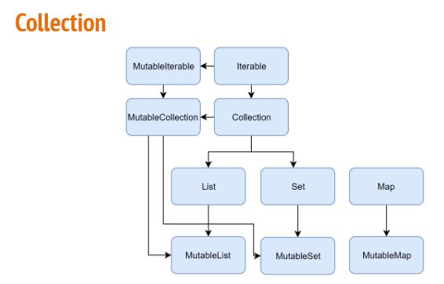
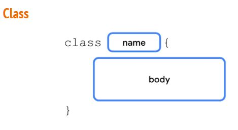
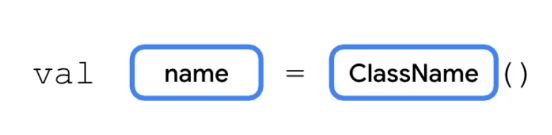
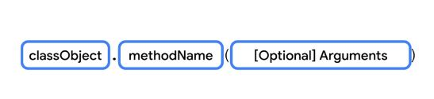
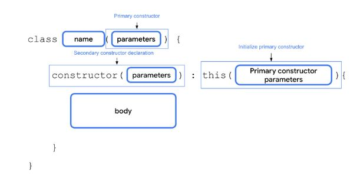
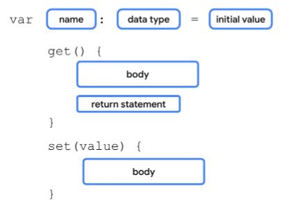

# Aula01

## Motivação

- Motivação
- Formato das aulas
- Calendário
- Nivelamento Kotlin
  - Variáveis
  - Operadores
  - Hello world
- Bibliografia


## Android


- Atividade: Falar um pocuo sobre você e uma ideia de aplicativo

- Atividade: Instalar o IntelliJ - (https://www.jetbrains.com/idea/)

## Kotlin

### Variáveis

- Nomes são **case-sensitive** (number não é o mesmo que Number, a mesma letras maiúscula e minúsculas são tratadas como letras diferentes)

- Cada nome pode incluir apenas **letras, dígitos, e underscores** (carácter de sublinhado _)

- Um nome **não pode começar com um dígito**

- Um nome **não pode ser uma palavra chave**(por exemplo, val, var, fun são ilegais)

- Variáveis
  - Char…….: caracter
  - String….: texto
  - Byte.……: -128 … 127
  - Short…..: -32768 … 32767
  - Int.………: -2_147_483_648 … 2_147_483_647
  - Long.……: -9_223_372_036_854_775_808 … 9_223_372_036_854_775_807
  - Float……: 7 casas decimais
  - Double..: 15 casa decimais
  - Boolean: true, false

- kotlin aceita undescore para compreenção.


### VAR x VAL 

ambas querem dizer variaveis

VAR - Mutável

VAL - Imutável 


### CONST x VAL

Const - Tempo de compilação

VAL - Tempo de Execução


```kotlin
fun main(){
  val a: Int = 1
  val b = 2
  val c: Int
  c = 3
  println("a = $a,b = $b, c = $c")
}
```

```kotlin
fun main(){
  var x = 5
  x += 1
  println("x = $x")
```

```kotlin
fun main(){
  var e: Int // 1
  println(e)
}
```
- Variavel 'e' deve ser inicializada

```kotlin
fun main(){
  val immutable = "immutable"
  immutable = "blah"
}
```
- Val não pode ser revalorado

```kotlin
fun someCondition() = true

fun main(){
  val d: Int

  if(someCondition()){
    d = 1
  }else{
    d = 2
  }
  println(d) 
}
```

Operadores
```
+
-
/
*
%
++
--
+=
-=
/=
*=
%=
```


```kotlin
fun main() {
    var count: Int = 88
    var temperature: Double = 14.3
    var x: Char = 'x'
    var isCSAwesome: Boolean = true
    var digit = 'B'
    var airTemperature = 78.8
    var score = 99
    var semesterHasStarted = true
    
    score++
    score+=50
    println(score)
   	println((airTemperature - 32)*5/9)
    println((temperature*9/6)+32)
}
```

- Funções


  
```kotlin
  fun main(){
    println("Happy Birthday, Rover!")
    println("You are now 5 yeras old!")
}
  fun main(){
    println("Happy Birthday, Rover!")
    println("You are now 5 years old!")
}
fun birtydayGreeting(){

```

```kotlin
}
fun main(){
  birthdayGreentin()

}
fun birthdayGreeting{
  println("Happy Birthday, Rover!")
  println("You are now 5 years old!")
```


```kotlin
fun main(){
  birthdayGreeting()
}

fun birthdayGreeting(): Unit {
  println("Happy Birthday, Rover!")
  println("You are now 5 years old!")
}
```

```kotlin

fun birthdayGreeting(): String{
  val nameGreeting = "Happy Birthday, Rover!"
  val ageGreeting = "You are now 5 years old!"
  return "$nameGreeting\n$ageGreeting"
}

fun main(){
  val greeting = birthdayGreeting()
  println(greeting)
}
```


```kotlin

fun birthdayGreeting(name: String): String{
  val nameGreeting = "Happy Birhday, $name!"
  val ageGreeting = "You are now 5 years old!"
  return "$nameGreeting/n$ageGreeting"
}
```
---------------------

Atividade 

Criar uma função para converter uma temperatura em Celsius em Fahrenheit e vice-versa
  - Função de ter 1 parâmetro de entrada
  - Função deve mostrar o resultado na tela
  - Função deve ser chamada pelo main

```kotlin
fun celsFahr(temp: Double){
    println((temp * 9/5)+32)
}

fun fahrCels(temp: Double){
    println((temp -32 )*5/9)
}

fun main() {
    celsFahr(40.0)
    fahrCels(200.0)
}
```

----------------------------

Atividade

Criar uma função para converter uma temperatura em Celsius em Fahrenheit e vice-versa
  - Função deve ter 1 parâmetro de entrada
  - Função deve ter um retorno
  - Resultado da função deve ser armazenada em uma variável quando chamada
  - Função deve ser chamada pelo main

```kotlin
fun celsFahr(temp: Double): Double{
    return ((temp * 9/5) + 32)
}

fun fahrCels(temp: Double): Double{
    return ((temp - 32) * 5/9)
}

fun main() {
    var celsius = celsFahr(40.0)
    var fahr = fahrCels(200.0)
    
    println(celsius.toString())
    println(fahr.toString())
}
```


intends - são intensões que tem no android para requisitar certas funções: camera, calendário. você pode passar e receber informações de uma intend para outra.

data management - banco de dados, persitências

threads 

permisões

broadcast recivers - é quando ocorre algum evento no celular e o aplicativo tá abilitado em fazer alguma coisa quando recebe esse broadcast.
Ex: você está recebendo uma mensagem e seu aplicativo ver que recebeu e faz alguma coisa.

notificações

Service workmanager - serviços que ficam rodando por tráz. Serviços que ficam continuamente rodando.

Conecção com internet - uso de API


IDE - IntelliJ IDEA

--------------------

Nivelamento de Código - Kotlin


Você pode Ter uma const val: Isso é uma constante em tempo de compilação
(mais na frente isso vai fazer sentido)

Obs: as variáveis precisam ser inicializadas

Função main
(slide)

operadores
(slide)

comentários
(slide)

24 27
-----------------

7:33

------------------------


Operador Elvis

lista x spt

spt só aceita valores únicos


----------------------------------------------------------------------
Part 2

Nivelamento Kotlin

- if

- when

- loops

- range

- nullable

- classes

## IF

```kotlin

fun maxOf(a: Int, b: Int): Int{
  if(a > b){
    return a
  }else{
    return b
  }
}

fun maxOf(a: Int, b: Int) =
  if (a > b){
    a
  }else{
    b
  }

fun maxOf(a: Int, b: Int) = if (a > b) a else b

```

## when

```kotlin
when(x) {
  1 -> print("x == 1")
  2 -> print("x == 2")
  else -> {
    print("x is neither 1 nor 2")
  }
}

when{
  x < 0 -> print("x < 0")
  x > 0 -> print("x > 0")
  else -> {
    print("x == 0")
  }
}
```

when qual retorno?

```kotlin

fun usingWhen(x: Int): Int{
  var xx = x
  when(xx) {
    1 -> return ++xx
    2 -> return --xx
    else->{
      return xx
    }
}
}
```
Se o valor de entrada for 1 a função retorna 2 (int)
Se o valor de entrada for 2 a função retorna 1 (int)
Se for qualquer outra valor retorna o mesmo número

## loops

```kotlin
val items = listOf("apple", "banana", "kiwifruit")

for (item in items){
  println(item)
}
```
apple

banana

kiwifruit


```kotlin
val items = listOf("apple", "banana", "kiwifruit")

for (index in items.indices){
  println("item at $index is ${item[index]}")
}
```

item at 0 is apple

item at 1 is banana

item at 2 is kiwifruit

```kotlin
val items = listOf("apple", "banana", "kiwifruit")

for ((index, item) in items.withIndex()) {
    println("item at $index is $item")
}
```

item at 0 is apple

item at 1 is banana

item at 2 is kiwifruit


```kotlin
val items = listOf("apple", "banana", "kiwifruit")

var index = 0
while (index < items.size) {
    println("item at $index is ${items[index]}")
    index++
}

```

item at 0 is apple

item at 1 is banana

item at 2 is kiwifruit

```kotlin
val items = listOf("apple", "banana", "kiwifruit")

var index = 0
do {
    println("item at $index is ${items[index]}")
    index++
} while(index < items.size)
```

item at 0 is apple

item at 1 is banana

item at 2 is kiwifruit

## loops

```kotlin

myLabel@ for (item in items){
  for (anotherItem in otherItems{
    if(...) break@myLabel
    else continue@myLabel
 }
}
```

## range

```kotlin

val x = 10
if(x in 1..10){
  println("fits in range")
}

for(x in 1..5){
  print(x)
}

for (x in 9 downTo 0 step 3){
  print(x)
}
```

## Nullable

```kotlin
val notNullText: String = "Definitely not null"
val nullableText1: String? = "Might be null"
val nullableText2: String? = null
val nullableInt2: Int? = null

fun funny(text:String?){
  if(text !== null)
    println(text)
  else
    println("Nothing to print :(")
}

fun funnier(text:String?){
  val toPrint = text?: "Nothing to print :("
  println(toPrint)
}
```

### Elvis Operator ?:  (Operador ternário)

```kotlin

  val notNullText: String = "Definitely not null"
  val nullableText1: String? = "Might be null"
  val nullableText2: String? = null

  fun funny(text: String?){
    if (text !== null)
      println(text)
    else
      println("Nothing to print :(")
    }

  fun funnier(text: String?){
    val toPint = text ?: "Nothing to print :("
    println(toPrint)
```

## Collection



## List, Set, Map

```kotlin

  fun printAll(string: Collection<String>){
    for(s in string) print("$s ")
    println()
  }

  fun main(){
    val stringList = listOf("one", "two","one")
    printAll(stringList)
    val stringSet = setOf("one", "two","three","three")
    printAll(stringSet)
}
```

Set - não registra repetidos

```kotlin

  val bob = Person("Bob",31)
  val people = listOf(Person("Adam",20),bob,bob)
  val people2 = listOf(Person("Adam",20),Person("Bob",31),bob)
  println(people == people2)
  bob.age = 32
  println(people == people2)
```

```kotlin
  val numbersMap = mapOf("key1" to 1, "key2" to 2, "key3" to 3, "key4" to 1)

  println("All keys: ${numbersMap.keys}")
  println("All values: ${numbersMap.values}")
  if("key2" in numbersMap) println("Value by key\"key2\":${numbersMap["key2"]}")
  if(1 in numbersMap.values) println("The value 1 is in the map")
  if(numbersMap.containsValue(1)) println("The value 1 is in the map") //same as previous
```

## Class









```kotlin

  class SmartDevice(val name: String, val category: String){
    var deviceStatus = "online"

    constructor(name: String, category: String, statusCode: Int): this(name,category{ deviceStatus = when(statusCode){
      0 -> "offline"
      1 -> "online"
      else -> "unknown"
}
}
```

### Class - Atividade

- Criar uma classe MyParentClass que uma val x = 3
  
- Criar uma classe MyChildClass
  
- MyChildClass herda de MyParentClass
  
- Criar uma função myFuncion em MyChildClass que faz um println de x
  
- Criar instancia de MyChildClass na função main e chamar my Function

```kotlin

open class MyParentClass(){
    val x = 3
}

//subclass
class MyChildClass:MyParentClass(){
    fun myFunction(){
        println(x)
    }
}

fun main(){
  var myObj = MyChildClass()
  myObj.myFunction()
}
```

### Class open vs public

Kotlin provides four visibility modifiers

- public. Default visibility modifier. Makes the declaration accessible everywhere. The properties and methods that you want used outside the class are marked as public

- private. Makes the declaration accessible in the same class or source file.

- protected. Makes the declaration accessible in subclasses. The properties and methods that you want used in the class that defines them and the subclasses are marked with the protected visibility modifier.

- internal. Makes the declaration accessible in the same module. The internal modifier is similar to private, but you can access internal properties and methods from outside the class as long as it's being accessed in the same module.

### Class Get and Set



When you don't define the getter and setter function for a property, Kotlin compiler internally creates the functions.

```kotlin

var speakerVolume = 2

get() = field
set(value){
  field =value
}
```

## Property Delegate

```kotlin

import kotlin.properties.ReadWriteProperty
import kotlin.reflect.KProperty

class RangeRegulator(
  initialValue: Int,
  private val minValue: Int,
  private val maxValue: Int
) : ReadWriteProperty<Any?,Int>{

  var fieldData = initialValue

  override fun getValue(thisRef: Any?, property: KProperty<*>): Int{
    return fieldData
}

  override fun setValue(thisRef: Any?, property: KProperty<*>, value:Int){
    if(value in minValue..maxValue){
      fieldData = value
    }
}
```

## && VS and

## || VS or

Atividade

- In the **SmartDivice** class, define a **printDeviceInfo()** method that prints a **"Device name: $name, category: $category, type: $deviceType"** string.

- In the **SmartTvDevice** class, define a **decreaseVolume()** method that decrease the volume and a **previousChannel()** method that navigates to previous channel

- In the **SmartLightDevice** class, define a **decreaseBrightness()** method that decreases the brightness

- In the **SmartHome** class, ensure that all action can only be performed when each device's **deviceStatus** property is set to an **"on"** string. Also, ensure that the **deviceTurnOnCount** property is updated correctly

After you're done with the implementation:

- In the **SmartHome** class, define an **decreaseTvVolume(), changeTvChannelToPrevious(),printSmartTvInfo(), printSmartLightInfo(),** and **decreaseLightBrightness()** method

- Call the appropriate methods from the **SmartTvDevice** and **SmartLightDevice** classes in the **SmartHome** class.

- In the **main()** function, call these added methods to test them.

```kotlin

/**
 * You can edit, run, and share this code.
 * play.kotlinlang.org
 */

open class SmartDevice(var name: String, var category: String, var deviceType: String){
    var deviceStatus = "on"
    
    fun printDeviceInfo(){
        println("Device name: $name,category: $category,type:$deviceType")
    }
}

class SmartTvDevice(name: String, category: String,deviceType:String):SmartDevice(name, category,deviceType){
    
    var volume: Int = 30
    var channel: Int = 13
    
    fun decreaseVolume(){
        --volume
    }
    
    fun previousChannel(){
        --channel
    }
}

class SmartLightDevice(name: String, category: String,deviceType:String):SmartDevice(name, category,deviceType){
    
    var brightness = 30
    
    fun decreaseBrightness(){
        --brightness
    }
}

class SmartHome(){
    var deviceTurnOnCount = 0
    
    fun decreaseTvVolume(){
        
    }
    
    fun changeTvChannelToPrevious(){
        
    }
    
    fun printSmartTvInfo(){
        
    }
    
    fun printSmartLightInfo(){
        
    }
    
    fun decreaseLightBrightness(){
        
    }
    
}

fun main() {
    var device = SmartDevice("tv","tv","tv")
    device.printDeviceInfo()
}
```
