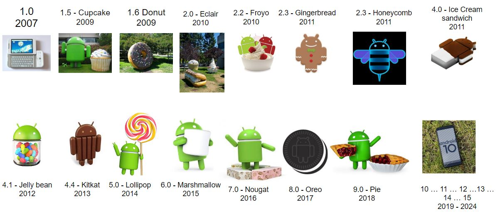
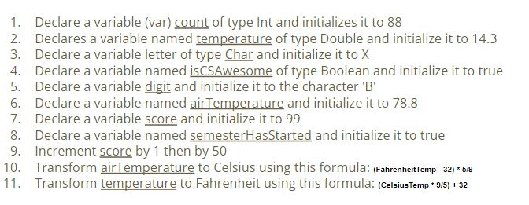
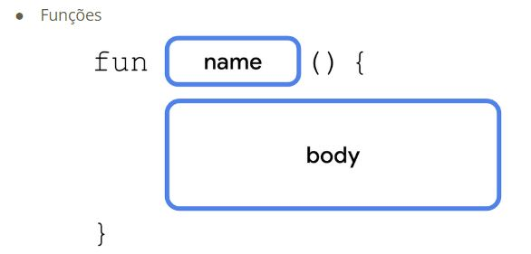
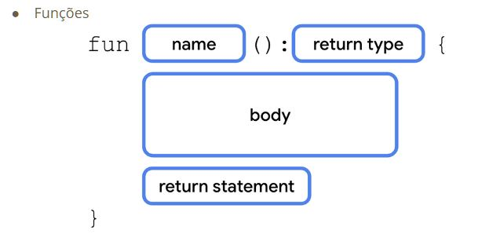
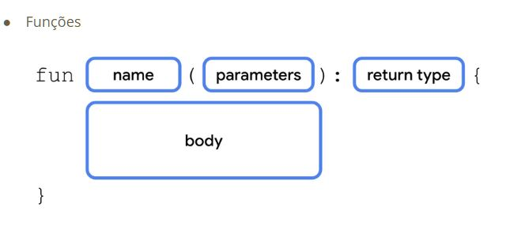

# Aula01

## Motivação

- Motivação
- Formato das aulas
- Calendário
- Nivelamento Kotlin
  - Variáveis
  - Operadores
  - Hello world
- Bibliografia


## Android




- Atividade: Falar um pocuo sobre você e uma ideia de aplicativo

- Atividade: Instalar o IntelliJ - (https://www.jetbrains.com/idea/)

## Kotlin

### Variáveis

- Nomes são **case-sensitive** (number não é o mesmo que Number, a mesma letras maiúscula e minúsculas são tratadas como letras diferentes)

- Cada nome pode incluir apenas **letras, dígitos, e underscores** (carácter de sublinhado _)

- Um nome **não pode começar com um dígito**

- Um nome **não pode ser uma palavra chave**(por exemplo, val, var, fun são ilegais)

- Variáveis
  - Char…….: caracter
  - String….: texto
  - Byte.……: -128 … 127
  - Short…..: -32768 … 32767
  - Int.………: -2_147_483_648 … 2_147_483_647
  - Long.……: -9_223_372_036_854_775_808 … 9_223_372_036_854_775_807
  - Float……: 7 casas decimais
  - Double..: 15 casa decimais
  - Boolean: true, false

- kotlin aceita undescore para compreenção.


### VAR x VAL 

ambas querem dizer variaveis

VAR - Mutável

VAL - Imutável 


### CONST x VAL

Const - Tempo de compilação

VAL - Tempo de Execução


```kotlin
fun main(){
  val a: Int = 1
  val b = 2
  val c: Int
  c = 3
  println("a = $a,b = $b, c = $c")
}
```

```kotlin
fun main(){
  var x = 5
  x += 1
  println("x = $x")
```

```kotlin
fun main(){
  var e: Int // 1
  println(e)
}
```
- Variavel 'e' deve ser inicializada

```kotlin
fun main(){
  val immutable = "immutable"
  immutable = "blah"
}
```
- Val não pode ser revalorado

```kotlin
fun someCondition() = true

fun main(){
  val d: Int

  if(someCondition()){
    d = 1
  }else{
    d = 2
  }
  println(d) 
}
```

Operadores
```
+
-
/
*
%
++
--
+=
-=
/=
*=
%=
```



```kotlin
fun main() {
    var count: Int = 88
    var temperature: Double = 14.3
    var x: Char = 'x'
    var isCSAwesome: Boolean = true
    var digit = 'B'
    var airTemperature = 78.8
    var score = 99
    var semesterHasStarted = true
    
    score++
    score+=50
    println(score)
   	println((airTemperature - 32)*5/9)
    println((temperature*9/6)+32)
}
```

- Funções


  
```kotlin
  fun main(){
    println("Happy Birthday, Rover!")
    println("You are now 5 yeras old!")
}
  fun main(){
    println("Happy Birthday, Rover!")
    println("You are now 5 years old!")
}
fun birtydayGreeting(){

```

```kotlin
}
fun main(){
  birthdayGreentin()

}
fun birthdayGreeting{
  println("Happy Birthday, Rover!")
  println("You are now 5 years old!")
```



```kotlin
fun main(){
  birthdayGreeting()
}

fun birthdayGreeting(): Unit {
  println("Happy Birthday, Rover!")
  println("You are now 5 years old!")
}
```

```kotlin

fun birthdayGreeting(): String{
  val nameGreeting = "Happy Birthday, Rover!"
  val ageGreeting = "You are now 5 years old!"
  return "$nameGreeting\n$ageGreeting"
}

fun main(){
  val greeting = birthdayGreeting()
  println(greeting)
}
```



```kotlin

fun birthdayGreeting(name: String): String{
  val nameGreeting = "Happy Birhday, $name!"
  val ageGreeting = "You are now 5 years old!"
  return "$nameGreeting/n$ageGreeting"
}
```
---------------------

Atividade 

Criar uma função para converter uma temperatura em Celsius em Fahrenheit e vice-versa
  - Função de ter 1 parâmetro de entrada
  - Função deve mostrar o resultado na tela
  - Função deve ser chamada pelo main

```kotlin
fun celsFahr(temp: Double){
    println((temp * 9/5)+32)
}

fun fahrCels(temp: Double){
    println((temp -32 )*5/9)
}

fun main() {
    celsFahr(40.0)
    fahrCels(200.0)
}
```

----------------------------

Atividade

Criar uma função para converter uma temperatura em Celsius em Fahrenheit e vice-versa
  - Função deve ter 1 parâmetro de entrada
  - Função deve ter um retorno
  - Resultado da função deve ser armazenada em uma variável quando chamada
  - Função deve ser chamada pelo main

```kotlin


```


intends - são intensões que tem no android para requisitar certas funções: camera, calendário. você pode passar e receber informações de uma intend para outra.

data management - banco de dados, persitências

threads 

permisões

broadcast recivers - é quando ocorre algum evento no celular e o aplicativo tá abilitado em fazer alguma coisa quando recebe esse broadcast.
Ex: você está recebendo uma mensagem e seu aplicativo ver que recebeu e faz alguma coisa.

notificações

Service workmanager - serviços que ficam rodando por tráz. Serviços que ficam continuamente rodando.

Conecção com internet - uso de API


IDE - IntelliJ IDEA

--------------------

Nivelamento de Código - Kotlin


Você pode Ter uma const val: Isso é uma constante em tempo de compilação
(mais na frente isso vai fazer sentido)

Obs: as variáveis precisam ser inicializadas

Função main
(slide)

operadores
(slide)

comentários
(slide)

24 27
-----------------

7:33

------------------------


Operador Elvis

lista x spt

spt só aceita valores únicos
