## Layout

- **Layout** define a **estrutura** de uma **interface** do usuário no seu app
- Possui hierarquia de objetos **View** e **ViewGroup**
  - **View** geralmente desenha algo que o usuário pode **ver e interagir**
  - **ViewGroup** é um **contêiner invisível** que **define** a **estrutura do layout para View** e outros objetos ViewGroup

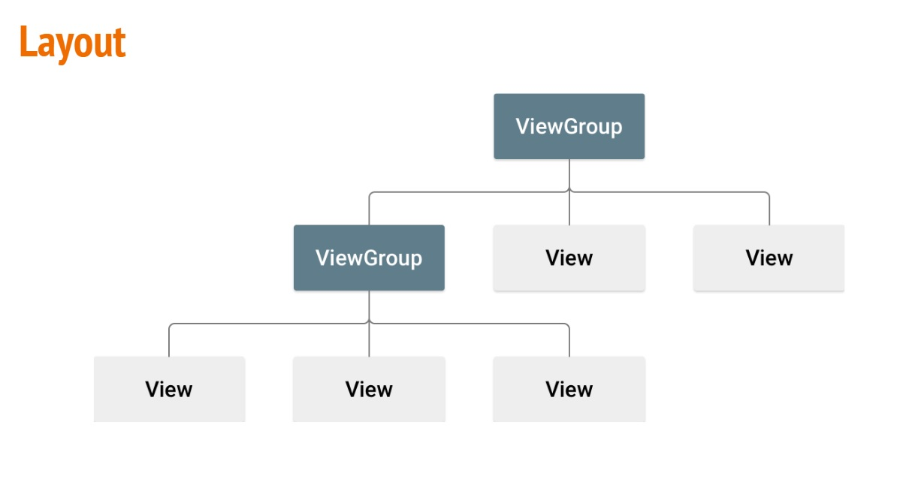
 
## View e Viewgroup

- **View** geralmente são chamados de **widgets** e podem ser uma das muitas subclasses, como **Button** ou **TextView**

- **ViewGroup** geralmente são chamados de **layouts** e podem ser de vários tipos que fornecem uma estrutura de layout diferente, como **LinearLayout** ou **ConstraintLayout**

- **Layouts** e **widgets** podem ser declarados de **duas maneiras**:
  - **Declarar** elementos de interface em **XML**
  - **Instanciar** elementos do layout em **run-time**
 
- Arquivo xml de layout são salvos no diretório res/layout

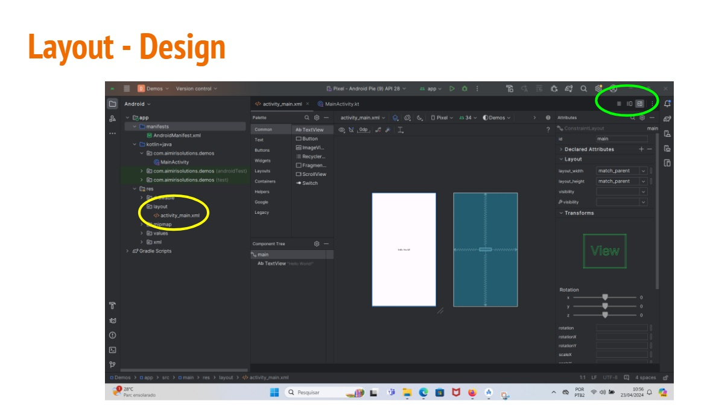

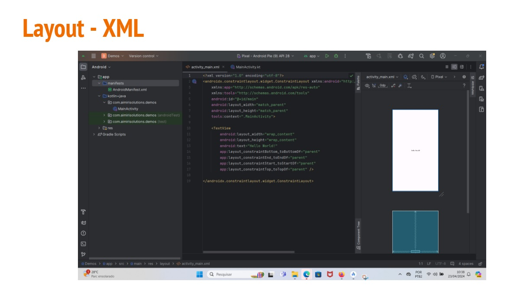

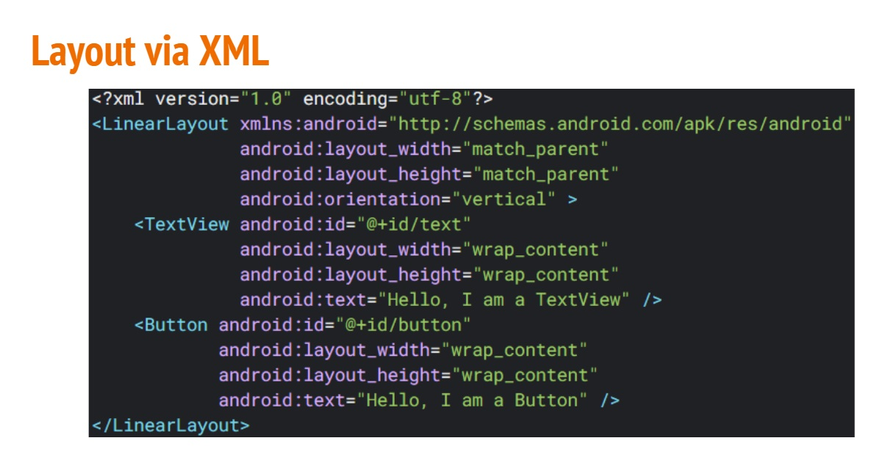

### Viewgroups

- **LinearLayout**: alinha seus filhos em uma única direção:vertical ou horizontal
- **RelativeLayout**: alinha seus filhos em posição relativa
- **TableLayout**: alinha seus filhos em linhas e colunas
- **FrameLayout**: é um placeholder que é usado para mostrar um única view ou stack de views
- **ConstraintLayout**: alinha as views com base em regras

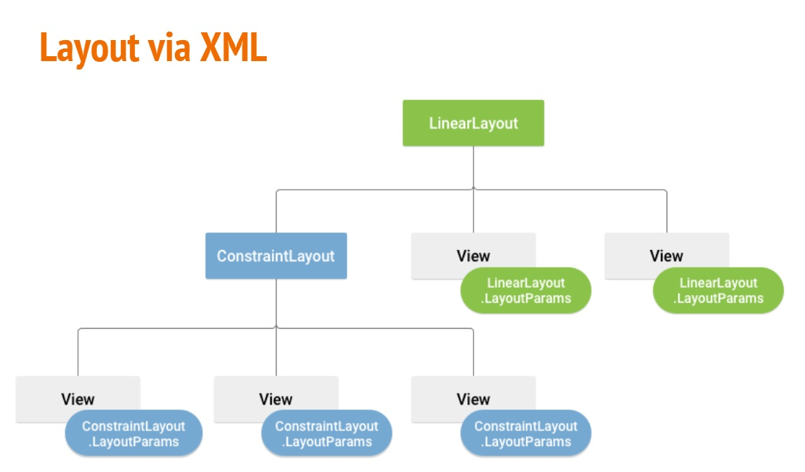

## Linearlayout

LinearLayout é um ViewGroup que alinha todos os filhos em um única direção vertical ou horizontal

### Linearlayout Attributes

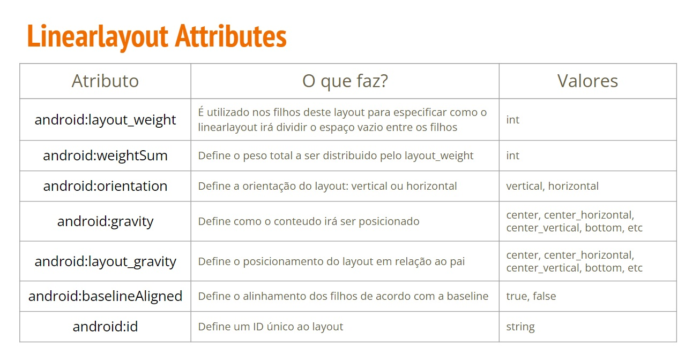

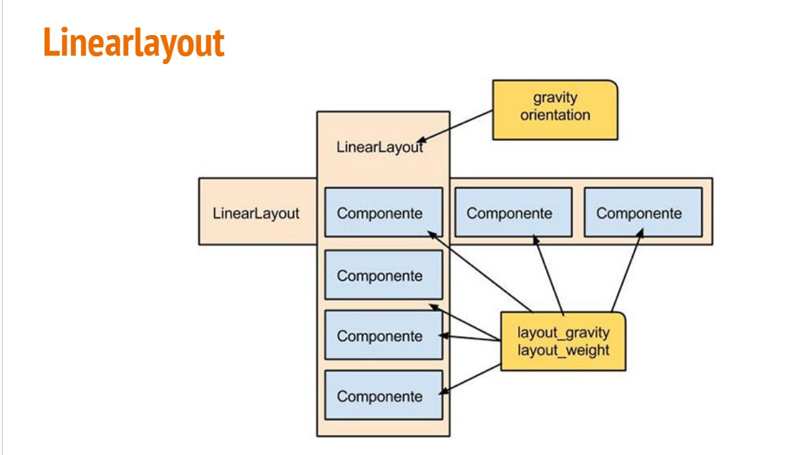

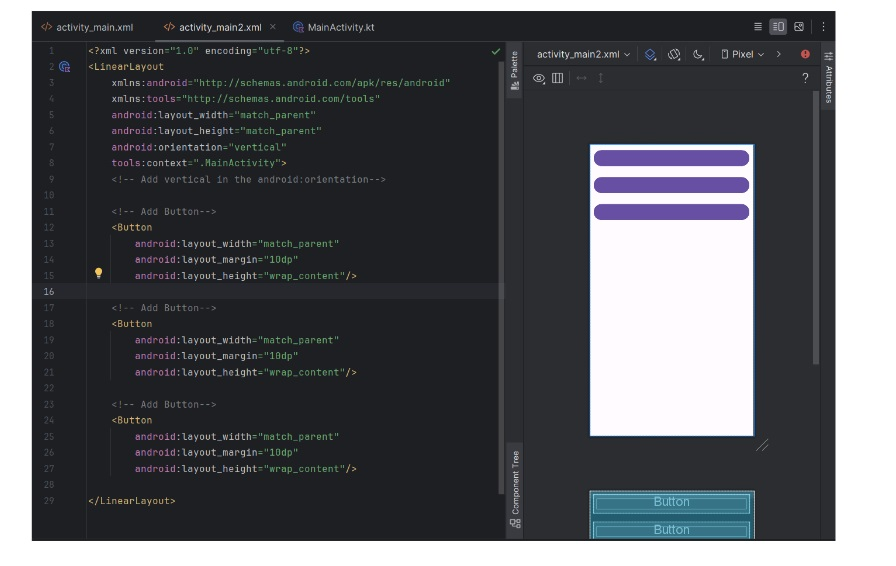

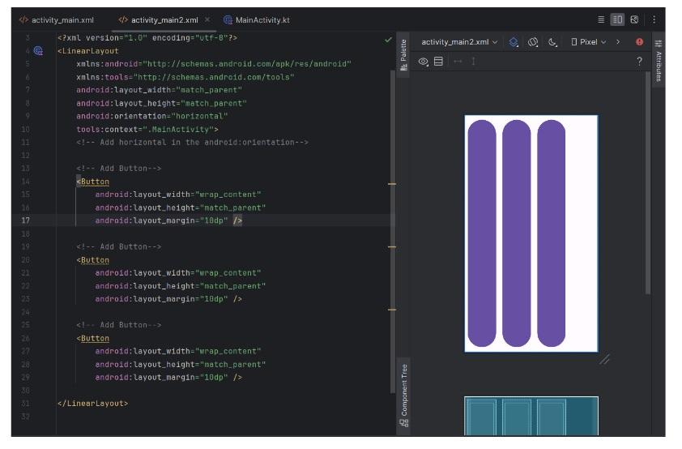

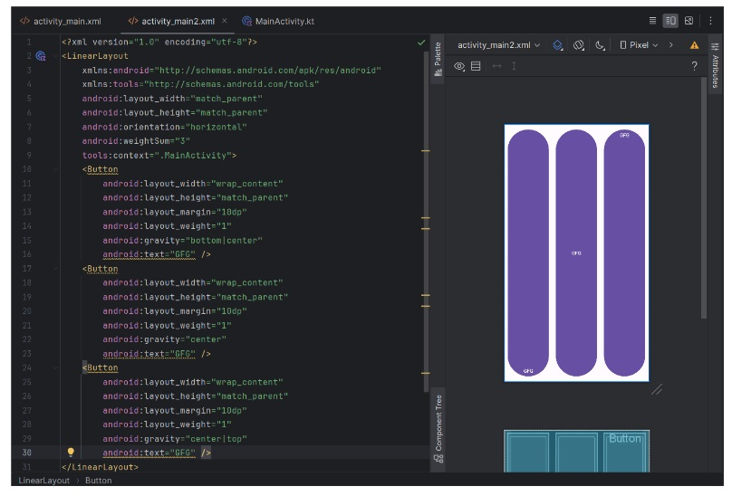

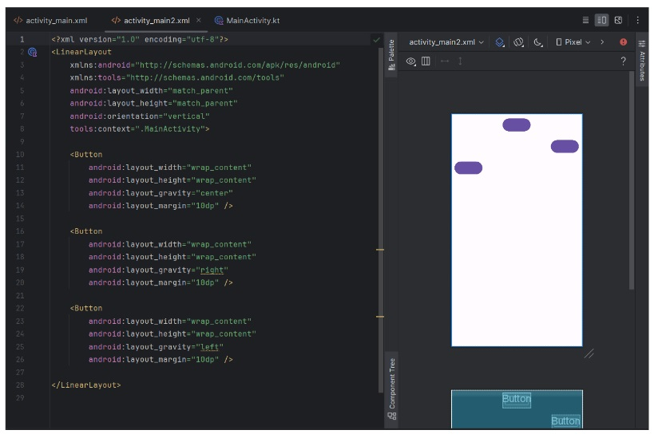

### Linearlayouts - Atividade

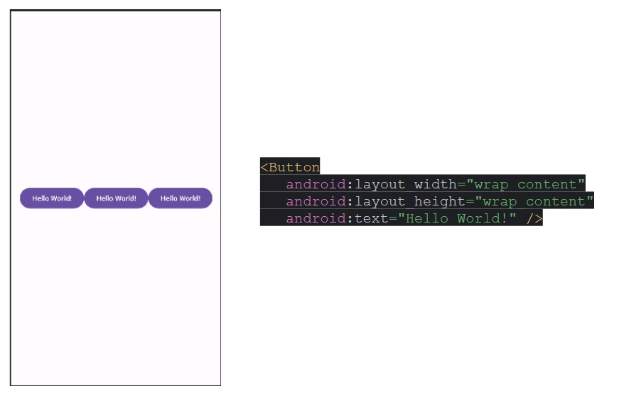

## Relativelayout

RelativeLayout é um ViewGroup que exibe visualizações dos seus filhos em posições relativas a elementos irmãos (i.e, a esquerda ou abeixo de outra view) ou relativas a área RelativeLayout pai (por exemplo, alinhado à parte inferior, à esquerda ou no centro)

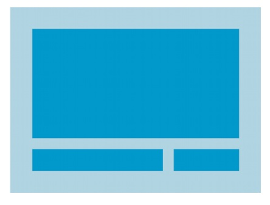

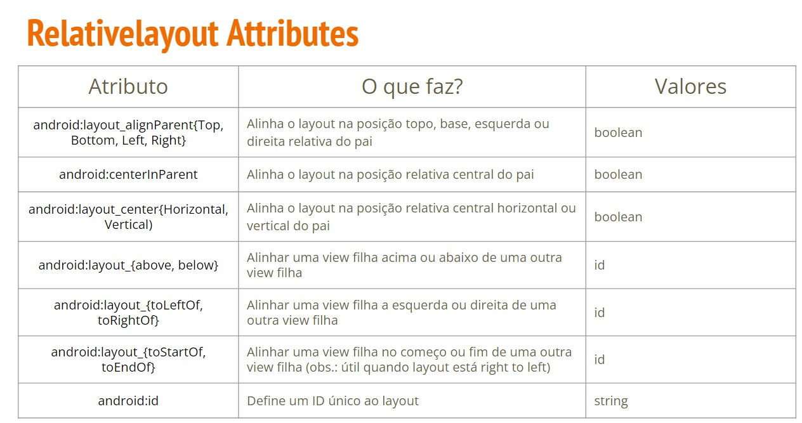

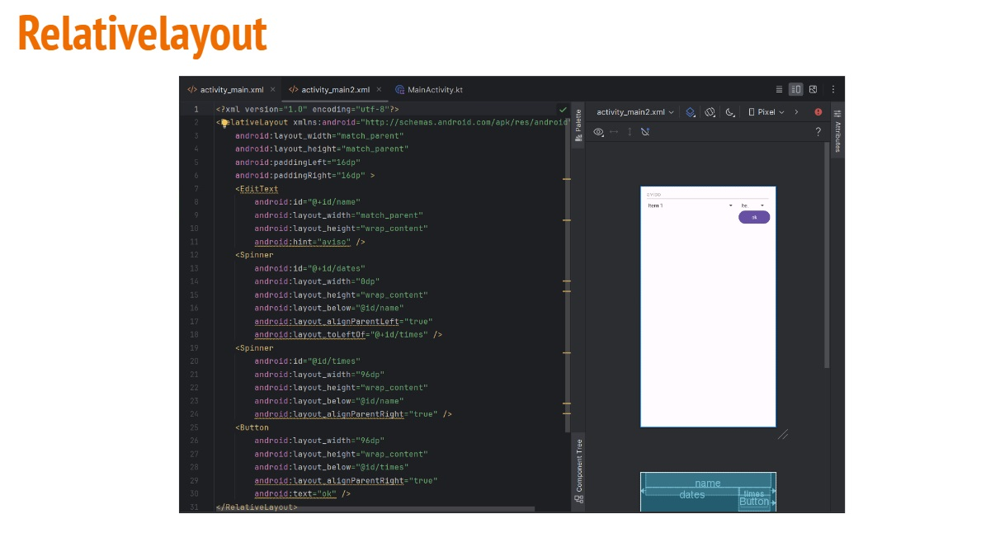

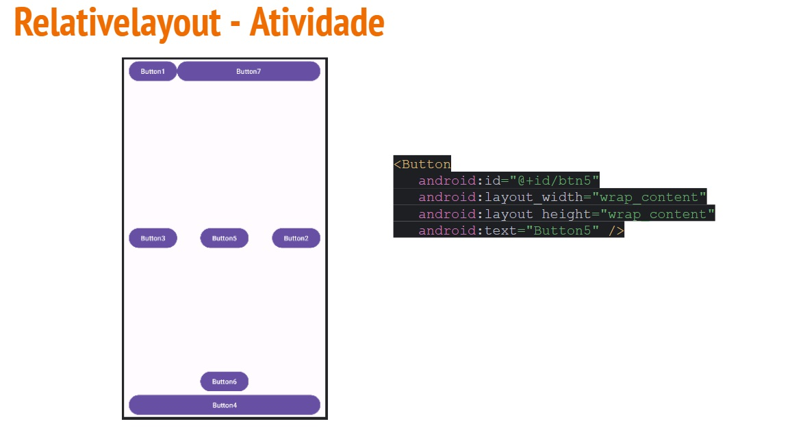

## Tablelayout

Tablelayout é um ViewGroup que exibe elementos filhos de View em linhas e colunas.

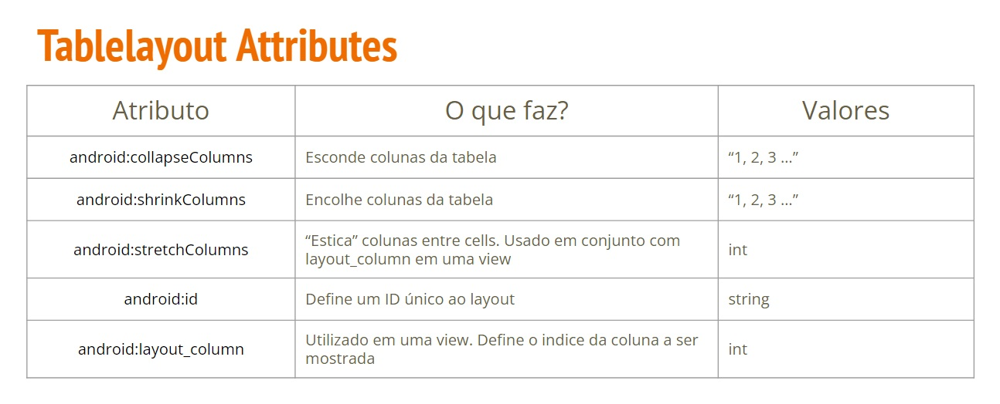

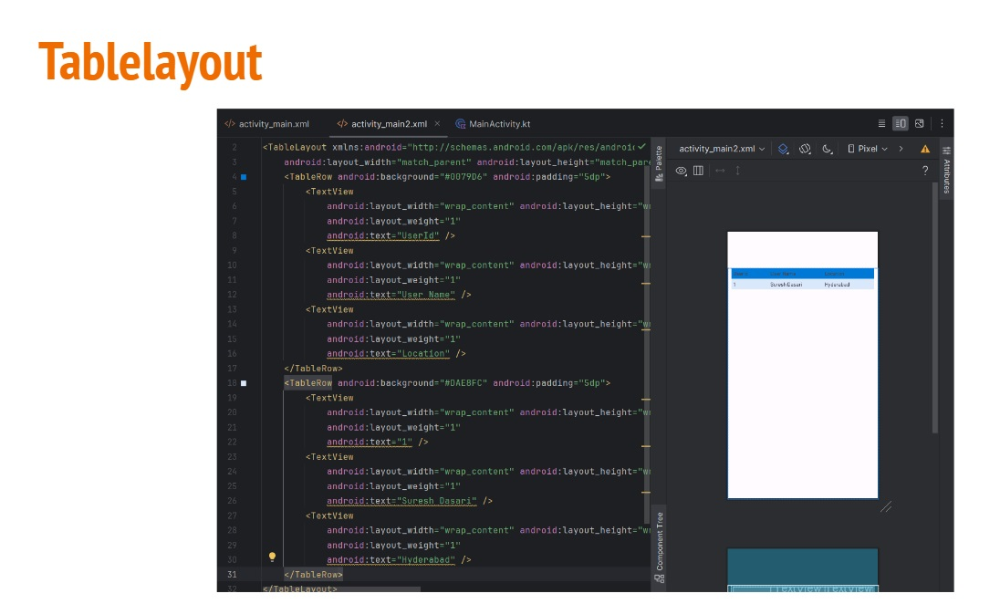
