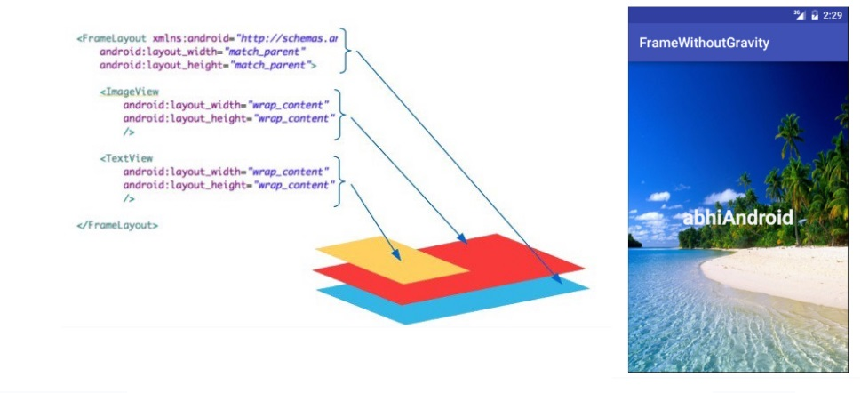
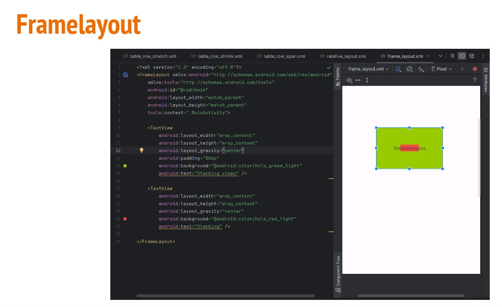
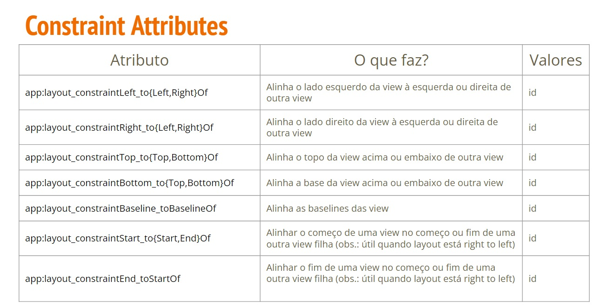
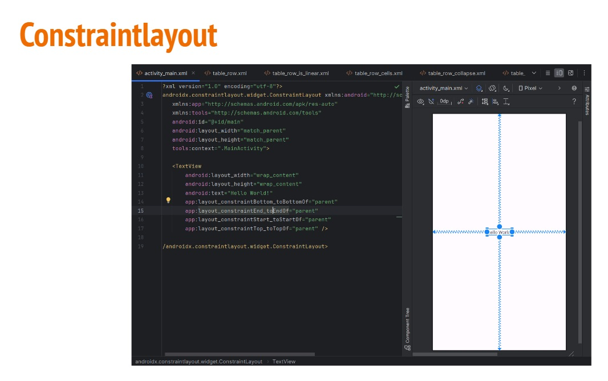
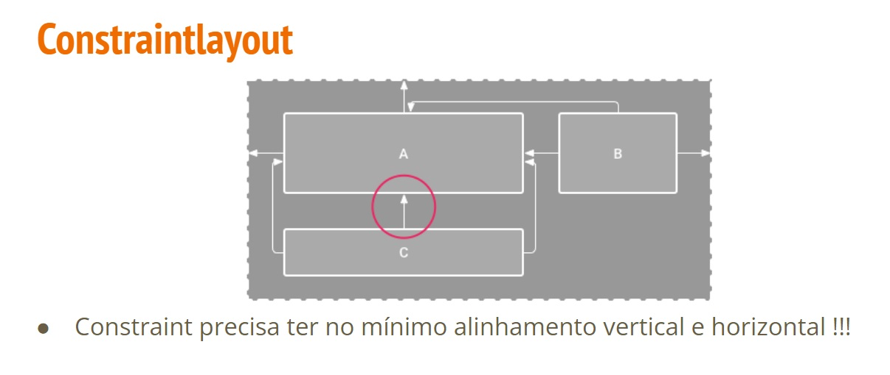
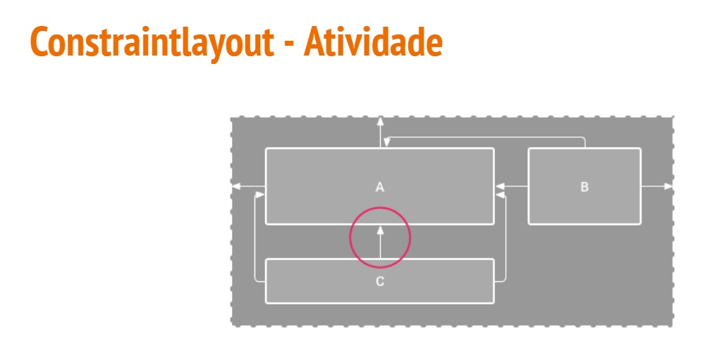

## Layout

- **Layout** define a **estrutura** de uma **interface** do usuário no seu app
- Possui hierarquia de objetos **View** e **ViewGroup**
  - **View** geralmente desenha algo que o usuário pode **ver e interagir**
  - **ViewGroup** é um **contêiner invisível** que **define** a **estrutura do layout para View** e outros objetos ViewGroup


 
## View e Viewgroup

- **View** geralmente são chamados de **widgets** e podem ser uma das muitas subclasses, como **Button** ou **TextView**

- **ViewGroup** geralmente são chamados de **layouts** e podem ser de vários tipos que fornecem uma estrutura de layout diferente, como **LinearLayout** ou **ConstraintLayout**

- **Layouts** e **widgets** podem ser declarados de **duas maneiras**:
  - **Declarar** elementos de interface em **XML**
  - **Instanciar** elementos do layout em **run-time**
 
- Arquivo xml de layout são salvos no diretório res/layout


### Viewgroups

- **LinearLayout**: alinha seus filhos em uma única direção:vertical ou horizontal
- **RelativeLayout**: alinha seus filhos em posição relativa
- **TableLayout**: alinha seus filhos em linhas e colunas
- **FrameLayout**: é um placeholder que é usado para mostrar um única view ou stack de views
- **ConstraintLayout**: alinha as views com base em regras


## Linearlayout

LinearLayout é um ViewGroup que alinha todos os filhos em um única direção vertical ou horizontal


### Linearlayout Attributes


### Linearlayouts - Atividade


```kotlin
<LinearLayout
xmlns:app="http://schemas.android.com/apk/res-auto"

xmlns:tools="http://schemas.android.com/tools"
    xmlns:android="http://schemas.android.com/apk/res/android"
    android:id="@+id/main"
    android:layout_width="match_parent"
    android:layout_height="match_parent"
    android:orientation="horizontal"
    tools:context=".MainActivity">


    <Button
        android:layout_width="wrap_content"
        android:layout_height="wrap_content"
        android:layout_gravity="center"
        android:layout_weight="1"
        android:layout_marginLeft="10dp"
        android:text="Hello World!"/>

    <Button
        android:layout_width="wrap_content"
        android:layout_height="wrap_content"
        android:layout_gravity="center"
        android:layout_weight="1"
        android:text="Hello World!"/>

    <Button
        android:layout_width="wrap_content"
        android:layout_height="wrap_content"
        android:layout_gravity="center"
        android:layout_weight="1"
        android:layout_marginRight="10dp"
        android:text="Hello World!"/>
</LinearLayout>
```

## Relativelayout

RelativeLayout é um ViewGroup que exibe visualizações dos seus filhos em posições relativas a elementos irmãos (i.e, a esquerda ou abeixo de outra view) ou relativas a área RelativeLayout pai (por exemplo, alinhado à parte inferior, à esquerda ou no centro)


## Tablelayout

Tablelayout é um ViewGroup que exibe elementos filhos de View em linhas e colunas.


## Framelayout

- Framelayout foi criado para bloquear uma parte da tela para mostrar múltiplas views como uma só. As views são desenhadas em forma de stack de forma que uma sobrepõe a outra

- Pode-se usar layout_gravity para posicionar as view





## Constraintlayout

- Constraint significa algo como "restrição" ou "limitação"

- O ConstraintLayout permite que você crie layouts grandes e complexos com uma hierarquia flat no seu XML (sem a necessidade de ficar alinhando um monte de layouts uns dentro dos outros).

- Ele é similar ao Reletivelayout, uma vez que todas suas views se relacionam entre si e com o parent










### Referências

- https://developer.android.com
- livros:
  Pro Android UI wallace Jackson

  Android UI Fundamentals develop and design - jason Ostrander

  Android UI Design Plan, design, and build engaging user interfaces for your Android applications - Jassica Thornsby


