# Activity layouts / widgets

- Android Manifest

- Activity

- Widgets

    - Button

    - Text

    - EditText

    - ImageView

    - ImageButton


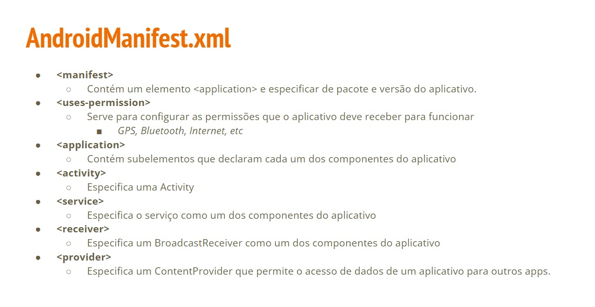

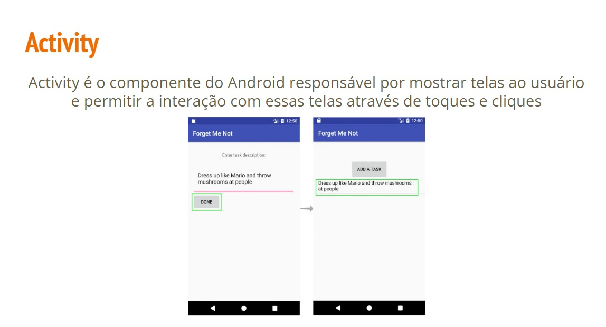


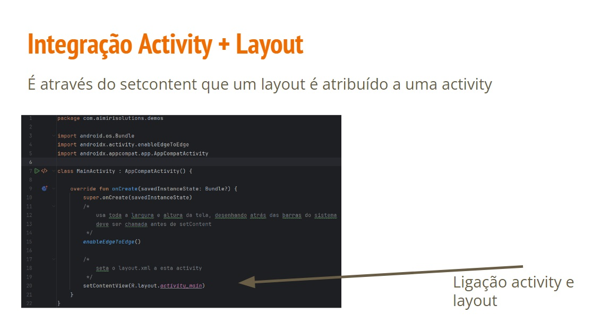

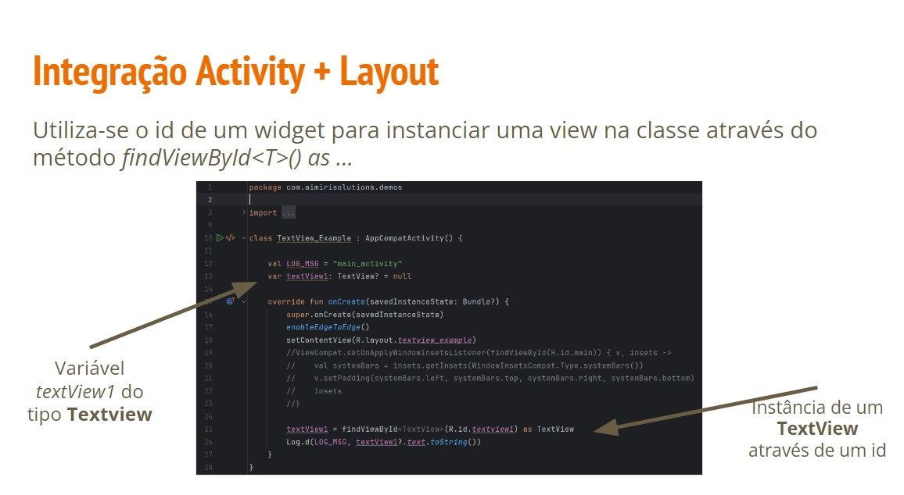

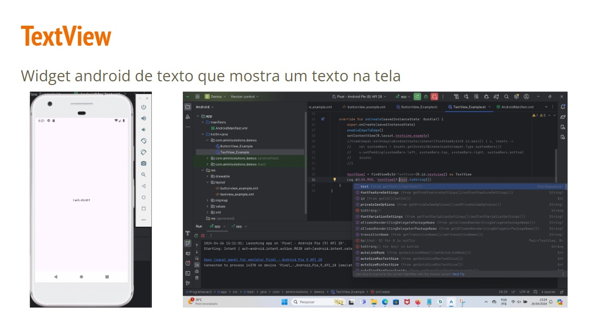

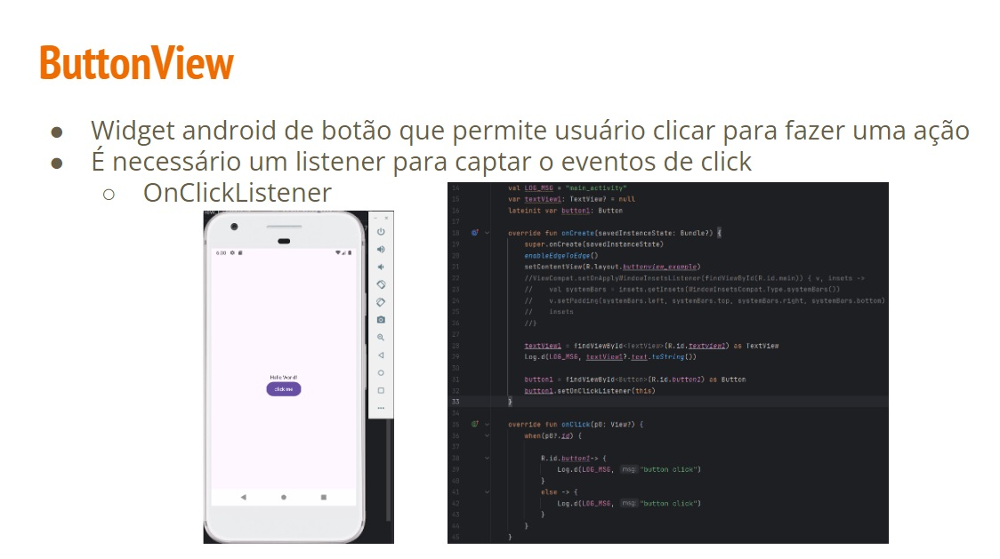

Acho que está desatualizado. fun onClick não está funcionando

```kotlin
button.setOnClickListener(){
            Log.d(LOG_MSG,"button click1")
}
```

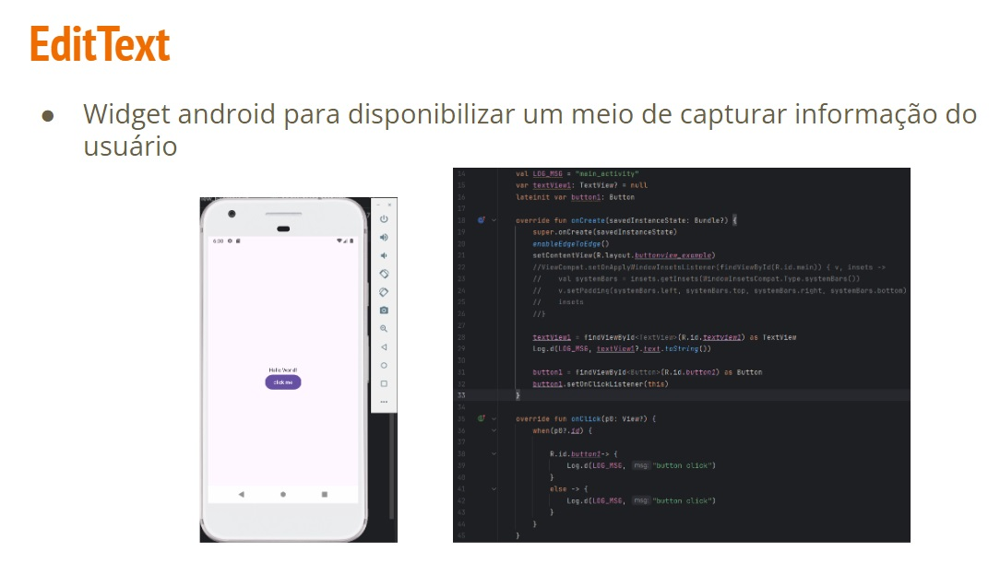

Acho que o código está errado um exemplo de EditText

```kotlin


package com.geeksforgeeks.myfirstkotlinapp
 
import androidx.appcompat.app.AppCompatActivity
import android.os.Bundle
import android.widget.Button
import android.widget.EditText
import android.widget.Toast
 
class MainActivity : AppCompatActivity() {
 
    override fun onCreate(savedInstanceState: Bundle?) {
        super.onCreate(savedInstanceState)
        setContentView(R.layout.activity_main)
 
        // finding the button
        val showButton = findViewById<Button>(R.id.showInput)
 
        // finding the edit text
        val editText = findViewById<EditText>(R.id.editText)
 
        // Setting On Click Listener
        showButton.setOnClickListener {
 
            // Getting the user input
            val text = editText.text
 
            // Showing the user input
            Toast.makeText(this, text, Toast.LENGTH_SHORT).show()
        }
    }
}
```

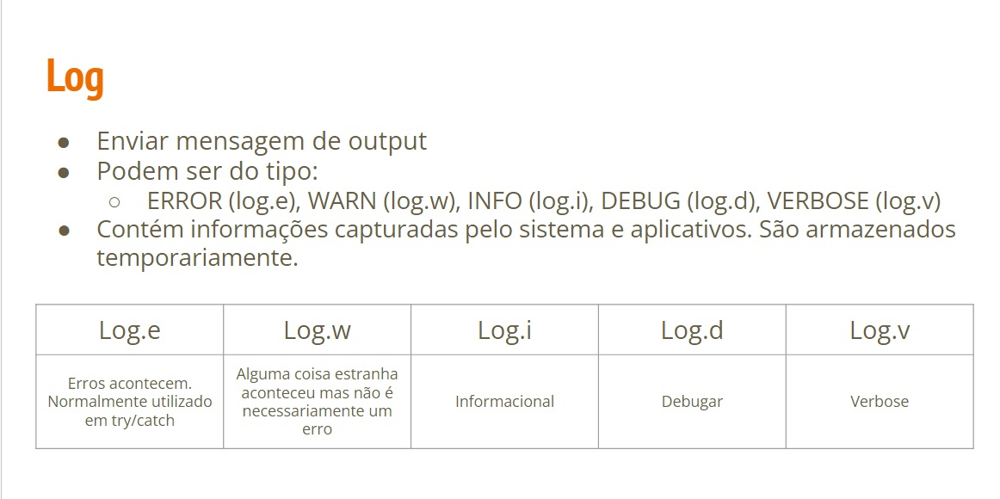

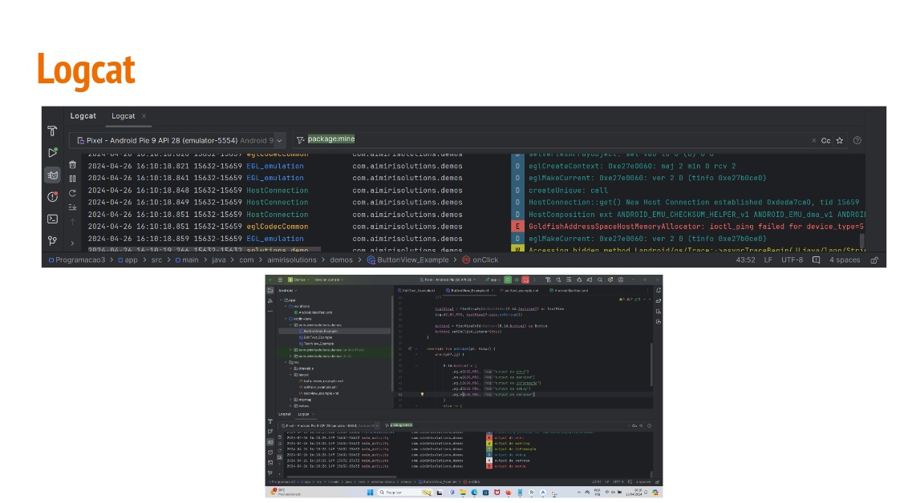


```kotlin
<?xml version="1.0" encoding="utf-8"?>
<androidx.constraintlayout.widget.ConstraintLayout xmlns:android="http://schemas.android.com/apk/res/android"
    xmlns:app="http://schemas.android.com/apk/res-auto"
    xmlns:tools="http://schemas.android.com/tools"
    android:id="@+id/main"
    android:layout_width="match_parent"
    android:layout_height="match_parent"
    tools:context=".MainActivity">

    <EditText
        android:id="@+id/editTextText"
        android:layout_width="wrap_content"
        android:layout_height="wrap_content"
        android:layout_marginStart="87dp"
        android:layout_marginTop="239dp"
        android:ems="10"
        android:inputType="text"
        android:text="Name"
        app:layout_constraintStart_toStartOf="parent"
        app:layout_constraintTop_toTopOf="parent" />

    <Button
        android:id="@+id/button"
        android:layout_width="wrap_content"
        android:layout_height="wrap_content"
        android:layout_marginTop="25dp"
        android:text="Button"
        app:layout_constraintEnd_toEndOf="@+id/editTextText"
        app:layout_constraintStart_toStartOf="@+id/editTextText"
        app:layout_constraintTop_toBottomOf="@+id/editTextText" />

    <TextView
        android:id="@+id/textView"
        android:layout_width="wrap_content"
        android:layout_height="wrap_content"
        android:layout_marginStart="15dp"
        android:layout_marginTop="36dp"
        android:text="TextView"
        app:layout_constraintStart_toStartOf="@+id/button"
        app:layout_constraintTop_toBottomOf="@+id/button" />
</androidx.constraintlayout.widget.ConstraintLayout>
``

```kotlin
class MainActivity : AppCompatActivity() {

    override fun onCreate(savedInstanceState: Bundle?) {

        super.onCreate(savedInstanceState)
        enableEdgeToEdge()
        setContentView(R.layout.activity_main)

        var showButton = findViewById<Button>(R.id.button)
        var editText = findViewById<EditText>(R.id.editTextText) as EditText
        var textView = findViewById<TextView>(R.id.textView) as TextView


        showButton.setOnClickListener{
            var text = editText.text
            textView.text = text
        }
    }
}
``

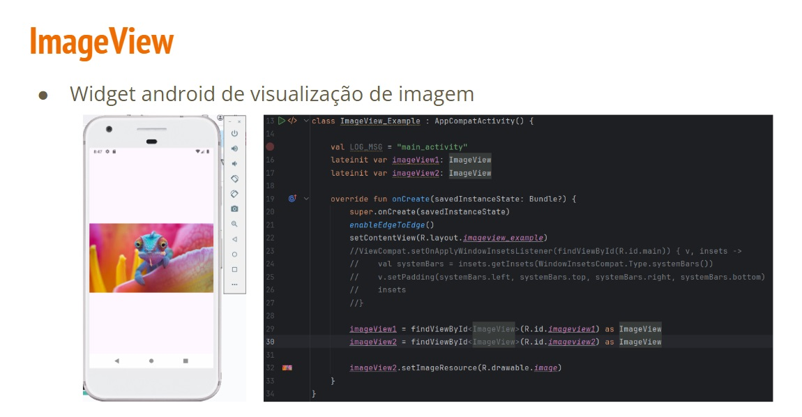

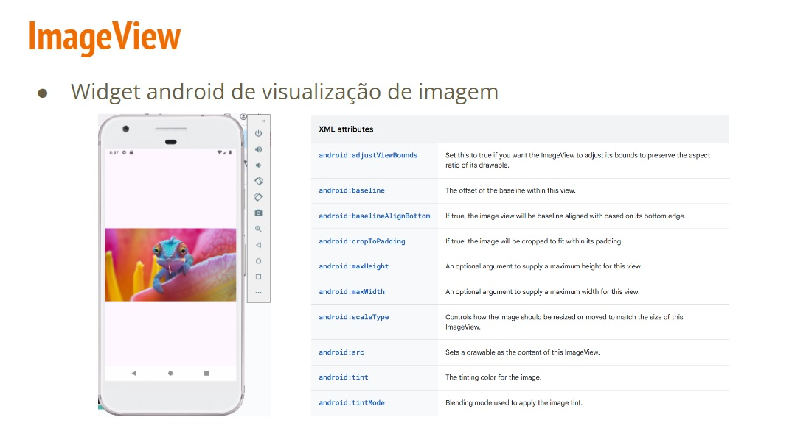

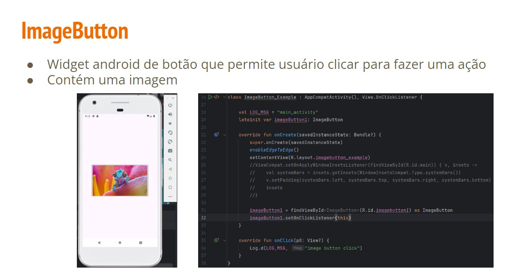


