# Activity layouts / widgets

- Android Manifest

- Activity

- Widgets

    - Button

    - Text

    - EditText

    - ImageView

    - ImageButton

## Exercício

- Criar um novo projeto Empty Views Project

- Ir para res/layout

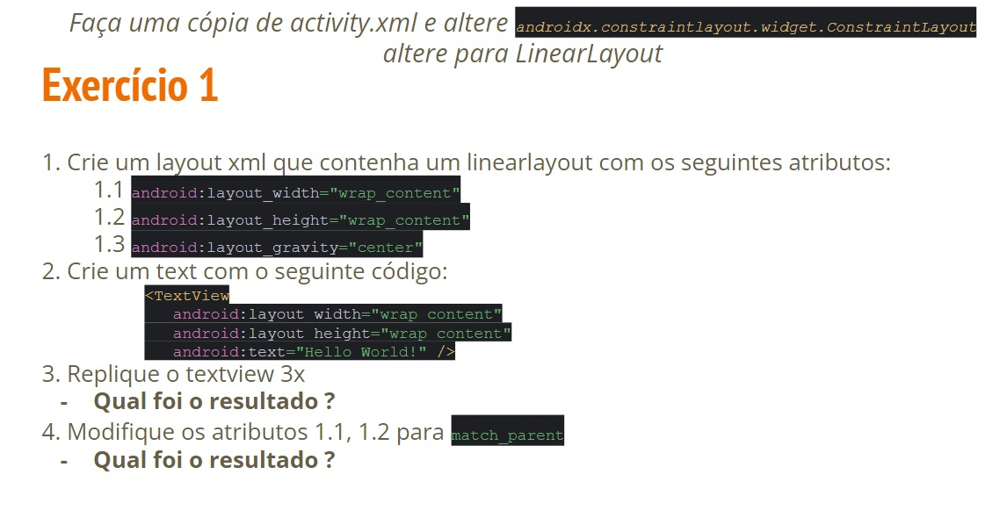

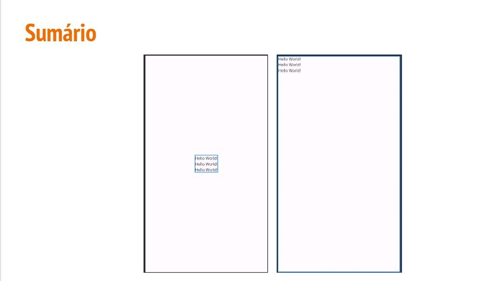

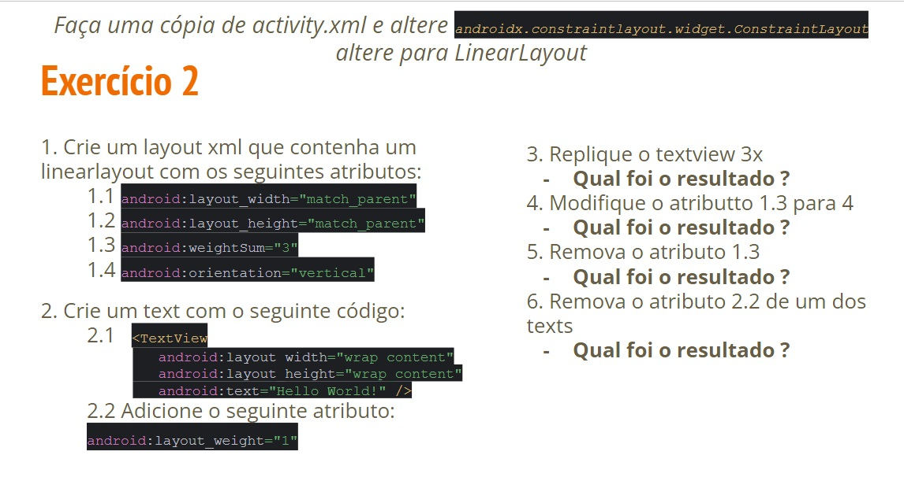

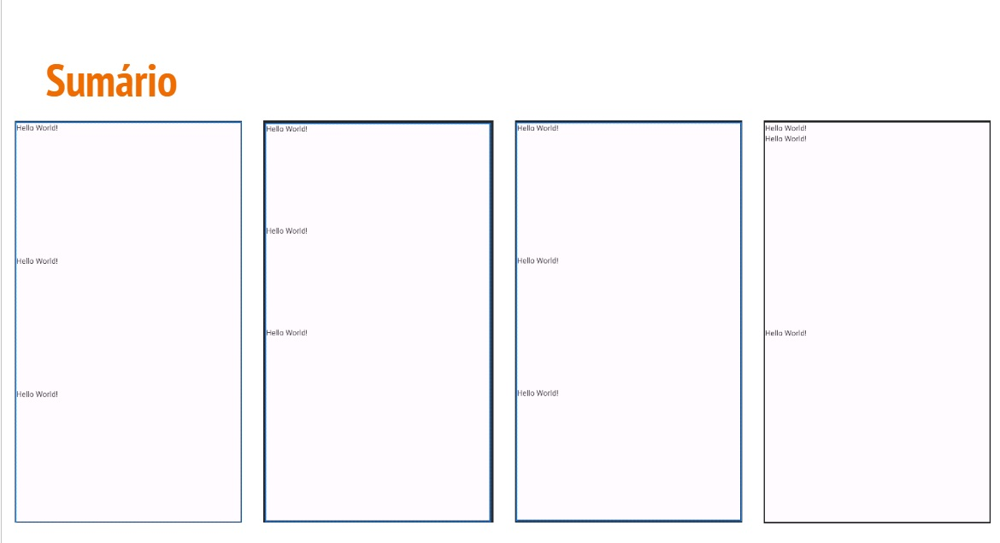

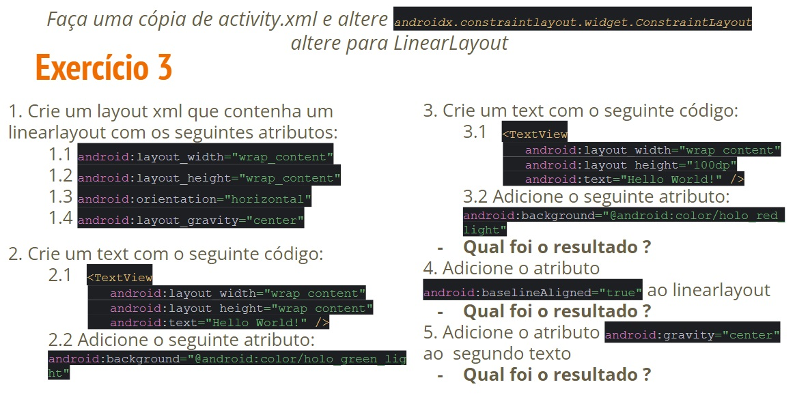

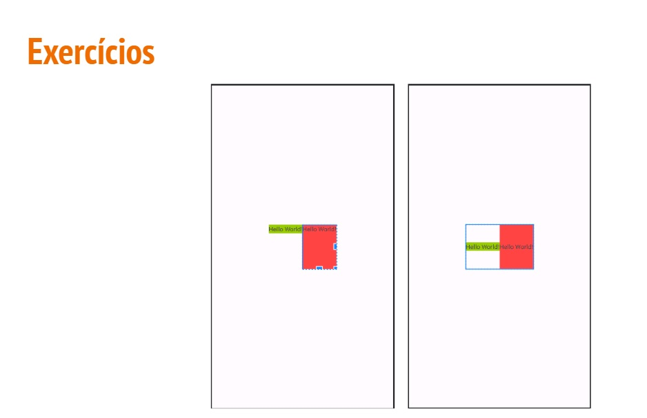

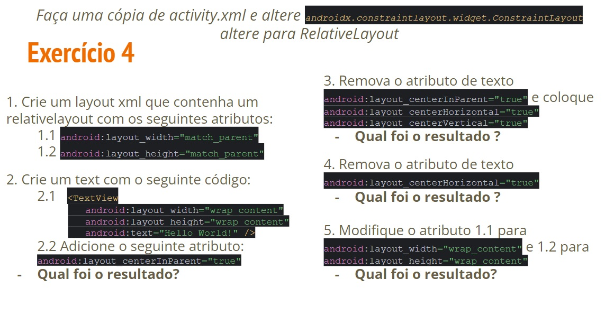

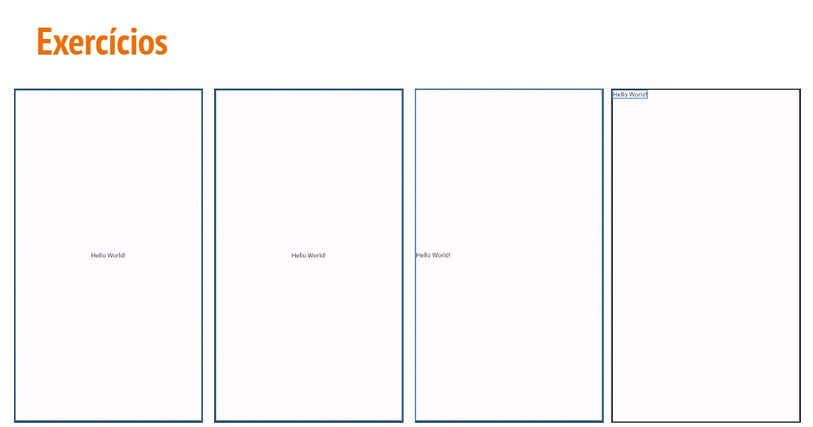

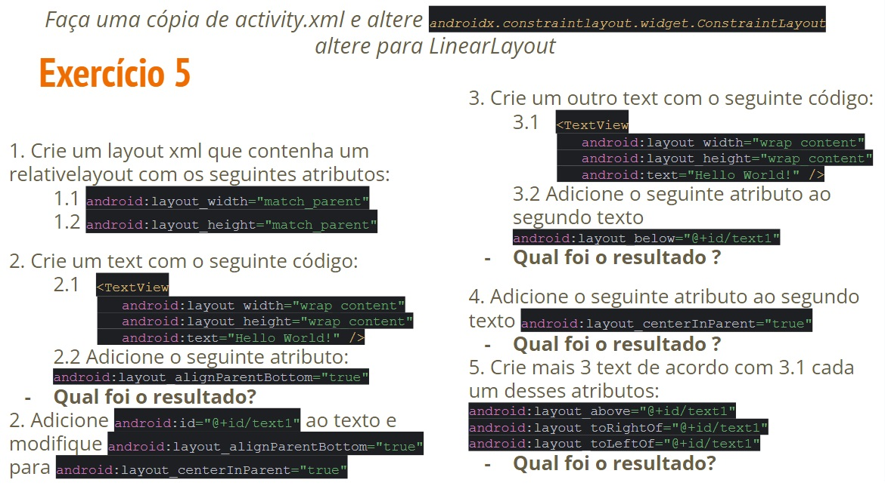

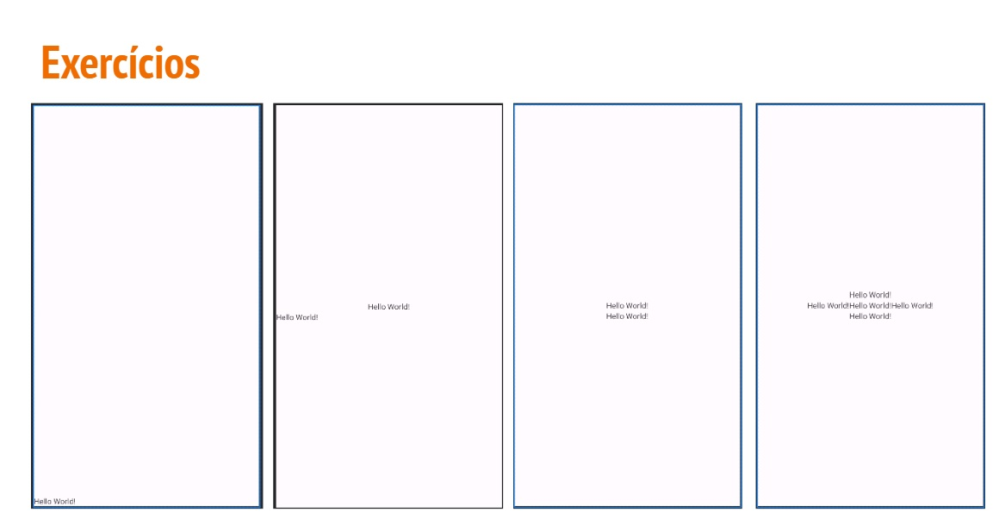

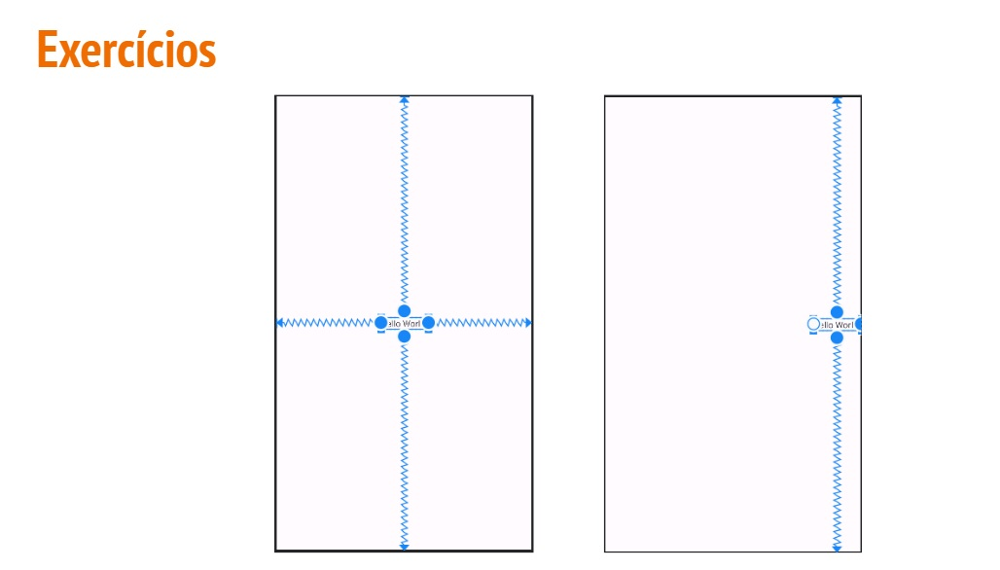

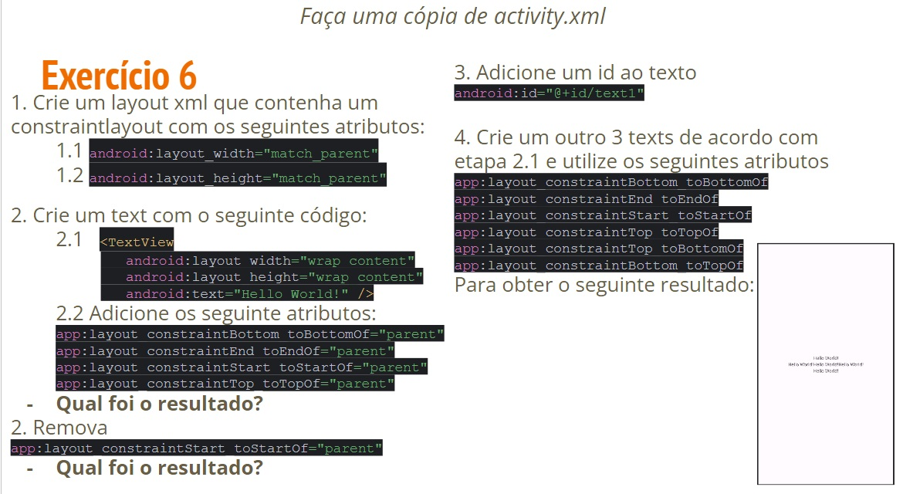

