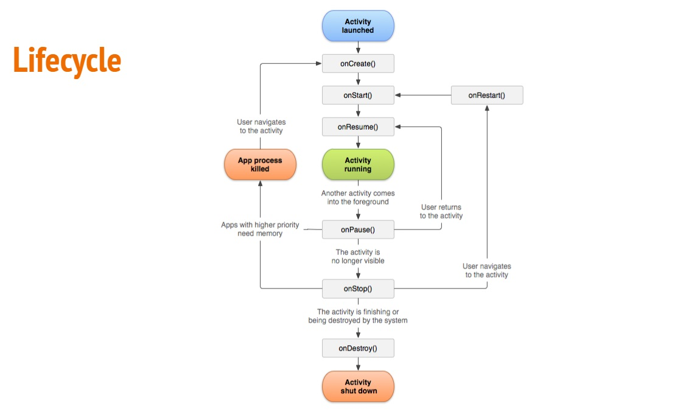

# Lifecycle

- Lifecycle
- Callback
  - onCreate()
  - onStart()
  - onResume()
  - onStop()
  - onRestart()
  - onDestroy()

## Lifecycle

- São **diferentes estados** no **ciclo de vida** de um **aplicativo**

- **Activity** fornece vários **callbacks** que permitem que a atividade saiba quando um **estado muda** ou que o **sistema está criando**
  - Programar como a atividade deve se comportar quando o usuário sai e retorna dela

- Callback do ciclo de vida pode ajudar seu app e evitar o seguinte:
  - **Falhas** se o usuário receber uma chamada telefônica ou mudar
  - **Consumo de recursos** importante do sistema quando o usuário não estiver usando ativamente o aplicativo
  - **Perda do progresso** do usuário se ele sair do aplicativo e retornar mais tarde
  - **Falhas ou perdas do progresso** do usuário quando a **orientação da tela mudar** entre paisagem e retrato
 
  

##onCreate()

- **Precisa ser implementado**
- **Acionado** assim que o sistem **cria a atividade**
- Acontece apenas **uma vez** durante toda a vida útil da atividade

##onStart()

- Essa chamada torna a **atividade visível para o usuário** enquanto o app se prepara para que a **atividade entre em primeiro plano** e se torne **interativa**.

