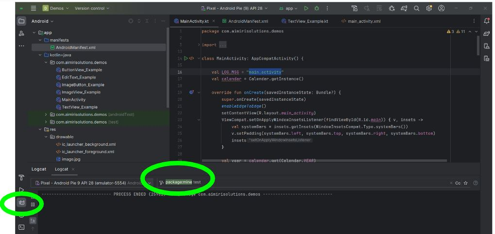

# Lifecycle

- Lifecycle
- Callback
  - onCreate()
  - onStart()
  - onResume()
  - onStop()
  - onRestart()
  - onDestroy()

## Lifecycle

- São **diferentes estados** no **ciclo de vida** de um **aplicativo**

- **Activity** fornece vários **callbacks** que permitem que a atividade saiba quando um **estado muda** ou que o **sistema está criando**
  - Programar como a atividade deve se comportar quando o usuário sai e retorna dela

- Callback do ciclo de vida pode ajudar seu app e evitar o seguinte:
  - **Falhas** se o usuário receber uma chamada telefônica ou mudar
  - **Consumo de recursos** importante do sistema quando o usuário não estiver usando ativamente o aplicativo
  - **Perda do progresso** do usuário se ele sair do aplicativo e retornar mais tarde
  - **Falhas ou perdas do progresso** do usuário quando a **orientação da tela mudar** entre paisagem e retrato
 
  


## onCreate()

- **Precisa ser implementado**
- **Acionado** assim que o sistem **cria a atividade**
- Acontece apenas **uma vez** durante toda a vida útil da atividade

```kotlin
class ImageButton_Example : AppCompatActivity(), View.OnClickListener{

  val LOG_MSG = "main_activity"
  lateinit var imageButton1: ImageButton

  override fun onCreate(savedInstanceState: Bundle?){
    super.onCreate(savedInstanceState)
    enableEdgeToEdge()
    setContentView(R.layout.imagebutton_example)

    imageButton1 = findViewById<ImageButton>(R.id.imagebutton1) as ImageButton
    imageButton1.setOnClickListener(this)
}

  override fun onClick(p0: View?){
    Log.d(LOG_MSG, "image button click")
  }
}
```

## onStart()

- Essa chamada torna a **atividade visível para o usuário** enquanto o app se prepara para que a **atividade entre em primeiro plano** e se torne **interativa**.

```kotlin

override fun onStart(){
  super.onStart()

  val year = calendar.get(Calendar.YEAR)
  val month = calendar.get(Calendar.MONTH)
  val day = calendar.get(Calendar.DAY_OF_MONTH)

  val hour = calendar.get(Calendar.HOUR_OF_DAY)
  val minute = calendar.get(Calendar.MINUTE)
  val second = calendar.get(Calendar.SECOND)

  Log.d(LOG_MSG, "onStart() " + day + "/" + month + "/" + year + " " + hour + ":" + minute + ":" + second)
}
```

- Essa chamada torna a **atividade visível para o usuário** enquanto o app se prepara para que a **atividade entre em primeiro plano** e se torne **interativa**.

## onResume()

- É nesse estado que o aplicativo interage com o usuário
- Permenece nesse estado até

  - Receber uma ligação
 
  - Navegar para outra atividade
 
  - Desligar tela/dispositivo
 
```kotlin

override fun onResume(){
  super.onResume()
  
  val year = calendar.get(Calendar.YEAR)
  val month = calendar.get(Calendar.MONTH)
  val day = calendar.get(Calendar.DAY_OF_MONTH)

  val hour = calendar.get(Calendar.HOUR_OF_DAY)
  val minute = calendar.get(Calendar.MINUTE)
  val second = calendar.get(Calendar.SECOND)

  Log.d(LOG_MSG, "onResume() " + day + "/" + month + "/" + year + " " + hour + ":" + minute + ":" + second)
}
```

```kotlin

class CameraComponent : LifecycleObserver{
  ...
  @OnLifecycleEvent(Lifecycle.Event.ON_RESUME)
  fun initializeCamera(){
    if(camera == null){
      getCamera()
    }
  }
  ...
}
```

## onPause()

- Sistema chama esse método como o primeiro indício de que o usuário está **saindo da atividade**
  - Nem sempre significa que a atividade vai ser destruída
 
- Indica que a atividade **não está mais em primeiro plano**, mas ainda está visível se o usuário estiver no modo de várias janelas
  - Enquanto a atividade estiver parcialmente visível, mais não for o foco, ela permanecerá pausada
 
```kotlin

override fun onPause(){
  super.onPause()
  
  val year = calendar.get(Calendar.YEAR)
  val month = calendar.get(Calendar.MONTH)
  val day = calendar.get(Calendar.DAY_OF_MONTH)

  val hour = calendar.get(Calendar.HOUR_OF_DAY)
  val minute = calendar.get(Calendar.MINUTE)
  val second = calendar.get(Calendar.SECOND)

  Log.d(LOG_MSG, "onPause() " + day + "/" + month + "/" + year + " " + hour + ":" + minute + ":" + second)
}
```

```kotlin

class CameraComponent : LifecycleObserver{
  ...
  @OnLifecycleEvent(Lifecycle.Event.ON_PAUSE)
  fun initializeCamera(){
    camera?.release()
    camera = null
  }
  ...
}
```

## onStop()

- Quando a atividade **não está mais visível** para o usuário
    - Recomendado **liberar ou ajustar recursos que não são necessários** enquanto o app não estiver visível
- Atividade entra no estado "Interrompido", o objeto Activity é mantido na memória e mantém todas as informações de estado e dos membros

## onDestroy()

Chamado antes de a atividade ser **destruída**
- A atividade está sendo concluída porque o usuário **descartou completamente a atividade** ou porque **finish() está sendo chamado** na atividade.

- O sistema está destruindo temporariamente a atividade devido a uma **mudança na configuração**, como a rotação do dispositivo ou a entrada no **modo de váiras janelas**


```kotlin

override fun onDestroy(){
  super.onDestroy()

  val year = calendar.get(Calendar.YEAR)
  val month = calendar.get(Calendar.MONTH)
  val day = calendar.get(Calendar.DAY_OF_MONTH)

  val hour = calendar.get(Calendar.HOUR_OF_DAY)
  val minute = calendar.get(Calendar.MINUTE)
  val second = calendar.get(Calendar.SECOND)

```

PS.: onDestroy()

- Pode-se usar um objeto ViewModel para conter os dados de visualização relevantes para a Activity. Se a Activity for recriada devido a uma mudança de configuração, a ViewModel não precisará fazer nada, já que será preservada e fornecida à próxima instância do Activity

```kotlin

class UserActivity:CompenentActivity{
  private val viewModel by viewModels<UserViewModel>()

  override fun onCreate(savedInstanceState: Bundle){
    super.onCreate(savedInstanceState)
    setContentView(R.layout.user_activity_layout)
    viewModel.user.observe(this) { user: User ->
      // update ui.
    }
    requireViewById(R.id.button).setOnClickListener{
      viewModel.doAction()
    }
}
}
```
```kotlin

class UserViewModel: ViewModel{
  private val userLiveDate = MutableLiveData<User>()
  val user: LiveData<User> get() = userLiveData

  init{
    //trigger user load.
  }

  fun doAction(){
    //depending on the action, do necessary business logic calls and update the
    //userLiveData.
}
}
```

Atividade

- Criar um aplicativo com os seguinte métodos overriden (pode escrever "on" e apertar ctrl+space para autocompletar):
  - onCreate(); onStart(); onResume(); onStop(); onDestroy(); onRestart()
- Adicione um Log.d("test",[nome do método]) em cada método
- Vá para o logcat e procure pela tag "test"



