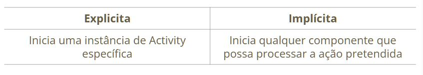
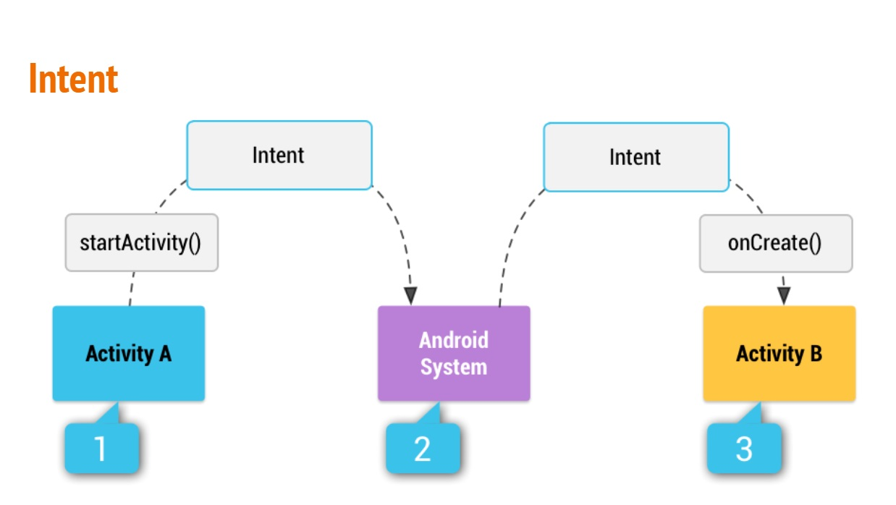

# Intents

- Leva o usuário **de uma atividade a outra**
- O app precisa usar uma Intent par adefinir a **"inteção" de fazer algo**
- Um **objeto de mensagens** que pode ser usado para **solicitar uma ação** de **outro componente** do app ou chamar **outra atividade**
- Uma Intent pode ser **explícita** ou **implícita**





## Intent - startActivity

- É utilizado para **chamar outra activity**
- Só tem **um argumento** que é uma intent

```kotlin
val intent = Intent(AlarmClock.ACTION_SET_TIMER).apply{
  putExtra(AlarmClock.EXTRA_MESSAGE, "Programação 3")
  putExtra(AlarmClock.EXTRA_LENGTH, 3)
  putExtra(AlarmClock.EXTRA_SKIP_UI, true)
}

if(intent.resolveActivity(packageManager)!= null){
  startActivity(intent)
}
```

- Podemos enviar dados para outra activity

```kotlin
val intent = Intent(AlarmClock.ACTION_SET_ALARM).apply{
  putExtra(AlarmClock.EXTRA_MESSAGE, "Programação 3")
  putExtra(AlarmClock.EXTRA_HOUR, 19)
  putExtra(AlarmClock.EXTRA_MINUTES, 0)
}

if(intent.resolveActivity(packageManager)!= null){
  startActivity(intent)
}
```

## Intent -startActivity -> resolveActivity

- Uma exception é lançada quando o sistema não encontra uma activity ou ação
  -  Por isso é boa prática utilizar o resolveActivity
 
```kotlin
val intent = Intent(AlarmClock.ACTION_SET_ALARM).apply{
  putExtra(AlarmClock.EXTRA_MESSAGE, "Programação 3")
  putExtra(AlarmClock.EXTRA_HOUR, 19)
  putExtra(AlarmClock.EXTRA_MINUTES, 0)
}

// resolveActicity
if(intent.resolveActivity(packageManager)!= null){
  startActivity(intent)
}
```  

## Intent Implícitas

- Não especifica um componente específico. Isso quer dizer que **qualquer aplicativo** pode **realizar uma ação** desde que esteja **habilitado** para esta função.
- Tipos de ações comuns
  - Criar um despertador
  - Criar um timer
  - Exibir todos os alarmes
  - Adicionar um evento à agenda
  - Capturar uma imagem ou um vídeo e retorná-lo
  - Selecionar um contato
  - Recuperar um tipo específico de arquivo
  - Exibir um local em um mapa
  - Reproduzir um arquivo de mídia
  - Iniciar uma chamada telefônica
  - Carregar um URL da Web

## Intent Implícitas - Criar um despertador

- Atividade
  - Criar um aplicativo com um botão com o seguinte código no método onClick() -> when()
 
```kotlin
R.id.create_alarm -> {
  Log.d(LOG_MSG, "create alarm")
  val intent = Intent(AlarmClock.ACTION_SET_ALARM).apply{
    putExtra(AlarmClock.EXTRA_MESSAGE, "Programação 3")
    putExtra(AlarmClock.EXTRA_HOUR, 19)
    putExtra(AlarmClock.EXTRA_MINUTES, 0)
  }
  if(intent.resolveActivity(packageManager)!=null){
    startActicity(intent)
  }
}
```

## Intent Implícitas - Criar um timer

```kotlin
R.id.create_timer -> {
  val intent = Intent(AlarmClock.ACTION_SET_TIMER).apply{
    putExtra(AlarmClock.EXTRA_MESSAGE, "Programação 3")
    putExtra(AlarmClock.EXTRA_LENGTH, 3)
    putExtra(AlarmClock.EXTRA_SKIP_UI, true)
  }
  if(intent.resolveActivity(packageManager)!=null){
    startActicity(intent)
  }
}
```

## Intent Implícitas - Criar uma agenda

```kotlin
R.id.create_agenda -> {
  val intent = Intent(Intent.ACTION_INSERT).apply{
    data = CalendarContract.Events.CONTENT_URI
    putExtra(CalendarContract.Events.TITLE, title)
    putExtra(CalendarContract.Events.EXTRA_LOCATION, "my place")
    putExtra(CalendarContract.Events.EXTRA_EVENT_BEGIN_TIME, 20.5)
    putExtra(CalendarContract.Events.EXTRA_EVENT_END_TIME, 22)
  }
  if(intent.resolveActivity(packageManager)!=null){
    startActicity(intent)
  }
}
```

## Intent implícitas - Tirar uma foto

- Atividade
  - Criar um aplicativo com um botão com o seguinte código criação declaração das variáveis
 
```kotlin
private val PIC_LAUNCHER: ActivityResultLauncher<Void?> =
  registerForActivityResult(ActivityResultContracts.TakePicturePreview()){
    image: Bitmap? ->
    image?.let{
      take_pic_preview.setImageBitmap(image)
}
}
```
- Crie um botão com o seguinte código no método onClick() -> when()

```kotlin
R.id.pic -> {
  PIC_LAUNCHER.launch(null)
}
```

