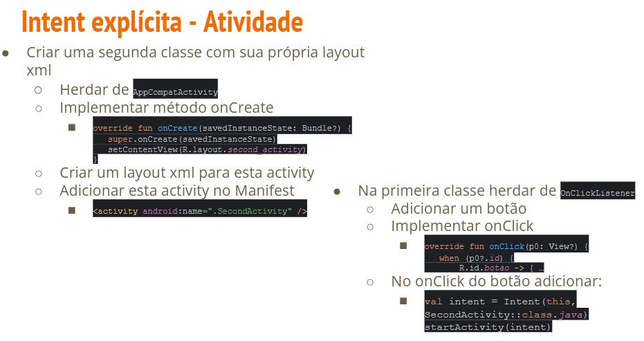
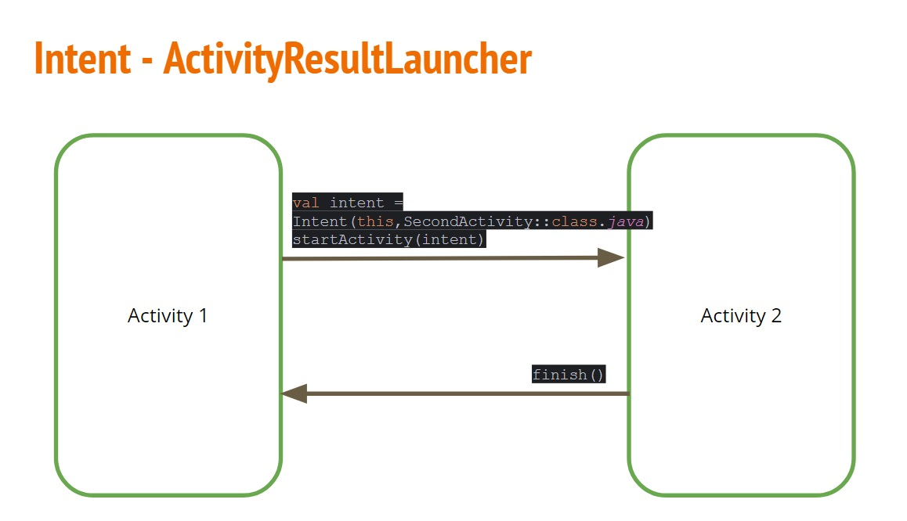
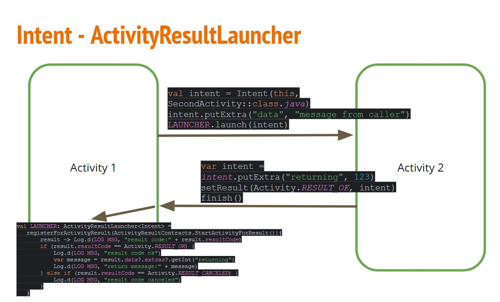
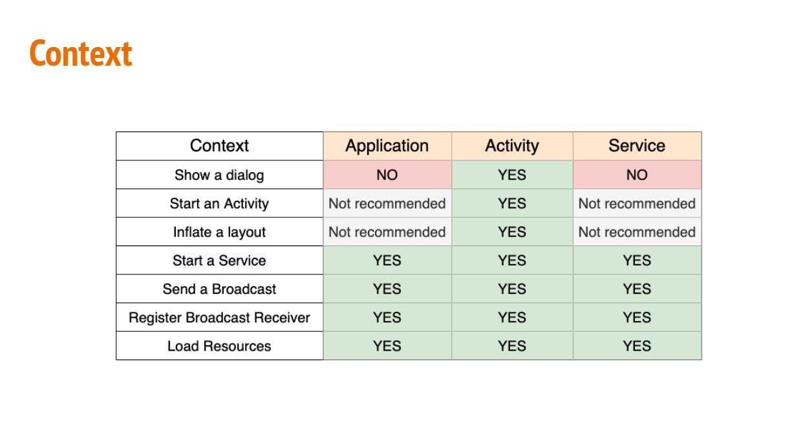
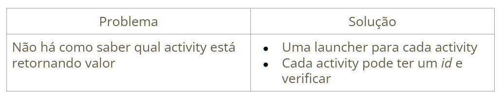
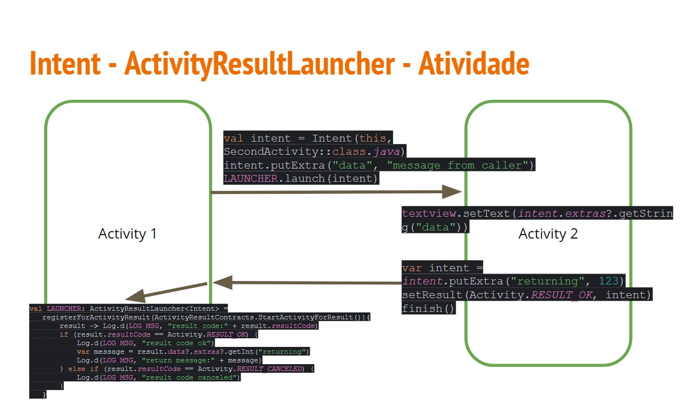

# Intent Explícita

- É quando passamos um component explicitamente

```kotlin
R.id.second_activity -> {
  val intent = Intent(this, SecondActivity::class.java)
  startActivity(intent)
}
```

- Podemos utilizar o startActivitiy() em uma intent explícita

- No intent podemos enviar mensagens através do putExtra

```kotlin
R.id.second_activity -> {
  val intent = Intent(this, SecondActivity::class.java)
  intent.putExtra("data","massage from caller")
  startActivity(intent)
}
```


  
- Mas e quano queremos obter um retorno de uma outra activity?

## Intent - ActivityResultLauncher

- É utilizado para **chamar outra activity** e pegar um resultado de volta

```kotlin

val LAUNCHER: ActivityResultLauncher<Intent> =
  registerForActivityResult(ActivityResultContracts.StartActivityForResult()){
    result ->
    if(result.resultCode == Activity.RESULT_OK){

}else if(result.resultCode == Activity.RESULT_CANCELED){

}
}
```

- Para chamar é só utilizar launch

```kotlin

val intent = Intent(AlarmClock.ACTION_SET_TIMER).apply{
  putExtra(AlarmClock.EXTRA_MESSAGE, "Programação 3")
  putExtra(AlarmClock.EXTRA_LENGTH, 3)
  putExtra(AlarmaClock.EXTRA_SKIP_UI, true)
}
LAUNCHER.launch(intent)
```

- startActivity() VS lauch

```kotlin
R.id.second_activity -> {
  val intent = Intent{this, SecondActivity::class.java)
  intent.putExtra("data","message from caller")
  startActivity(intent)
}

R.id.second_activity_return ->{
  Log.d(LOG_MSG,"second_activity_return")
  val intent = Intent(this,SecondActivity::class.java)
  intent.putExtra("data","message from caller")
  LAUNCHER.launch(intent)
}
```

### Intent - ActivityResultLauncher

- Para capturar mensagem

```kotlin
textview = findViewByI(R.id.textview)

textview.setText(intent.extra?.getString("data"))
```

- Para enviar uma mensagem de volta

```kotlin
R.id.back_data ->{
  var intent = intent.putExtra("returning",123)
  setResult(Activity.RESULT_OK,intent)
  finish()
}
```

- Para capturar uma mensagem de volta

```kotlin
val LAUNCHER: ActivityResultLauncher<Intent> =
  registerForActivityResult(ActivityResultContracts.StartActivityForResult()){
    result -> Log.d(LOG_MSG,"result code:" + result.resultCode)
    if(result.resultCode == Activity.RESULT_OK){
      Log.d(LOG_MSG, "result code ok")
      var message = result.data?.extras?.getInt("returning")
      Log.d(LOG_MSG,"return_message:" + message)
  }else if(result.resultCode == Activity.RESULT_CANCELED){
      Log.d(LOG_MSG,"result code canceled")
  }
}
```





## Context

- **Ponto de acesso** para **informação globais** sobre um ambiente de **aplicativo**
- **Classe abstrata** cuja implementação é **fornecida** pelo sistema **Android**
- **Permite acesso a recursos e classes específicas** de aplicativo, bem como chamadas para operações em nível de aplicativo como **iniciar activities, enviar ou receber intents por broadcast, etc.
- Podemos utilizar:
  -  this
  -  getApplicationContext()
- **Classes base** para **Activity, Service, Application, Context, Broadcast receiver**



## Intent Explícita

- Problemas com ActivityResultLauncher





