# Data management

- Armazenamento específico do app

- Armazenamento compartilhado
  
- Preferências
  
- Bancos de dados

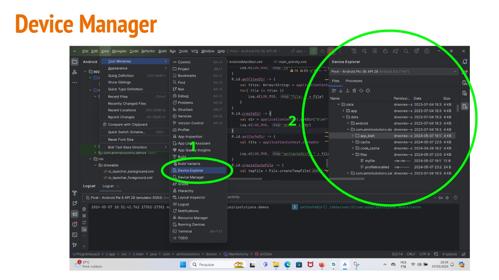

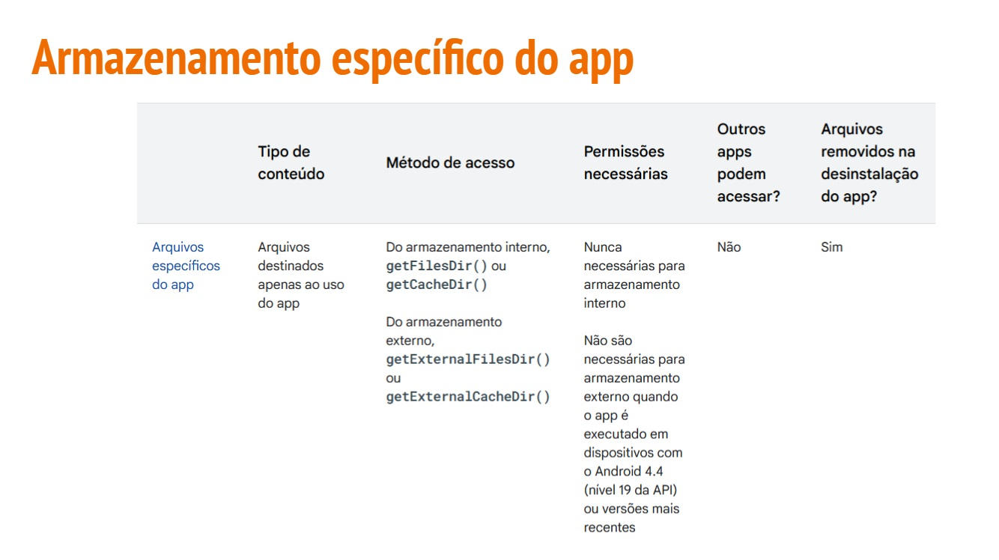

## Armazenamento específico do app

- **Armazenamento interno**

  - Incluem um **local dedicado** para **armazenar arquivos persistentes** e outro para **armazenar dados em cache**
 
  - **Outros apps** são **impedidos de acessar esses locais**
 
  - No Android 10 (**API de nível 29**) e versões **mais recentes**, esses locais são **criptografados**
 
    - Bom lugar para **guardar informações sensíveis** ou **temporárias**
   
  - Utiliza memória interna do dispositivo
 
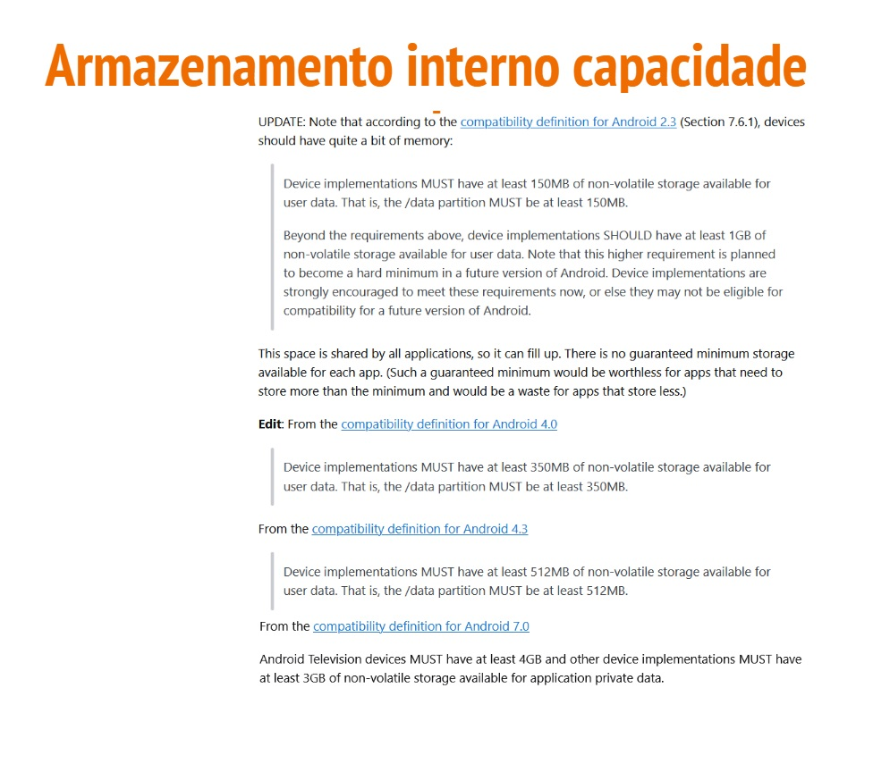

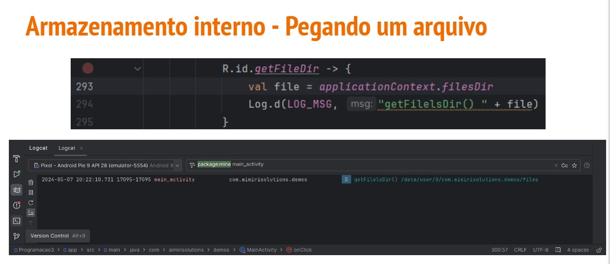

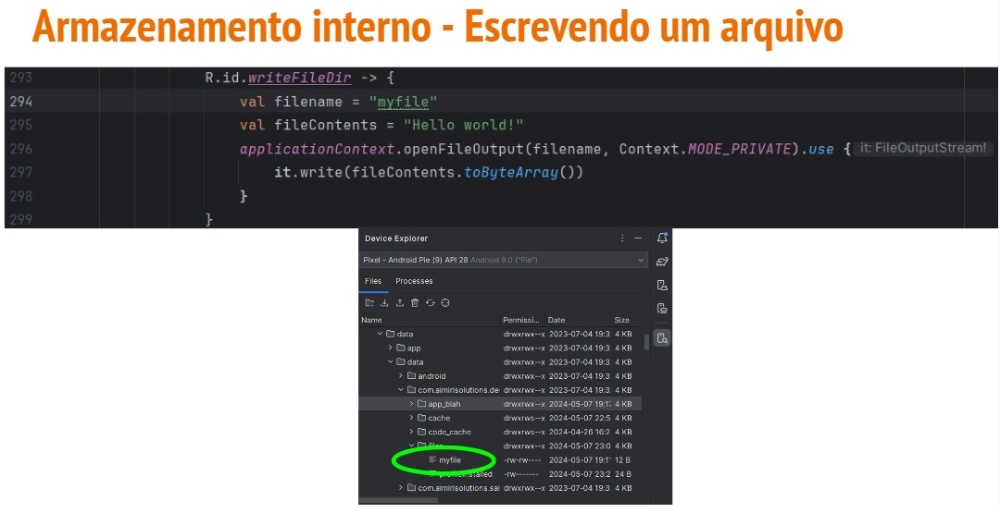

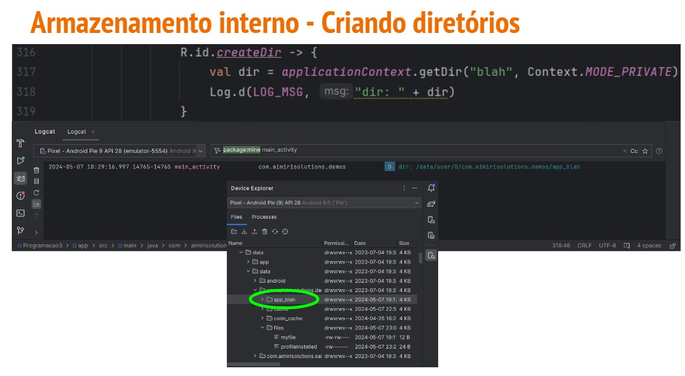

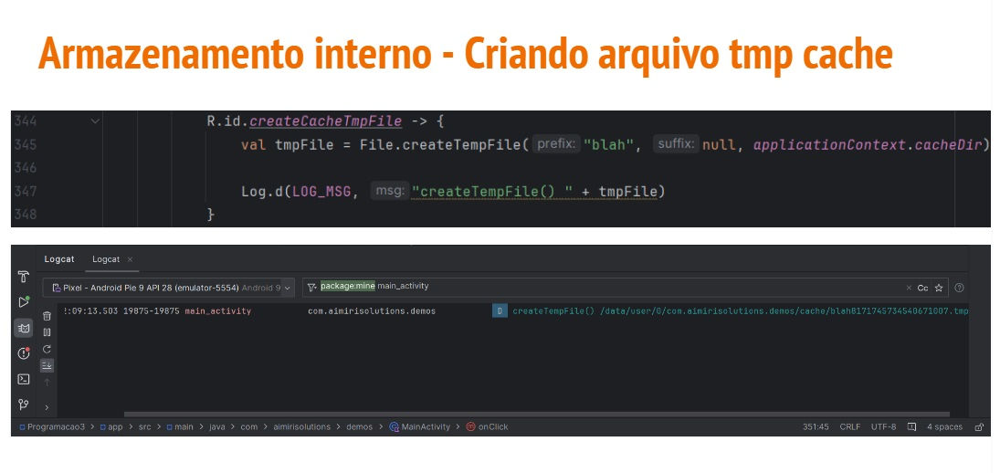

## Armazenamento específico do app

- **Armazenamento Externo**

  - Incluem um **local dedicado** para **armazenar arquivos persistentes** e outro para **armazenar dados em cache**
 
  - Outros **apps podem acessar** esses locais com as **devidas permissões**
 
    - App precisa armazenar na parte de armazenamento compartilhado doi armazenamento externo
   
  - É **recomendado** verificar se o armazenamento externo está disponível
 
  - A fim de manter o bom desempenho do app, **não abra e feche o mesmo arquivo várias vezes**

- **Armazenamento Externo**

  - Utiliza memória externa do dispositivo
    - Sdcard
   

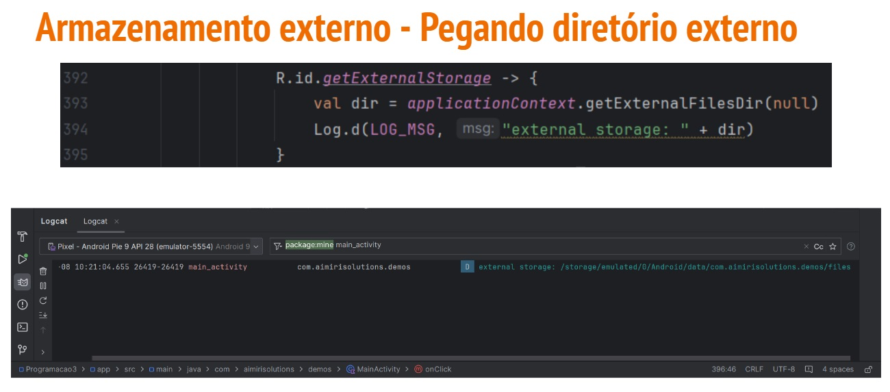

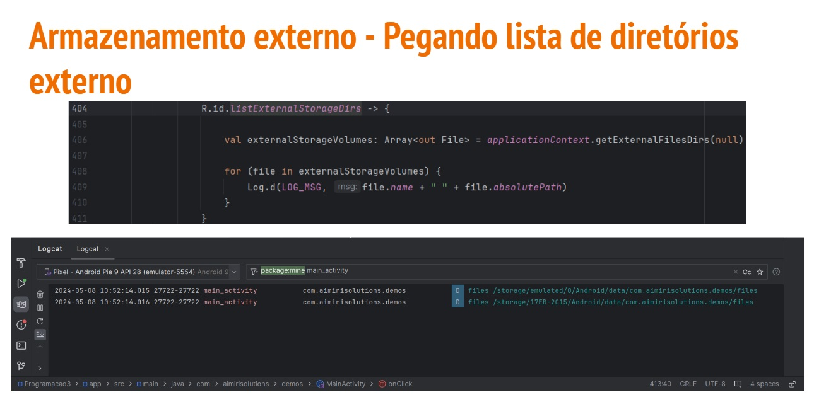

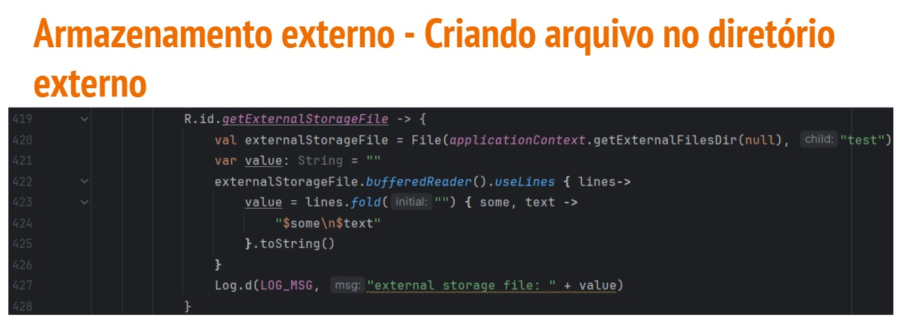

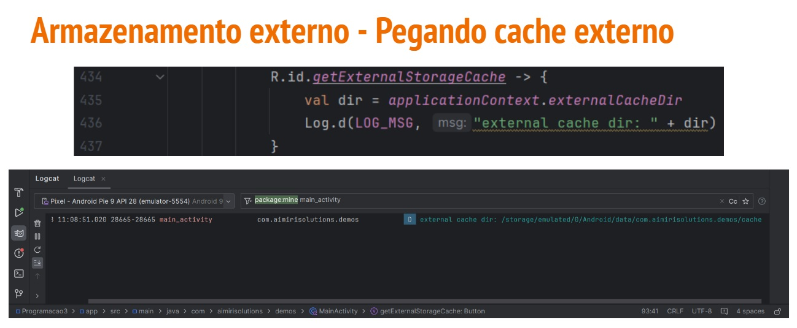

