# Data Management

- Armazenamento específico do app
- Armazenamento compartilhado
- Data store
  - Preferences DataStore
  - Proto DataStore
- Bancos de dados

## DataStore

- **Biblioteca de armazenamento** de dados lançada pela Google como uma alternativa ao SharedPreferences

- Oferece uma maneira mais **robusta** e **fácil** de usar para **armazenar** e **recuperar** dados de forma **assíncrona**

- Oferece dois tipos de armazenamento
  - Preference DataStore
  - Proto DataStore
 
## Preference DataStore

- **Armazena** e **acesa** dados usando **chaves**
  - Essa implementação não requer um esquema predefinido e não fornece segurança de tipo.

- Parecido com SharedPreferences porém com melhorias como:
  - Salva de modo **assíncrono**
  - Captura **exceções**
  - **Consistência** dos dados
    - Leitura sempre vai refletir o valor atualizado
  - Suporte a migração
 
## Preferências

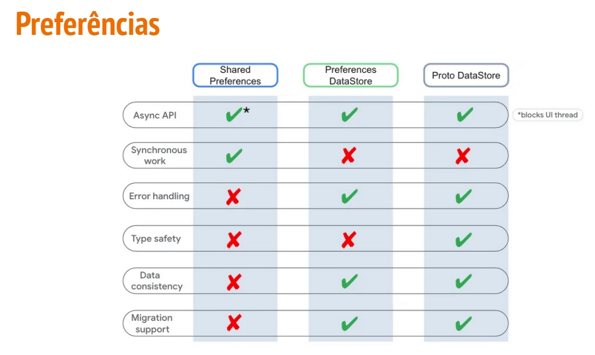

## Flow e Suspend

- **Flow**
  - É uma co-rotina que pode emitir vários **valores sequencialmente**
    - É um **stream de dados** que pode ser computado de forma **assíncrona**
   
  - São criados com base nas **co-rotinas** e podem fornecer vários valores
  - Os valores emitidos precisam ser do mesmo tipo

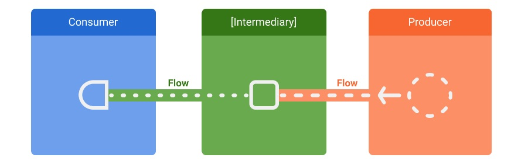

- **Suspend**

  - É uma função normal que pode ser suspensa e retomada novamente mais tarde
    - As funções de suspensão só podem ser chamadas usando outras funções desse tipo que disponibilizem esse recurso ou outra co-rotina
   
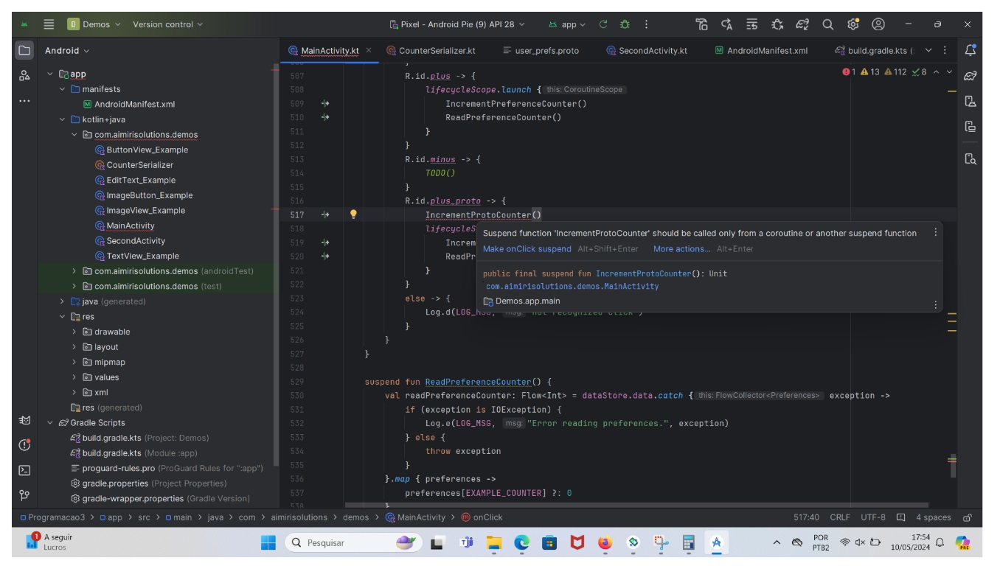

## LifecycleScope

- Forma de chamar uma co-rotina
- Qualquer co-rotina iniciada nesse escopo será cancelada quando o Lifecycle for destruído

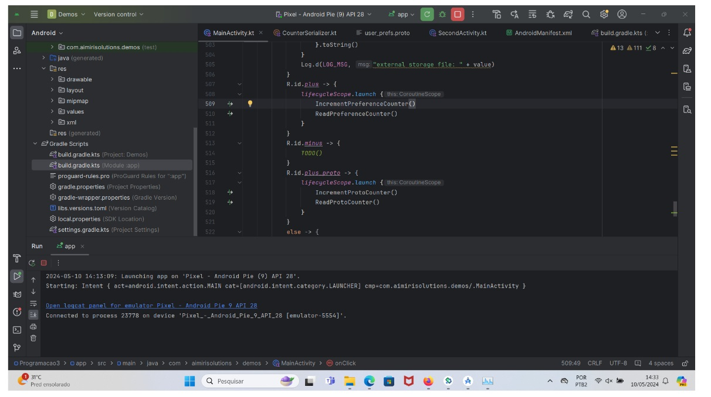

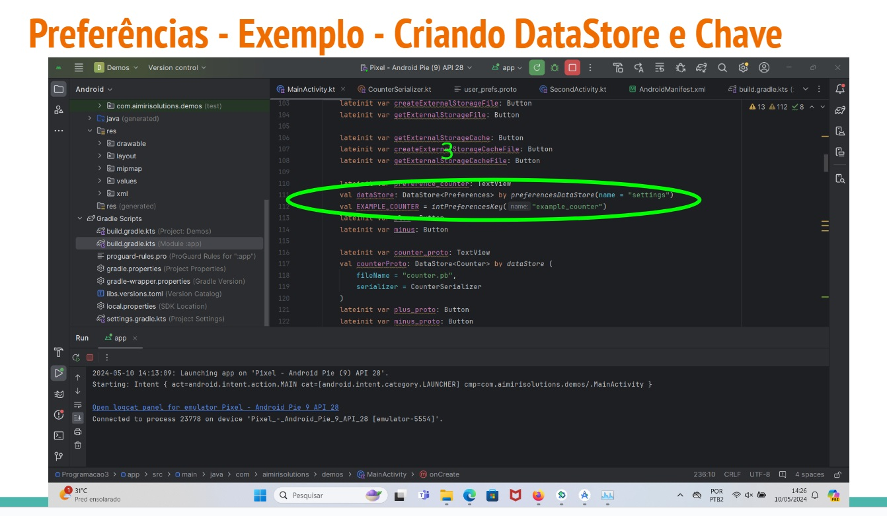

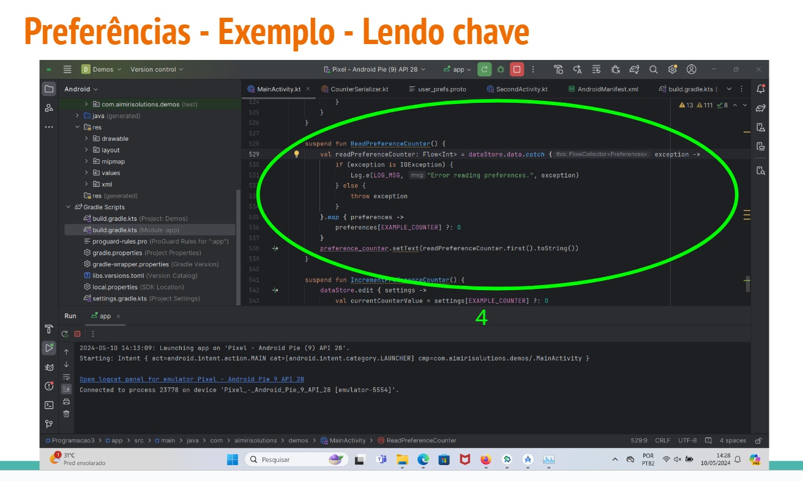

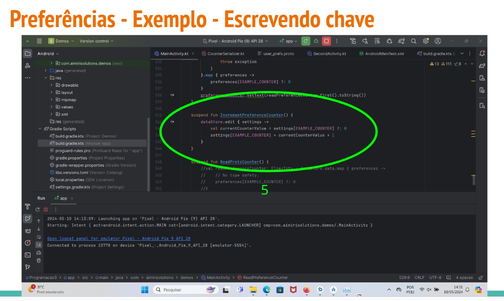

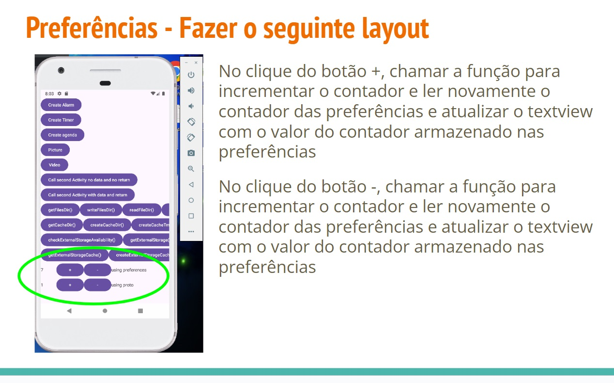

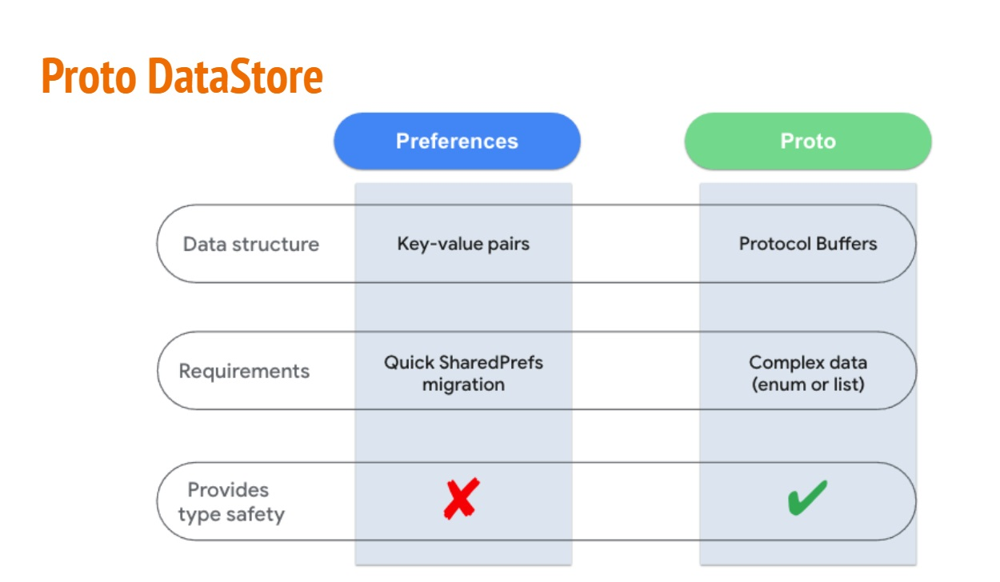

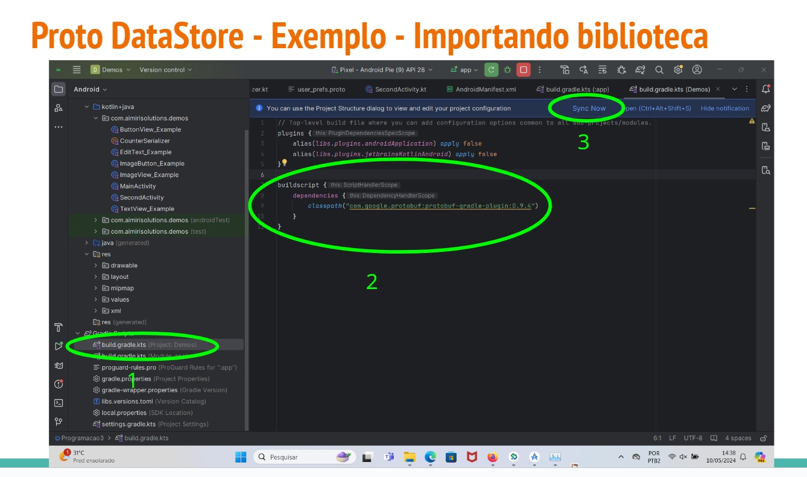

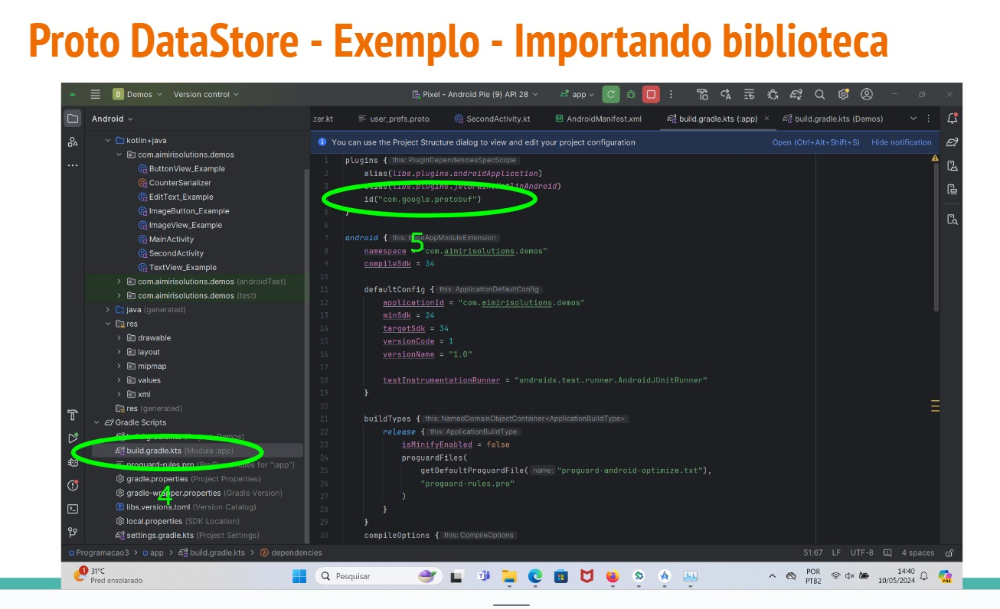

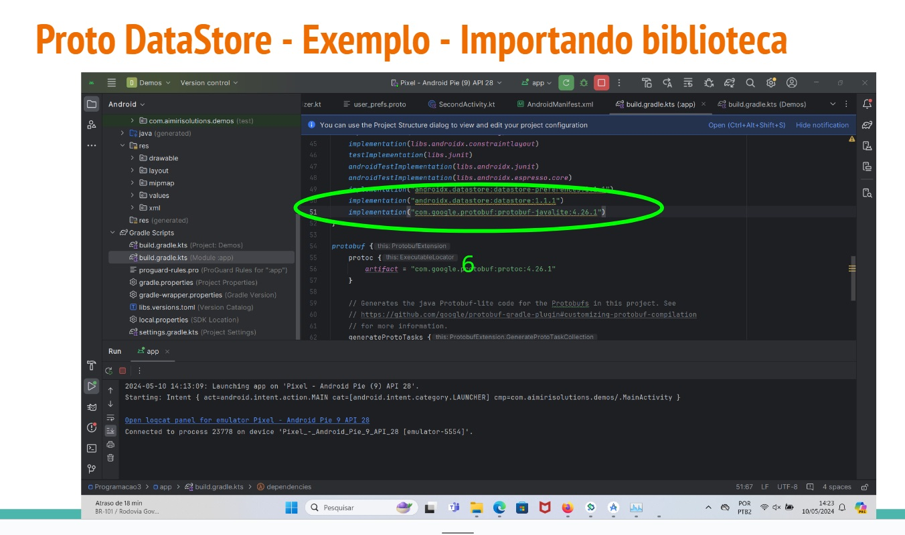

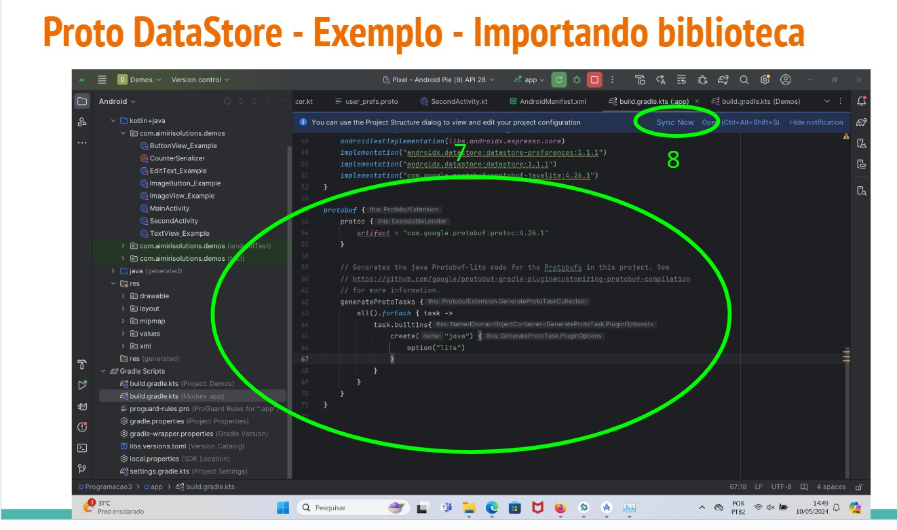

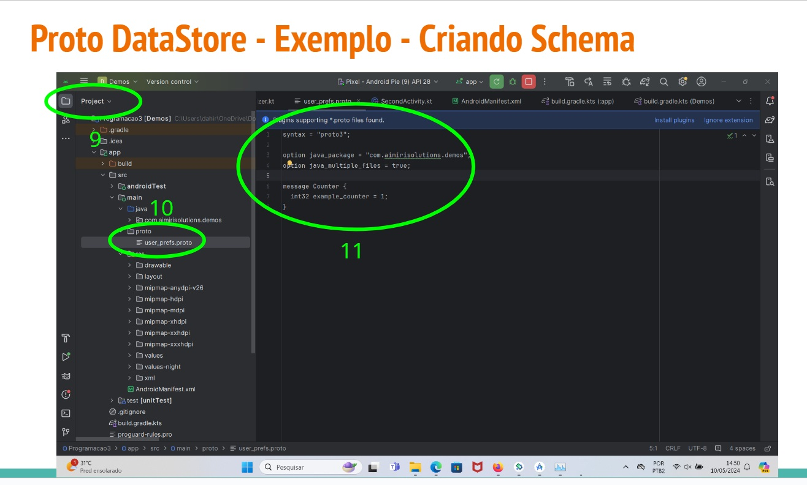

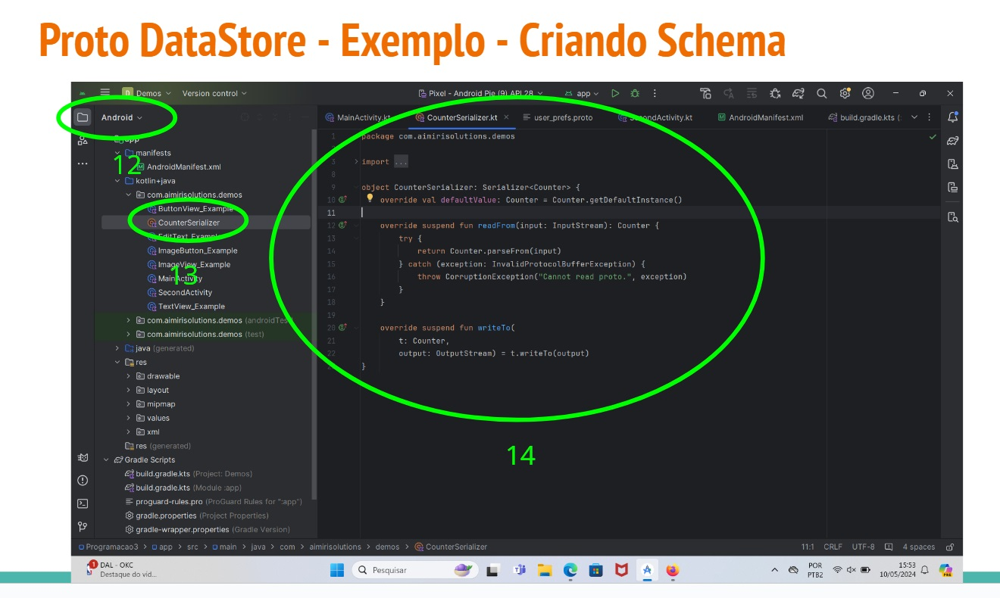

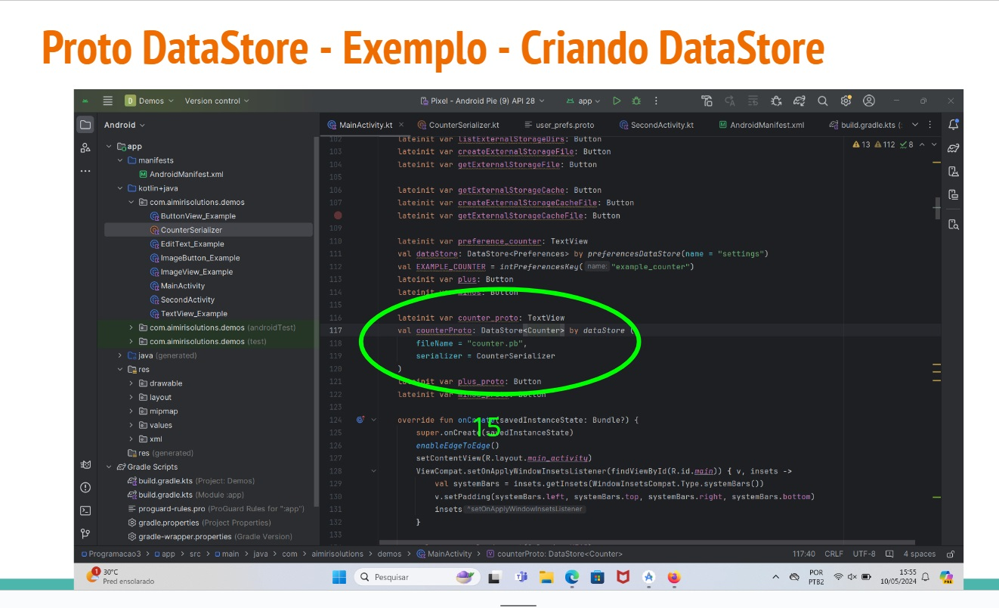

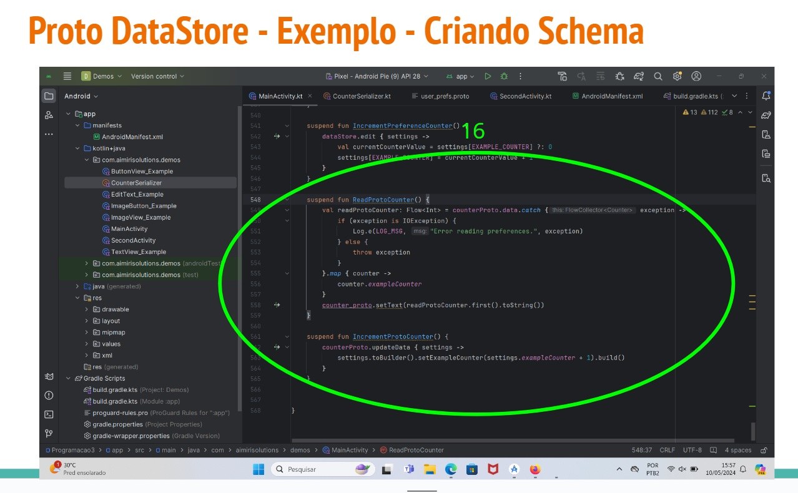

