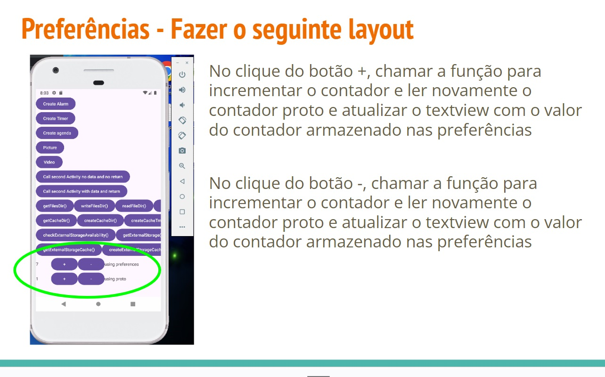

# Room DB + Background processing 1/2

- Banco de dados
  - Room
- Background processing
  - lifeCycleScope
  - Suspend
 
# Room

- Oferece uma **camada de abstração** sobre o **SQLite** para permitir acesso fluente ao banco de dados, aproveitando toda a capacidade do SQLite

- Cria uma abstração das camadas de banco de dados (SQLite). Possui 3 componentes principais:
  - **Entity**
    - Representam **tabelas** no banco de dados do app.
  - **Dao (Data Access Object)**
    - **CRUD** - Fornecem métodos que o app pode usar para consultar, atualizar, inserir e excluir dados do banco de dados
    - **Database**
      - Contém o **banco de dados** e serve como o ponto de acesso principal para a conexão com os dados persistidos do app

