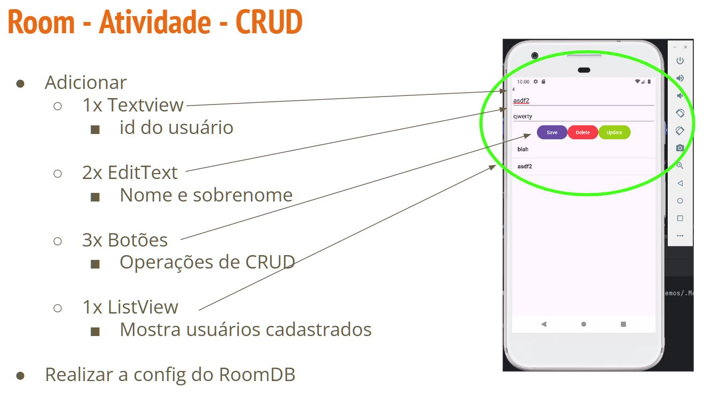
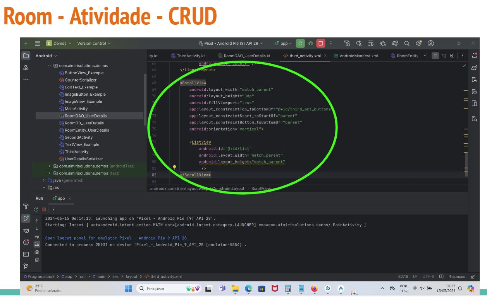
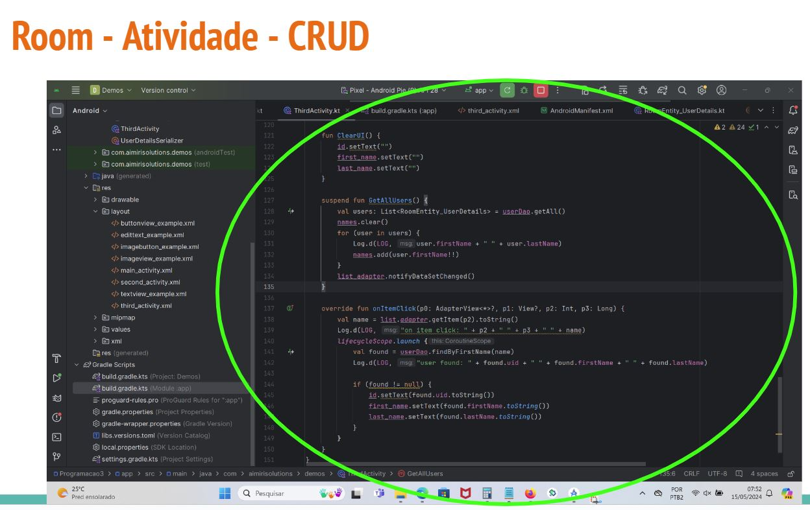
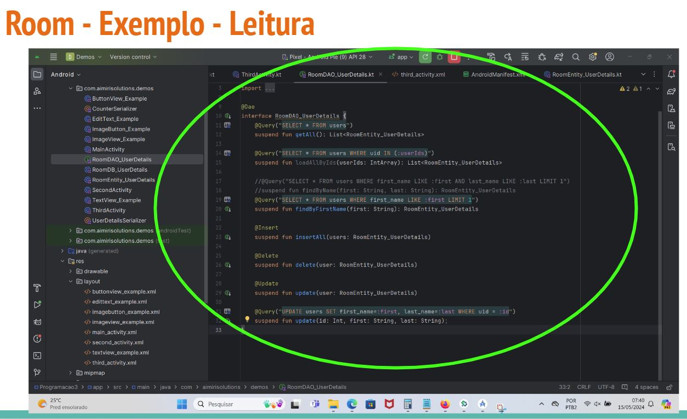
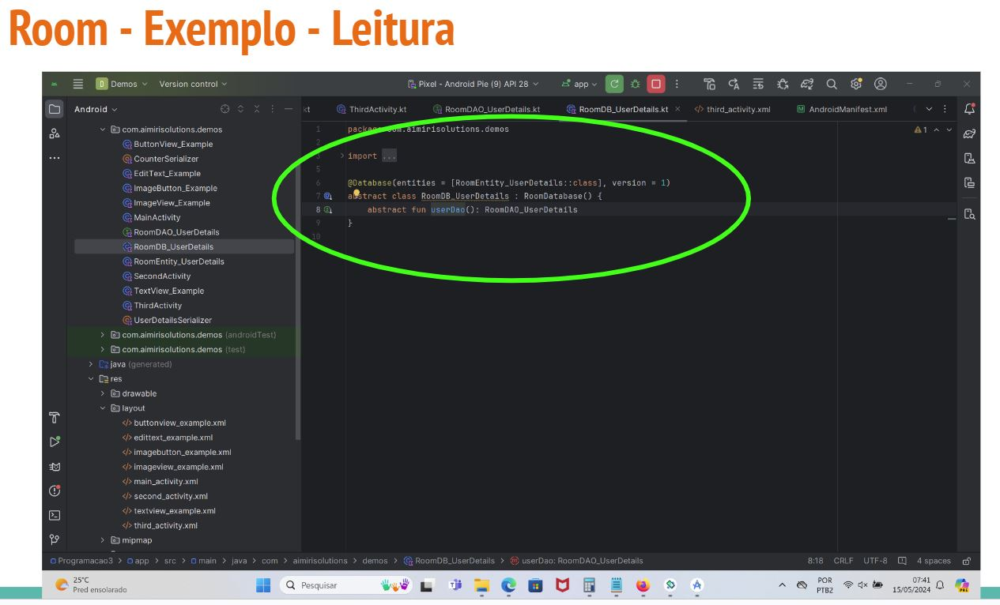
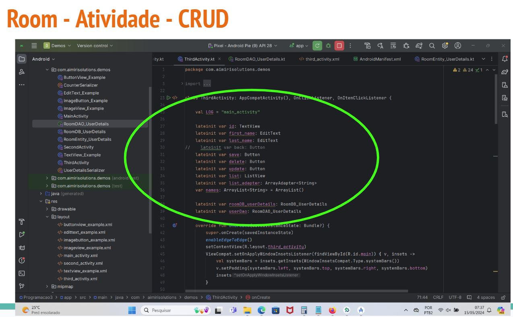
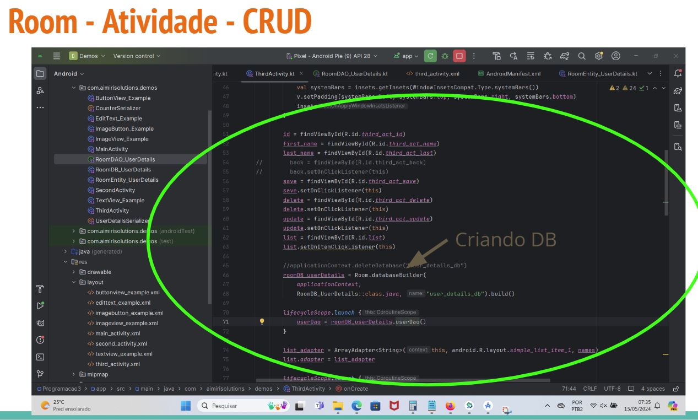
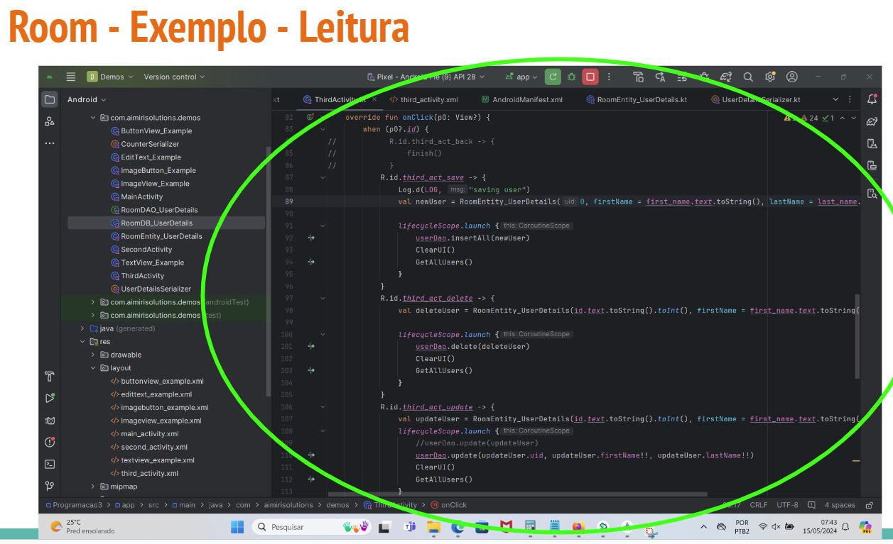
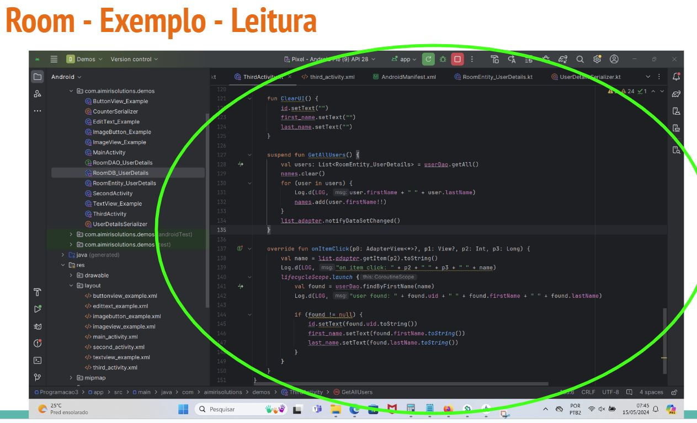

# Background Processing


## Room - Background processing

- É a **execução de tarefas e operações** que ocorre **independente** da thread principal (**UI thread**)

- São **tarefas** que envolvem **muito tempo de execução** tais como:
  - Requisição web
  - Requisição DB
  - Operações de arquivo

- Assegura que a interface se mantenha **responsiva e sem travamento**

- Aysnchronous Programming in Kotlin
  - Programação assíncrona permite que tarefas sejam executadas ao mesmo tempo sem bloquear a thread principal

- Kotlin fornece vários meios de programação assíncrona tais como:
  - Subrotinas
    - Funções suspend
  - AsyncTask
  - Handlers e loopers
 
### Escopo Subrotina

- Os componentes com reconhecimento de ciclo de vida definem os seguintes escopos integrados que você pode usar no saeu app

  - **ViewModelScope**
    - É definido para cada ViewModel no app
   
  - **LifecycleScope**
    - É definido para cada objeto Lifecycle ou seja qualquer subrotina iniciada nesse escopo será **cancelada quando o seu Lifecycle** (código a ser executado) for **concluído**
   
  - **Livedata**
    - É uma classe armazenadora de dados observáveis
      - Conta com reconhecimento de ciclo de vida, ou seja, ele respeita o ciclo de vida de outros componentes do app, como atividades, fragmentos ou serviços desta forma **atualiza apenas os observadores de componentes do app que estão em um estado ativo no ciclo de vida**
     
### Suspend

- São funções que podem ser pausadas e continuadas sem travar a thread que a chamou

- Funções suspend só podem ser chamadas por outras funções suspend ou subrotinas

```kotlin

supend fun fetchUserData(): String{
  //Perform network request
  delay(1000) //Simulate delay
  return "User data"
}
```

```kotlin
  lifecycleScope.launch{
    val userData = fetchUserData()
    //Update UI with user data
}
```




















