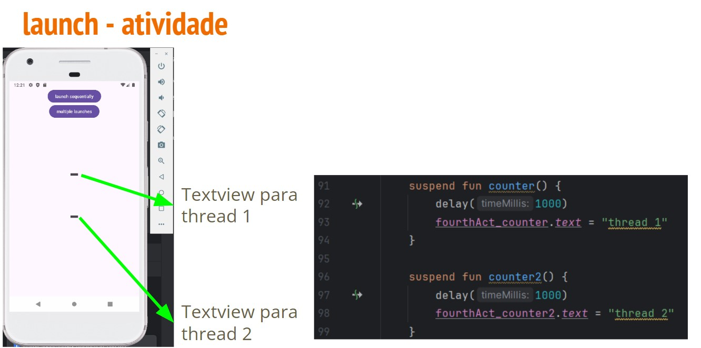
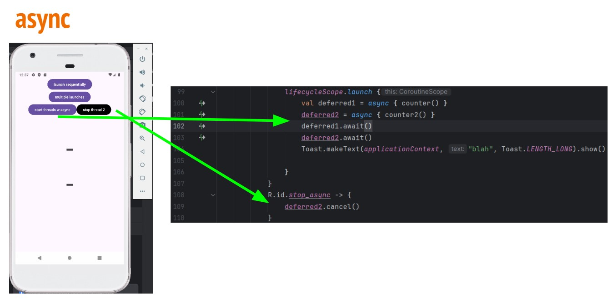
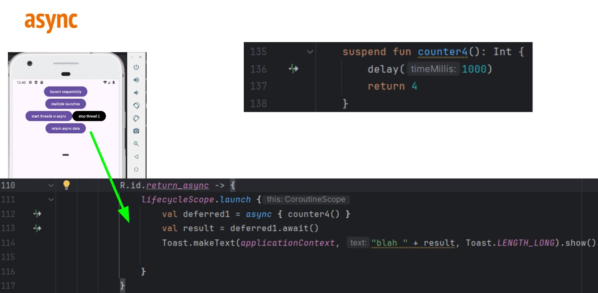
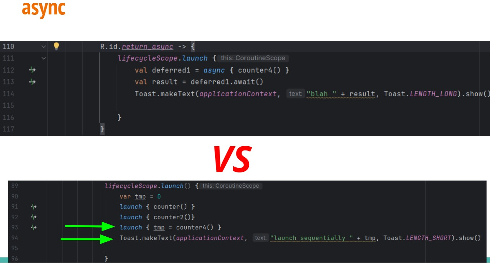
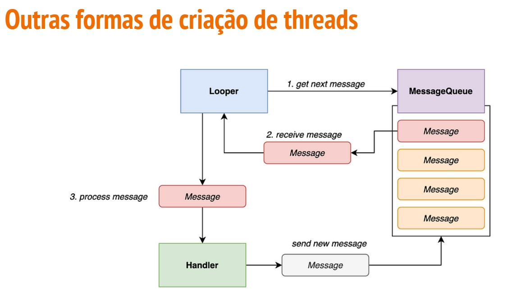
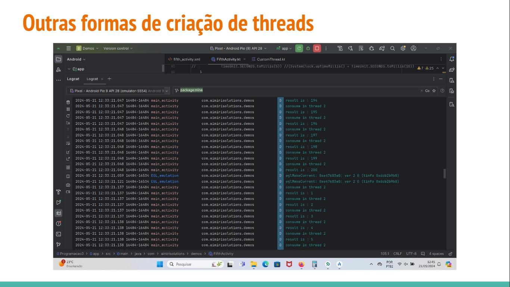

- Background processing
  - Async e await
  - Handlers e looper

## launch

- Inicia uma nova sub-rotina e não retorna o resultado para o autor da chamada. Qualquer trabalho que seja considerado "**disparar e esquecer**" pode ser iniciado usando launch.

 ```kotlin

  lifecycleScope.launch(){
    counter()
  }

```

- Qual vai ser o resultado do seguinte código

```kotlin

  lifecycleScope.launch(){
    counter()
    counter2()
}
```

## Atividade



- No clique do primeiro botão

```kotlin

lifecycleScope.launch(){
  counter()
  counter2()
  Toast.makeText(applicationContext,"launch sequentially", Toast.LENGHT_SHORT).show()
```

- No clique do segundo botão


```kotlin

lifecycleScope.launch(){
  launch(counter())
  launch(counter2())
  Toast.makeText(applicationContext,"launch sequentially", Toast.LENGHT_SHORT).show()
```
  
## async

- Inicia uma nova sub-rotina e permite retornar o resultado com uma função de suspensão chamada **await**

```kotlin
lifecycleScope.launch{
  val deferred1 = async { counter()}
  deferred2 = async { counter2()}
  deferred1.await()
  deferred2.await()
}
```

- Podemos cancelar uma async chamando o cancal()

```kotlin
deferred2.cancel()
```







## Criando seu próprio escopo

```kotlin
class ExampleClass{
//Job and Dispatcher are combined into a CoroutineContext which
//wii be discussed shortly

val scope = CoroutineScope(Job() + Dispatchers.Main)

fun exampleMethod(){
  //Starts a new coroutine within the scope
  scope.launch{
    //New coroutine that can call suspend functions
    fetchDocs()
  }
}

fun cleanUp(){
  // Cancel the scope to cancel ongoing coroutines work
 scope.cancel()
}
}
```

## Nomeando sua sub-rotina

```kotlin
class ExampleClass{
  val scope = CoroutineScope(Job() + Dispatchers.Main)
  fun exampleMethod(){
    //Starts a new coroutine on Dispatchers.Main as it's the scope's default
    val job1 = scope.launch{
      //New coroutine with CoroutineName = "coroutine" (default)
    }

    //Starts a new coroutine on Dispatchers.Default

    val job2 = scope.launch(Dispatchers.Default + CoroutineName("BackgroundCoroutine")){
        //New Coroutine with CoroutineName = "BackgroundCoroutine" (overridden)
    }
}
}
```

## Outras formas de criação de threads

- runnable
  - É uma interface que requer implementação do método run():
 
```kotlin
val runnable = object:Runnable{
    override fun run(){
      for(i in 1 <= ... <= 100){
        println("first runnable value: $i")
      }
}
}
```

- Para executar a thread:

```kotlin
runnable.run()
```

## Outras forma de criaçaõ de threads

- handler
  - Encarregado de enviar mensagens entre threads. Para isso precisa de um runnable
      - post, sendMessage, postDelayed

- looper
  - Encarregado de executar as mensagens de um thread
 
- messageQueue
  - lista de mensagens para serem executadas no looper
 


- Criação do handler simples

```kotlin
private fun addRunnableToCurrentThreadMessageQueue(runnable: Runnable, looper: Looper, ToMillis: Long){
  val handler = Handler(looper)
  Log.d(LOG, "thread state: ${looper.thread.state}")
  handler.postDelayerd(runnable, toMillis)
  //handler.postAtTime(runnable, toMillis)
  //handler.post(runnable)
}
```

- Chamando a função para criar a thread

```kotlin
addRunnableToCurrentThreadMessageQueue(
  runnable = myRunnable(),
  looper = Looper.getMainLooper(),
  TimeUnit.SECONDS.toMillis(5)//(SystemClock.uptimeMillis() + TimeUnit.SECONDS.toMillis(10))
```

- Executando em uma nova thread

```const val MSG_DATA_VALUE = "value"

class CustomThread{
  private lateinit var thread: Thread

  fun initThread(handler: Handler){
    thread = Thread{
      var result = 0L
      for (value in 100 <= .. <= 200){
        result = value.toLong()
        val executionResult = Message().apply {data = bundleOf(MSG_DATA_VALUE to result)}
        handler.sendMessage(executionResult)
      }
}
thread.start()
}
}
```

- Executando em uma nova thread

```kotlin
private fun initCustomThreadFlow(){
  val customThread = CustomThread()
  val handler = Handler(Looper.getMainLooper()){ message -> Log.d(LOG,"consume in thread ${Looper.getMainLooper().thread.id}")
  val result = message.data.getLong(MSG_DATA_VALUE)
  Log.d(LOG,"result is : $result")
  true
}
customThread.initThread(handler)
handler.postDelayed(myRunnable(handler),5) // <- Enviando uma nova mensagem para a thread!!!
}
```



## Atividade 1

- Criar uma função que torna um runnable. Esta função tem um for de 1 - 100
  - Chame esta função no onCreate e veja o resultado no logcat
    
  ```kotlin
  fun myRunnable(){
    val runnable = object : Runnable {
      override fun run() {
        for (i in 1..10){
          println("value: $i")
        }
      }
  }
  runnable.run()
  }
  ```

## Atividade 2

- Criar uma função para postegar uma execução de um thread

```kotlin
private fun addRunnableToCurrentThreadMessageQueue(runnable: Runnable, looper: Looper, toMillis: Long){
  val handler = Handler(looper)
  Log.d(LOG, "thread state: ${looper.thread.state}")
  handler.postDelayed(runnable,toMillis)
  //handler.postAtTime(runnable, toMillis)
  //handler.post(runnable)
}
```

- Chamar esta função no oncreate com o seguinte código

```kotlin
addRunnableToCurrentThreadMessageQueue(
  runnable = myRunnable(),
  looper = Looper.getMainLooper(),
  TimeUnit.SECODS.toMillis(5)//(SystemClock.uptimeMillis() + TimeUnit.SECONDS.toMillis(10))
```

## Atividade 3

- Criar uma classe para trocar de mensagem entre a thread e o handler

```kotlin
const val MSG_DATA_VALUE = "value"

class CustomThread {
  private lateinit var thread: Thread

  fun initThread(handler: Handler){
    thread = Thread{
      var result = 0L
      for (value in 100<= ..<= 200){
        result = value.toLong()
        val executionResult = Message().apply{data = bundleOf(MSG_DATA_VALUE to result)}
        handler.sendMessage(executionResult)
    }
}
thread.start()
}
}
```

- Crie uma função para iniciar sua custom thread e trocar mensagem com o handler
  - Chame esta função no onCreate e veja o resultado
 
```kotlin
private fun initCustomThreadFlow(){
  val customThread = CustomThread()
  val handler = Handler(Looper.getMainLooper()){message ->
    Log.d(LOG,"consume in thread ${Looper.getMainLooper().thread.id}")
    val result = message.data.getLong(MSG_DATA_VALUE)
    Log.d(LOG,"result is : $result")
    true
}
customThread.initThread(headler)
}
```

- Envie através do handler com um delay de 5 miliseconds o runnable criado na etapa anterio
  - Chame esta função no onCreate e veja o resultado
 
```kotlin
private fun initCustomThreadFlow(){
  val customThread = CustomThread()
  val handler = Handler(Looper.getMainLooper()){ message -> Log.d(LOG,"cosume in thread &{Looper.getMainLooper().thread.id}")
  val result = message.data.getLong(MSG_DATA_VALUE)
  Log.d(LOG,"result is: $result")
  true
}
customThread.initThread(handler)
handler.postDelayed(myRunnable(handler),5)
}
```

## Atividade 4

- Crie uma função que retorne um runnable para ser adicionada na pool de mensagens de uma thread
  - Esta função deverá enviar mensagens de volta ao handler
 
```kotlin

private fun myRunnable2(handler: Handler): Runnable{
  return Runnable{
    var result = 0L
    for(1 in 1 <= .. <= 100){
      result = i.toLong()
      val executionResult = Message().apply{data = bundleOf(MSG_DATA_VALUE to result)}
      handler.sendMessage(executionResult)
    }
}
}
```

