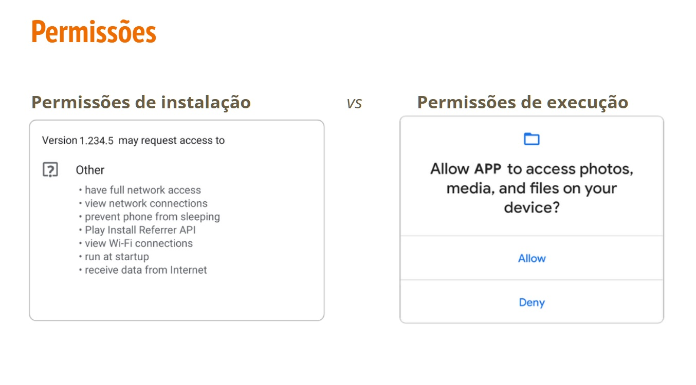
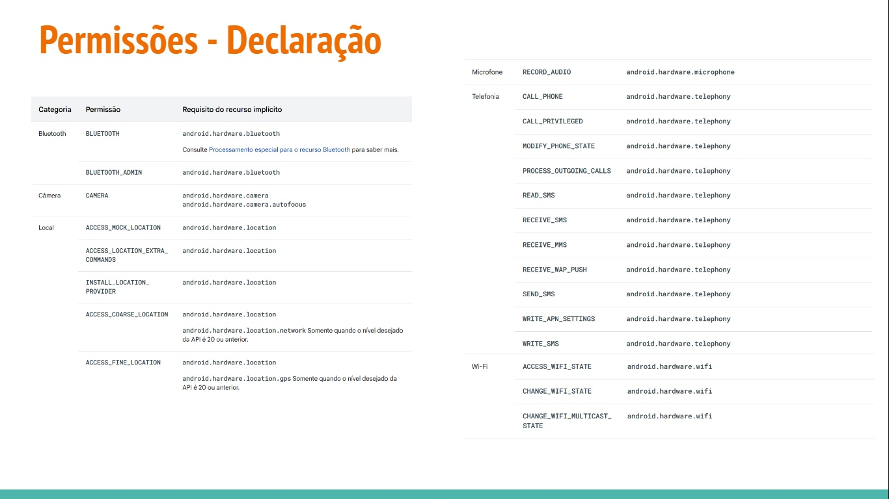
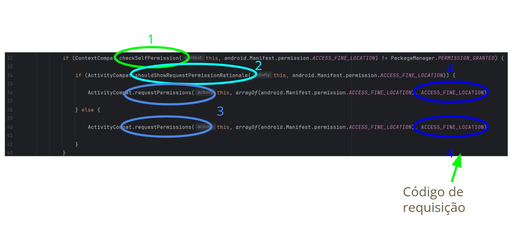
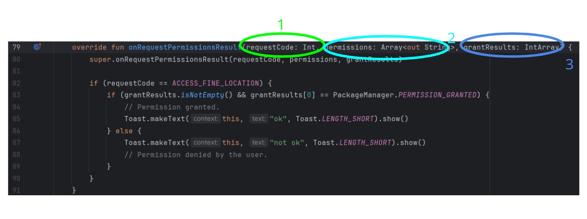

# Permissões

- Ajudam a **manter a privacidade** do usuário protegendo o seguinte:
  
  - **Dados restritos:**
    - Estado do sistema e os dados de contato dos usuário

  - **Ações restritas**
    - Conexão a um dispositivo pareado e a gravação de áudio
   
  Tipos de permissão:

  - Permissões no momento da **instalação**
    - São concedidas automaticamente quando o app é **instalado**
   
  - Permissão de **execução**
    - Exigem que seu app solicite a permissão no momento da **execução**




## Declaração

```kotlin
<mainifest...>
  <uses-permission android:name="android.permission.CAMERA"/>
  <application...>
    ...
  </application>
</manifest>
```

```kotlin
<mainifest...>

  <application...>
    ...
  </application>
  <uses-feature android:name="android.permission.camera android:required="false"/>
</manifest>
```



## Solicitando autorização ao usuário

- No onCreate

```kotlin
if(ContextCompat.checkSelfPermission(this, android.Manifest.permission.ACCESS_FINE_LOCATION)!= PackageManager.PERMISSION_GRANTED){
  if(ActicityCompat.shouldShowRequestPermissionRationale(this, android.Manifest.permission.ACCESS_FINE_LOCATION)){
    ActivityCompat.requestPermissions(this,arrayOf(android.Manifest.permission.ACCESS_FINE_LOCATION),ACCESS_FINE_LOCATION)
}else{
  ActivityCompat.requestPermissions(this, arrayOf(android.Manifest.permission.ACCESS_FINE_LOCATION),ACCESS_FINE_LOCATION)
}
}
```

```kotlin

override fun onRequestPermissionsResult(
  requestCode: Int,
  permissions: Array<out String>,
  grantResults: IntArray
){
  super.onRequestPermissionsResult(requestCode, permissions, grantResults)
  if(requestCode == ACCESS_FINE_LOCATION){
    if(grantResults.isNotEmpty() && grantResults[0] == PackageManager.PERMISSION_GRANTED){
      //Permission granted.
      Toast.makeText(this,"ok",Toast.LENGTH_SHORT).show()
}else{
      Toast.makeText(this,"not ok",Toast.LENGTH_SHORT).show()
      //Permission denied by the user.
      }
}
}

## Solicitando autorização ao usuário - Atividade

- No manifest logo abaixo da tag manifest

```kotlin
<uses-permission android:name="android.permission.ACCESS_FINE_LOCATION"/>
<uses-permission android:name="android.permission.ACCESS_COARSE_LOCATION"/>
```
- No onCreate
```kotlin
if(ContextCompat.checkSelfPermission(this,android.Manifest.permission.ACCESS_FINE_LOCATION)!=PackageManager.PERMISSION_GRANTED){
  if(ActivityCompat.shouldShowRequestPermissionRationale(this,android.Manifest.permission.ACCESS_FINE_LOCATION)){
    ActivityCompat.requestPermissions(this,arrayOf(android.Manifest.permission.ACCESS_FINE_LOCATION),ACCESS_FINE_LOCATION)
}else{
    ActivityCompat.requestPermissions(this,arrayOf(android.Manifest.permission.ACCESS_FINE_LOCATION),ACCESS_FINE_LOCATION)
  }
}
```

```kotlin
override fun onRequestPermissionsResult(
  requestCode: Int,
  permissions: Array<out String>,
  grantResults: IntArray
){
  super.onRequestPermissionsResult(requestCode, permissions, grantResults)

  if(requestCode == ACCESS_FINE_LOCATION){
    if(grantResults.isNotEmpty() && grantResults[0] == PackageManager.PERMISSION_GRANTED){
      //Permission granted
      Toast.makeText(this,"ok",Toast.LENGTH_SHORT).show()
    }else{
      Toast.makeText(this,"not ok",Toast.LENGTH_SHORT).show()
      //Permission denied by the user.
    }
}
}
```

## Adicionando uma permissão

- **checkSelfPermission**
  - Checa se usuário **já concedeu permissão**
    - Retorna boolean (GRANTED, DENIED)

- **shouldShowRequestPermissionRationale**
  - Mostra importância da permissão
    - Retorna true
      - Se a permissão foi pedida anteriormente mas o usuário **negou e não clicou** "never ask again"
    - Retorna false
      - Se a permissão é requisitada pela **primeira vez**
      - Se a permissão foi pedida anteriormente mas o usuário **negou e clicou** "never ask again"
     
 - **Request permission**
   - **Requisita a permissão**

## Adicionando uma permissão
  




## Atividade

```kotlin
if(ContextCompat.checkSelfPermission(this,android.Manifest.permission.ACCESS_FINE_LOCATION)!= PackageManager.PERMISSION_GRANTED){
  if(ActivityCompat.shouldShowRequestPermissionRationale(this,android.Manifest.permission.ACCESS_FINE_LOCATION)){
  ActivityCompat.requestPermissions(this,arrayOf(android.Manifest.permission.ACCESS_FINE_LOCATION),ACCESS_FINE_LOCATION)
}else{
  ActivityCompat.requestPermissions(this,arrayOf(android.Manifest.permission.ACCESS_FINE_LOCATION),ACCESS_FINE_LOCATION)
}
}
```

```kotlin
override fun onRequestPermissionsresult(requestCode: Int, permissions: Array<out String>,grantResults: IntArray){
  super.onRequestPermissionsResult(requestCode, permissions, grantResults)

  if(requestCode == ACCESS_FINE_LOCATION){
    if(grantResults.isNotEmpty() && grantResults[0] == PackageManager.PERMISSION_GRANTED){
    //Permission granted.
    Toast.makeText(this,"ok",Toast.LENGTH_SHORT).show()
    }else{
    Toast.makeText(this,"not ok", Toast.LENGTH_SHORT).show()
    //Permission denied by the user.
  }
}
}
```

## Adicionando Múltiplas Permissões

```kotlin

fun checkPermission(): Boolean{

    val permissions: List<String> = listOf(
      android.Manifest.permission.ACCESS_FINE_LOCATION,
      android.Manifest.permission.ACCESS_COARSE_LOCATION,
      android.Manifest.permission.WRITE_EXTERNAL_STORAGE,
      android.Manifest.permission.CAMERA)
  
    var listPermissionsNeeded: List<String> = listOf()
  
    for(permission in permissions){
      val result = ContextCompat.checkSelfPermission(this, permission)
      if (result != PackageManager.PERMISSION_GRANTED || ActivityCompat.shouldShowRequestPermissionRationale(this, permission)){
        Log.d(LOG, android.Manifest.permission.ACCESS_FINE_LOCATION + " not granted")
        listPermissionsNeeded = listPermissionsNeeded.plus(permission)
      } else {
        Log.d(LOG, android.Manifest.permission.ACCESS_FINE_LOCATION + " granted")
      }
  }
  
    if(listPermissionsNeeded.isNotEmpty()){
      val arrayOfStrings: Array<String> = listPermissionsNeed.toTypedArray()
      ActivityCompat.requestPermissions(this,arrayOfStrings,MULTIPLE_PERMISSIONS)
      return false
    }
  return false
}
```
