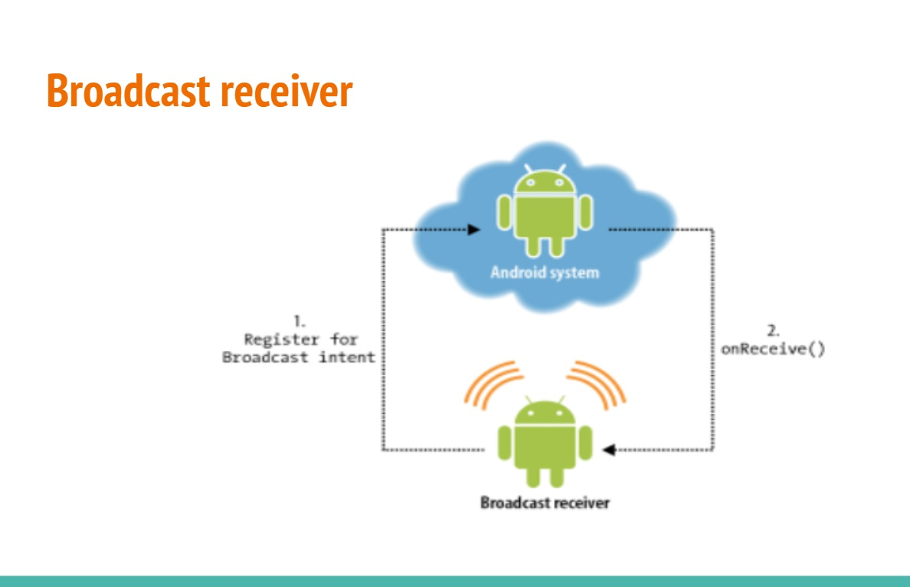
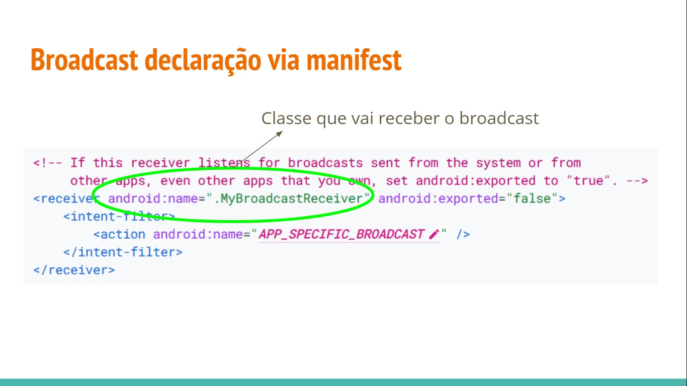
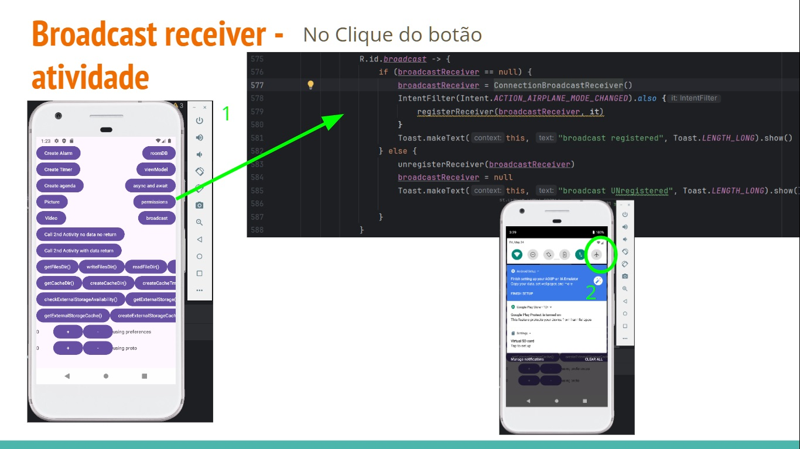
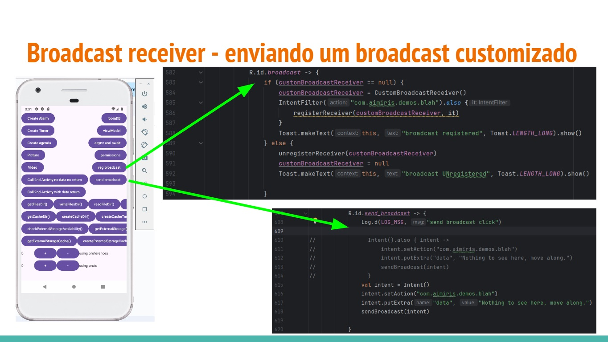

# Broadcast Receiver

- Apps Android podem **enviar ou receber mensagens de transmissão** do sistema Android e de outros apps Android, de maneira semelhante ao padrão de design **publicação/assinatura**
  - transmissão são enviadas quando ocorre um **evento de interesse**

- Apps também podem enviar **transmissões personalizadas**
  - Quando uma transmissão é enviada, o sistema a **roteia** automaticamente para **apps** que se **inscreveram** para receber esse tipo específico de **transmissão**
 
- **Transmissões** podem ser usadas como um **sistema de mensagens entre apps** e **fora do fluxo normal** do usuário



- A mensagem de transmissão é unida em um objeto **Intent** com uma **string de ação** que identifica o evento

- A intent tembém pode incluir **outras informações** agrupadas no campo **extra**

## Broadcast "recebedor"

Classe que herda de BroadcastReceiver() e override o método onReceive

```kotlin
class ConnectionReceiver: BroadcastReceiver(){

  val LOG_MSG = "main_activity"

  override fun onReceive(p0: Context?,p1: Intent?){
    val isAirplaneModeEnabled = p1?.getBooleanExtra("state",false)?:return
    Toast.makeText(p0,"is airplane mode enabled: " + isAirplaneModeEnabled, Toast.LENGTH_SHORT).show()
  }
}
```

## Broadcast declaração

- Via manifesto

- Via código
  - Uma vez registrado para escutar um broadcast, é importante você remover o registro de escuta.



## Broadcast declaração via código

```kotlin
IntentFilter(Intent.ACTION_AIRPLANE_MODE_CHANGED).also{
  registerReceiver(broadcastReceiver, if)
}
```




