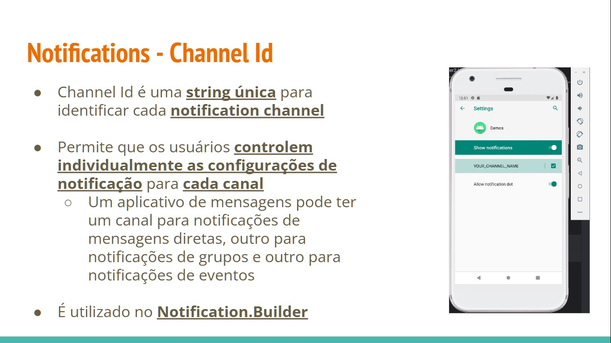
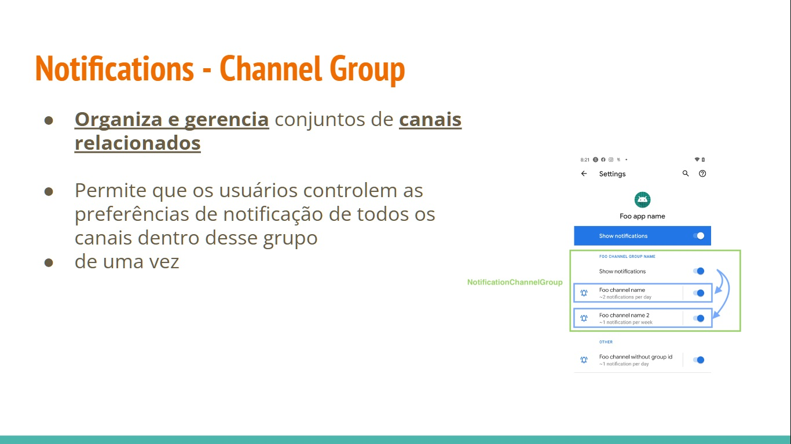
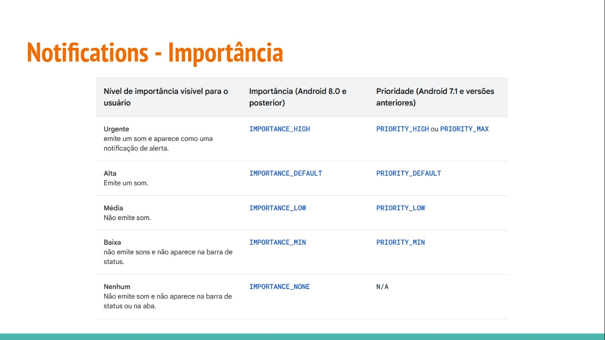
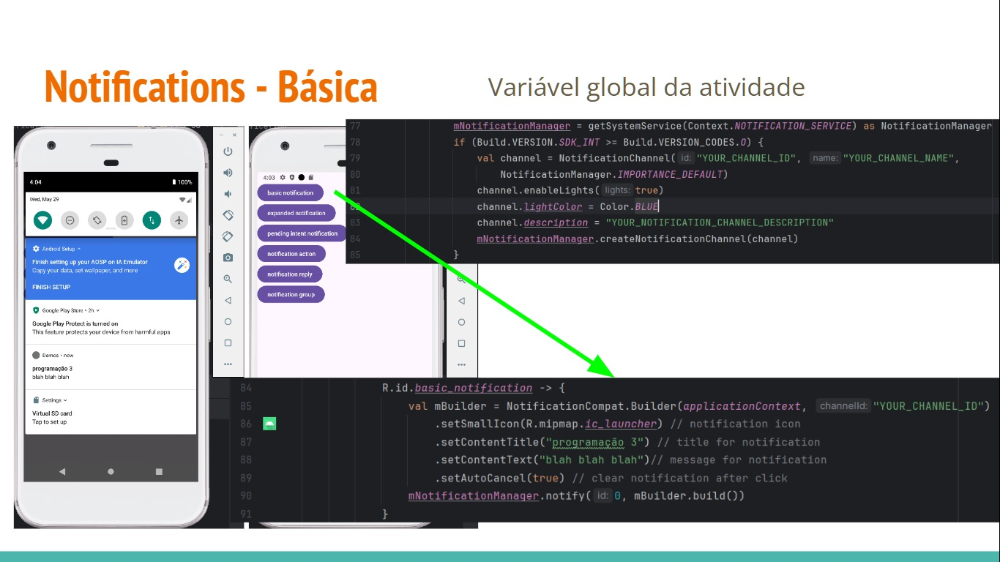
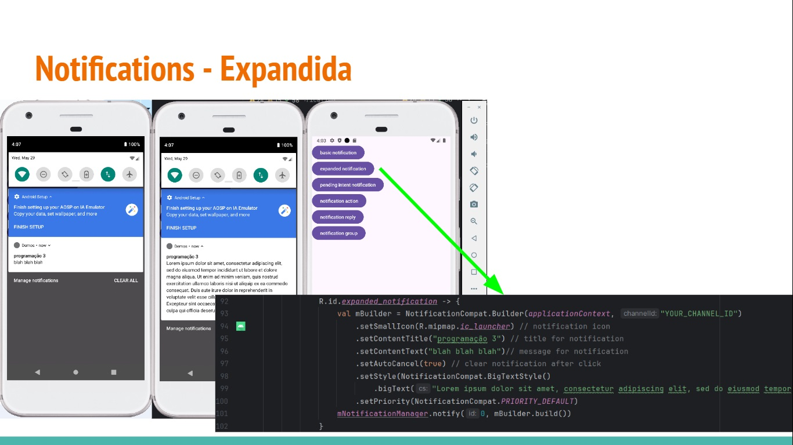
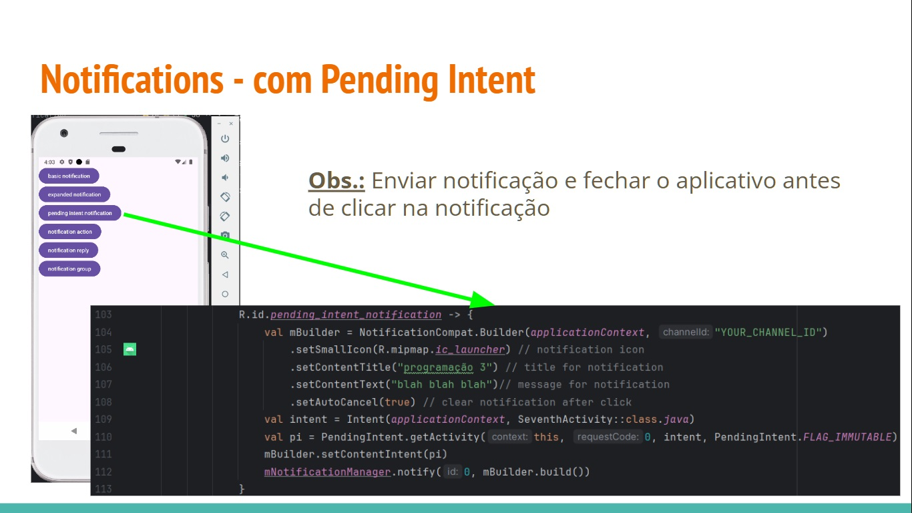
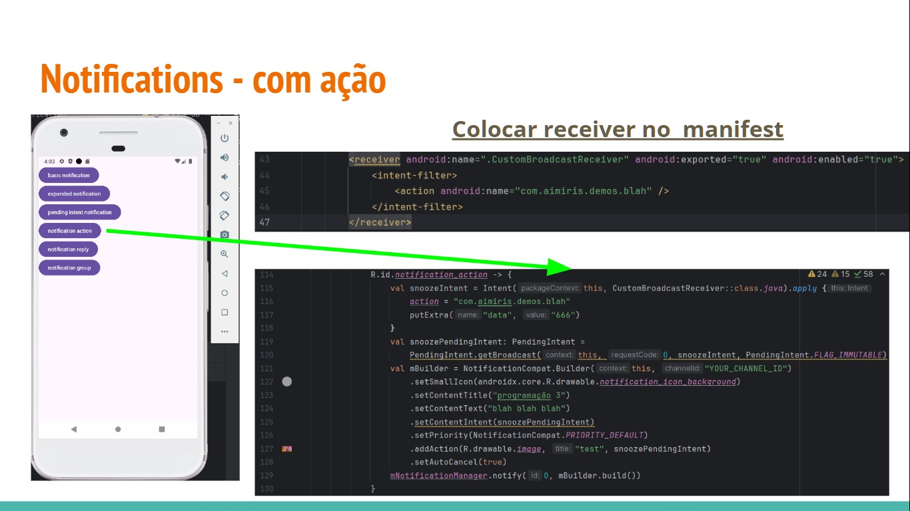
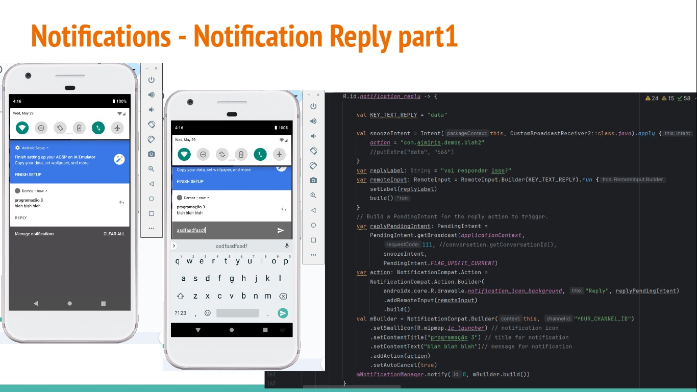
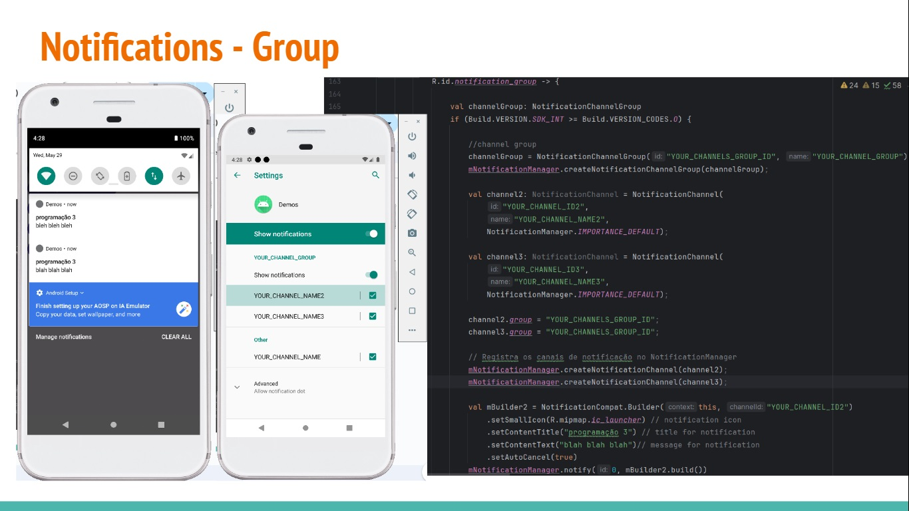
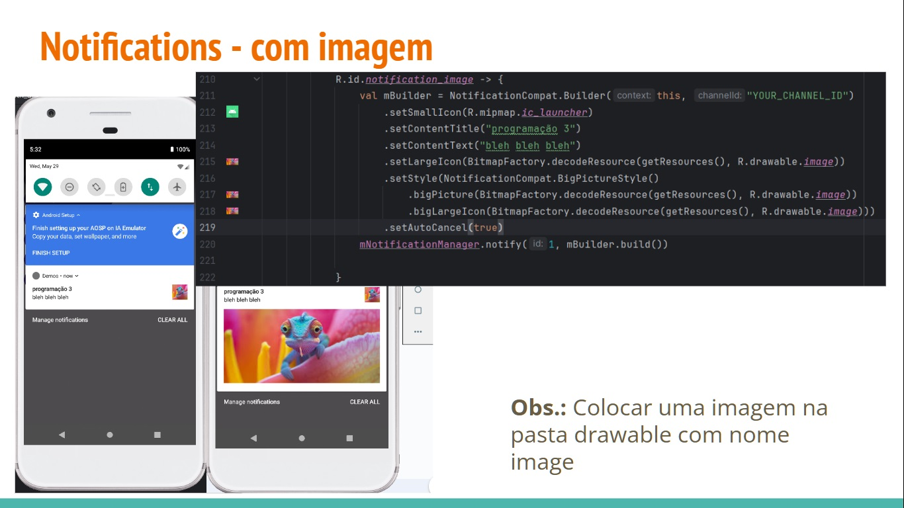

Notifications
- Básicas
- Extendidas
- Pending intent
- Ação
- Reply
- Image

# Notifications - Tipos

- Aparecem automaticamente para os usuários em diferentes locais e formatos
  - Ícone na barra de status
  - Entrada mais detalhada na gaveta de notificações
  - Notificações de alerta
  - Notificações de bloqueio
  - Um ícone no ícone do app
 


## Notifications

- A partir do Android 8.0 (API de nível 26), **todas as notificações precisam ser atribuídas a um canal ou não serão exibidas!!!**

  - Abaixo do Android 8.0 (API de nível 26) isso é ignorado
 
  **Precisa ser adicionado a seguinte biblioteca nas dependências do build.gradle.kts do app**

  ```kotlin
  //notifications
  implementation("androidx.core:core-ktx:1.13.1")
  ```

  **Precisa ser adicionado a permissão no manifesto**

  ```
  <user-permission android:name="android.permission.POST_NOTIFICATIONS"/>
  ```







## Pending Intent

- PendingIntent é um objeto que representa uma **intenção futura de execução** de uma operação
  - **Ação** que será realizada **em nome do seu aplicativo** em algum momento **futuro**
 
  A utilidade primordial de uma PendingIntent é **permitir** que você entregue uma **referência de ação** a **outro aplicativo ou ao sistema**, permitindo que esse aplicativo ou o sistema **execute a ação** em nome do seu aplicativo, mesmo se o **seu aplicativo não estiver em primeiro plano**.

  ```kotlin
  Intent intent = new Intent(this, MinhaAtividade.class);
  PendingIntent pendingIntent = PendingIntent.getActivity(this, 0, intent, PendingIntent.FLAG_UPDATE_CURRENT)

  ```

## Pending Intent - Flags

- **FLAG_CANCEL_CURRENT:** Se a PendingIntent já existir, esta será cancelada e a nova PendingIntent será criada

- **FLAG_IMMUTABLE**: Esta flag indica que a PendingIntent não deve ser modificada posteriormente

- **FLAG_NO_CREATE:** Se a PendingIntent já existir, o sistema não irá criar uma nova PendinIntent, mas irá retornar null.

- **FLAG_ONE_SHOT**: Esta flag indica que a PendingIntent só pode ser usada uma vez. Depois que a ação for realizada, a PendingIntent será automaticamente cancelada

- **FLAG_UPDATE_CURRENT**: Se a PendingIntent já existir, seus extras serão atualizados com os extras passados no novo intent.















