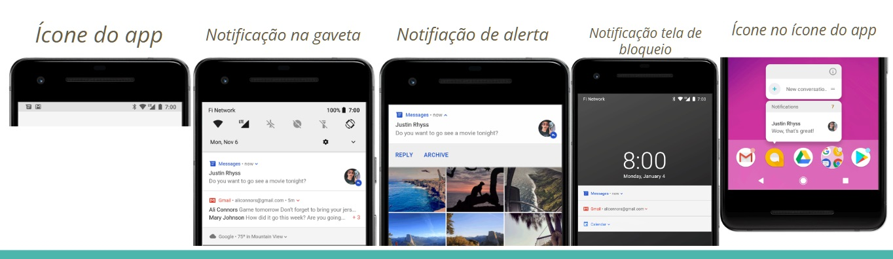
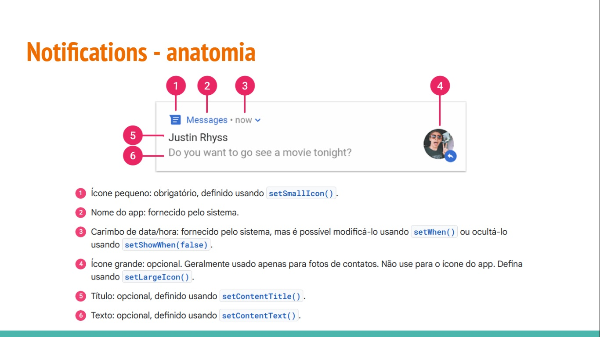
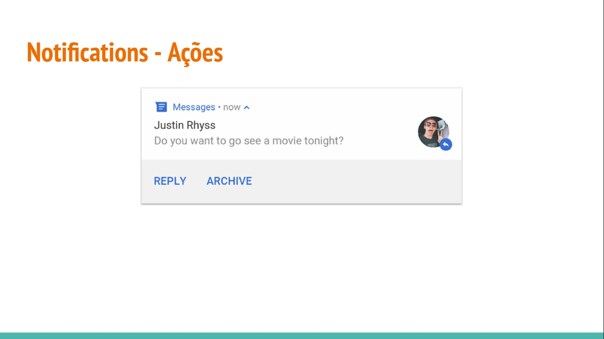

Notifications
- Básicas
- Extendidas
- Pending intent
- Ação
- Reply
- Image

#Notifications - Tipos

- Aparecem automaticamente para os usuários em diferentes locais e formatos
  - Ícone na barra de status
  - Entrada mais detalhada na gaveta de notificações
  - Notificações de alerta
  - Notificações de bloqueio
  - Um ícone no ícone do app
 

