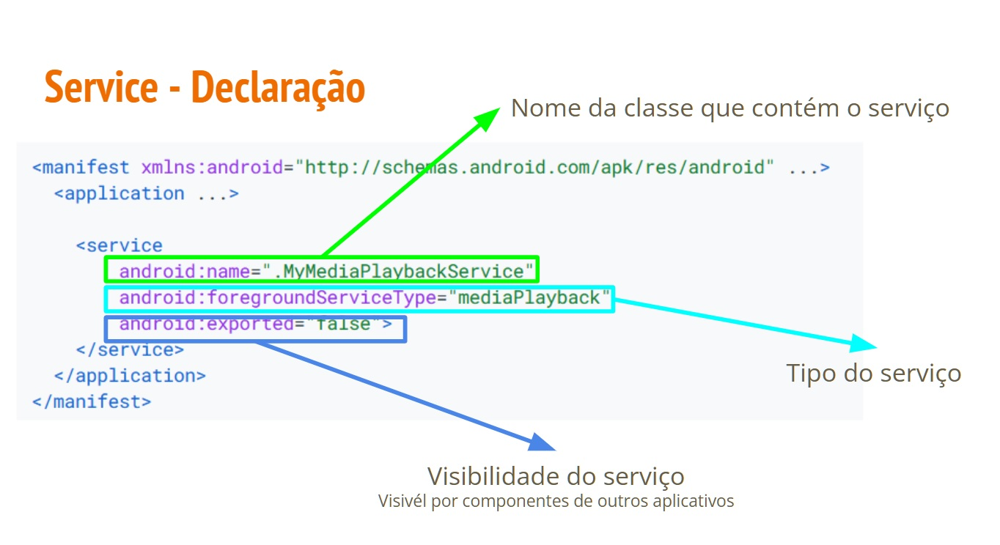
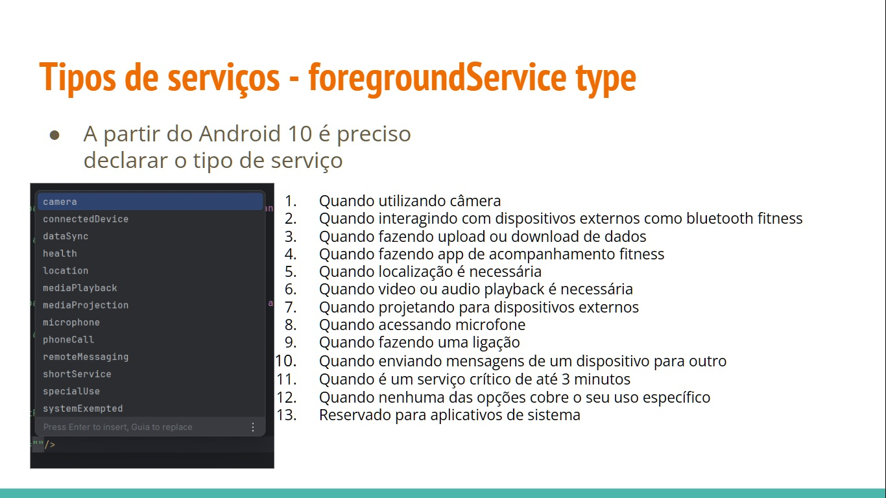
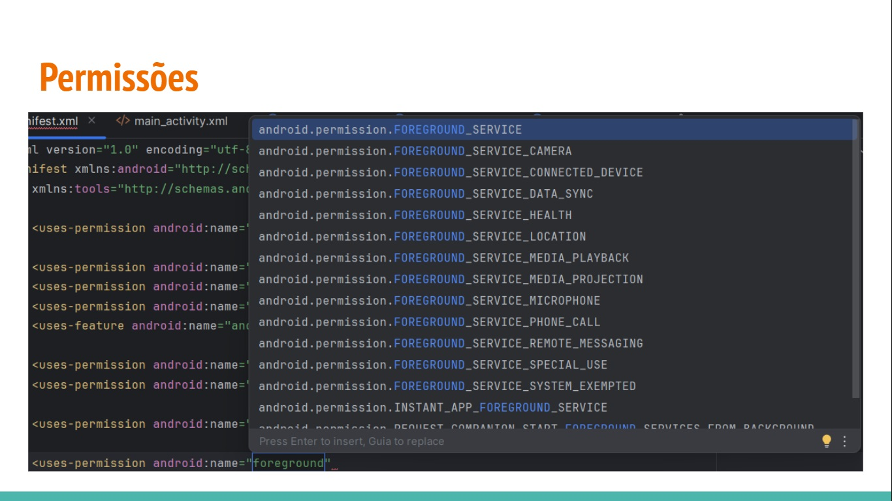
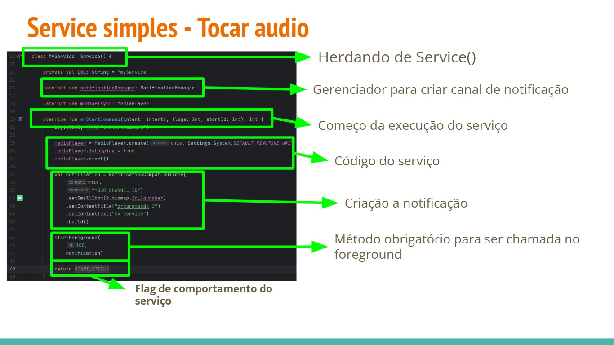
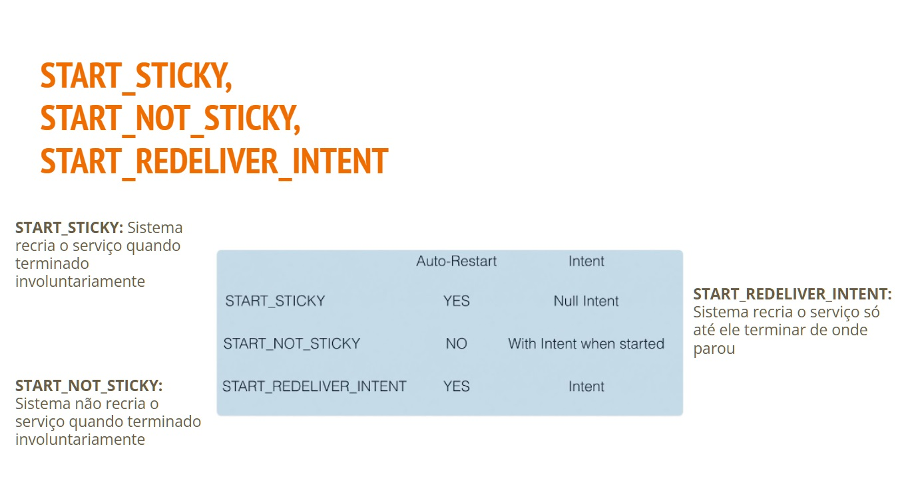
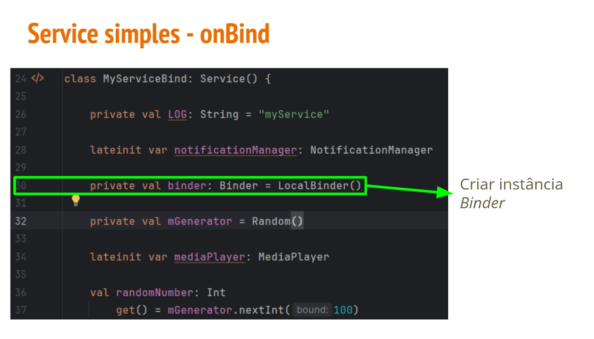
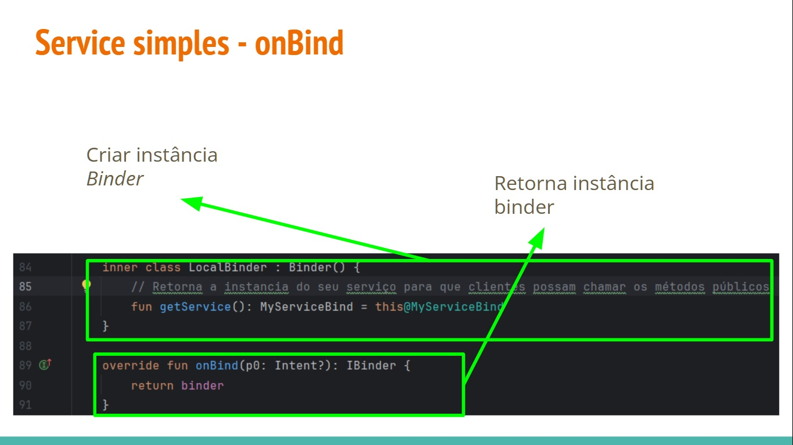
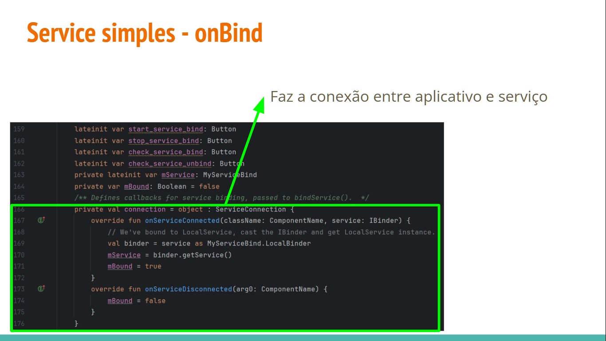
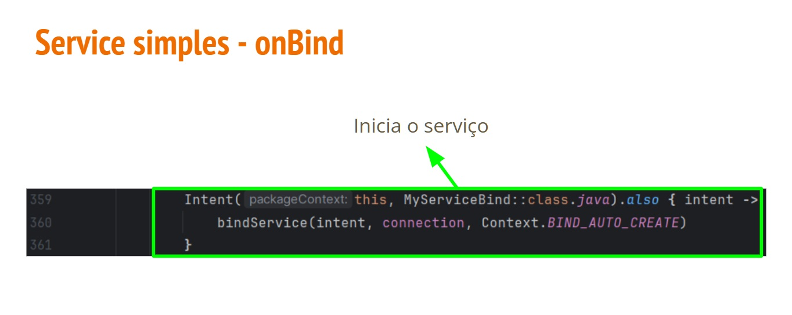
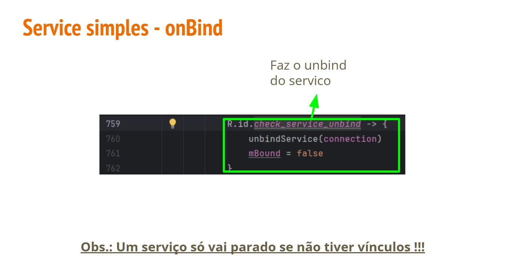

# Services

- Services
  - Foreground
  - Bind
 
- É um componente de aplicativo capaz de **executar operações de longa duração em segundo plano**

- Não oferece uma interface do usuário

- Pode se **vincular** a um serviço para **interagir** com ele e **até realizar comunicaçõa entre processos (IPC)**

  - Um serviço pode **processar transações de rede, trocar música, executar E/S de arquivos**
 
- **Precisa das permissões**
  - **FOREGROUND SERVICE (>= Android 9(API 28))**
  - **Outros componentes do sistema (GPS, Camera, Wifi etc)**
 
## Service - Primeiro plano

- Primeiro plano
  - Executa alguma **operação perceptível** para o usuário
    - Um app de áudio usaria um **serviço em primeiro plano para tocar uma faixa de áudio**

  - Os serviços em primeiro plano **precisam exibir uma Notificação** para que os usuário estejam **ativamente cientes** de que o serviço está em execução
    - Essa notificação **não pode ser dispensada, a menos que o serviço seja interrompido ou removido do primeiro plano**
      - OBS: No Android 13 usuários podem dispensar a notificação associada a um serviço em primeiro plano por padrão









## Service simples - Começar um serviço

```kotlin
R.id.start_service -> {
  val intent: Intent = Intent(this, MyService::class.java)
  if(Build.VERSION.SDK_INT >= Build.VERSION_CODES.O){
    startForegroundService(intent)
}
}
```



## Parando um serviço

```kotlin
  R.id.stop_service -> {
    val intent: Intent = Intent(this, MyService::class.java)
    stopService(intent)
}
```

```
  val cameraPermission = ContextCompat.checkSelfPermission(this,android.Manifest.permission.CAMERA)
if(cameraPermission as PackageManager.PERMISSION_DENIED){
  stopSelf()
  return
}
```

## Service simples - Tocar som

```kotlin

class MyService: Service(){
  private val LOG: String = "myService"

  lateinit var notificationManager: NotificationManager

  lateinit var mediaPlayer: MediaPlayer

  override fun onStartCommand(intent: Intent?, flags: Int, startId: Int): Int{
    Log.d(LOG, "onStartCommand")

    mediaPlayer = MediaPlayer.create(this,Settings.System.DEFAULT_RINGTONE_URI)
    mediaPlayer.isLooping = true
    mediaPlayer.start()

    val notification = NotificationCompat.Builder(
      this,
      "YOUR_CHANNEL_ID")
      .setSmallIcon(R.mipmap.ic_launcher)
      .setContentTitle("programação 3")
      .setContentText("my service")
      .build()

    startForeground(
      100,
      notification)

  return START_STICKY
}

  override fun onCreate(){
    super.onCreate()

    Log.d(LOG,"service onCreate")

    notificationManager = getSystemService(Context.NOTIFICATION_SERVICE) as NotificationManager
  if(Build.VERSION.SDK_INT >= Build.VERSION_CODES.O){
      val channel: NotificationChannel = NotificationChannel(
        "YOUR_CHANNEL_ID",
        "YOUR_CHANNEL_NAME", NotificationManager.IMPORTANCE_DEFAULT)
      channel.enableLights(true)
      channel.lightColor = Color.BLUE
      channel.description = "YOUR_NOTIFICATION_CHANNEL_DESCRIPTION"
      notificationManager.createNotificationChannel(channel)
  }
}

override fun onDestroy(){
  super.onDestroy()
  Log.d(LOG,"service onDestroy")
  mediaPlayer.stop()
}

override fun onBind(p0: Intent?): IBinder? {
  return null
}
}
```

```kotlin
R.id.start_service ->{
  val intent: Intent = Intent(this, MyService::class.java)
  if(Build.VERSION.SDK_INT >= Build.VERSION_CODES.O){
    startForegroundService(intent)
  }
}
R.id.stop_service ->{
    val intent: Intent = Intent(this, MyService::class.java)
    stopService(intent)
}
```
No manifest
```kotlin
<service
  android:name=".MyService"
  android:exported="true"
  android:foregroundServiceType="mediaPlayback"/>
```
adicionar permissão
```kotlin
<uses-permission android:name="android.permission.FOREGROUND.SERVICE"/>
<uses-permission android:name="android.permission.FOREGROUND.SERVICE_MEDIA_PLAYBACK"/>
```

# Service vinculado - onBind()

- Permite que outros aplicativos sejam **vinculados e interajam com o serviço**

- Para isso é necessário fornecer a vinculação através da do método de callback **onBind()**

- Esse método **retorna** um objeto **IBinder** que define a **interface de programação** que os clientes podem usar para interagir com o serviço.











## Service simples - onBind - Atividade

```kotlin

class MyServiceBind: Service(){
  private val LOG: String = "myService"
  lateinit var notificationManager: NotificationManager
  private val binder: Binder = LocalBinder()
  private val mGenerator = Randow()

  val randomNumber: Int
    get() = mGenerator.nextInt(100)

  overrider fun onStartCommand(intent: Intent?, flags: Int, startId: Int): Int{
    Log.d(LOG,"onStartCommand")

    val notification = NotificationCompat.Builder(
      this,
      "YOUR_CHANNEL_ID")
      .setSmallIcon(R.mipmap.ic_laucher)
      .setContentTitle("programação 3")
      .setContentText("my service")
      .build()

    startForeground(
      100,
      notification)

    return START_NOT_STICKY
}
