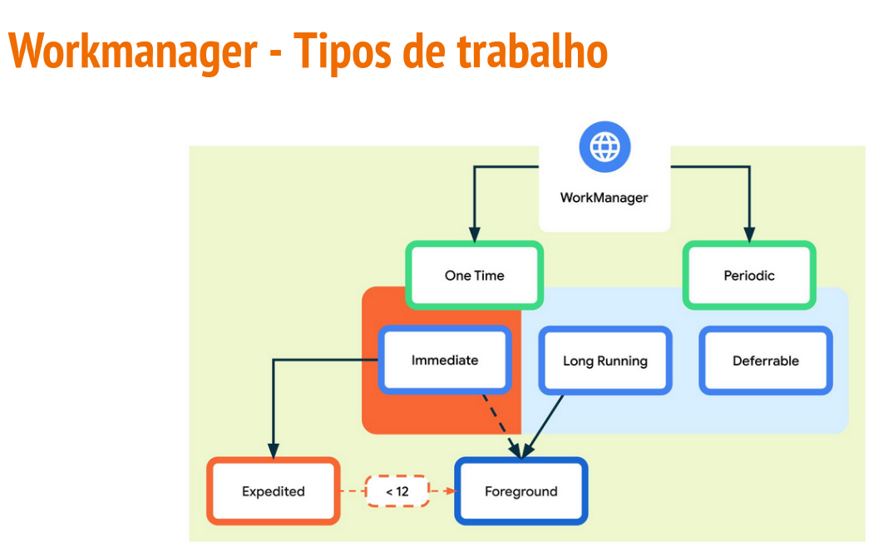
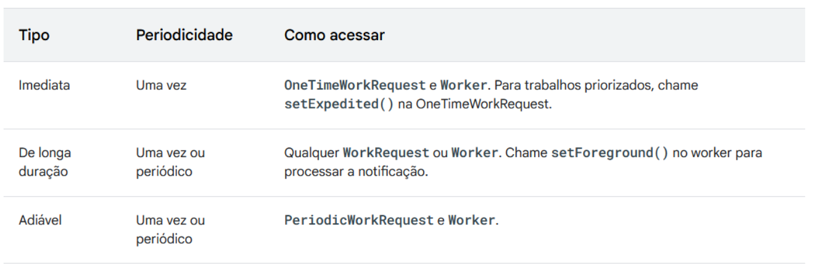

# Workmanager

- Recomendado para **trabalhos persistentes**
  - O trabalho é persistente quando **permanece programado após as reinicializações do app e do sistema**
 
- É uma biblioteca que gerencia trabalhos que requerem uma combinação de **execução oportunista e garantiada**
  - **Execução oportunista** significa que o WorkManager faz o trabalho em segundo plano o **quanto antes**
 
  - **Execução garantida** se refere à lógica para **iniciar o trabalho em diversas situações**, mesmo se você sair do app
 
## Tupos de trabalho

- Imediato: tarefas que precisam começar imediatamente e terminar em breve. Podem ser priorizados

- De longa duração: tarefas que podem ser executadas por mais tempo, potencialmente mais de 10 minutos

- Adiável: tarefas programadas que começam posteriormente e podem ser executadas periodicamente

## Quando utilizar

Alguns exemplos de tarefas que fazem um bom uso do WorkManager:

- Consultar periodicamente as últimas notícias
- Aplicar filtros a uma imagem e salvá-la.
- Sincronização periódica de dados locais com a rede.

## Principais classes e conceitos

- **Worker**
  - **Define como o work vai ser executado**. Aceita **inputs** (workerParameters) e produz **outputs**(Data/chave - valor). Sempre vai retornar um resultado representado **SUCCESS, FAILURE ou RETRY**
 
- **WorkRequest**
  - Representa uma tarefa. Deve no mínimo especificar qual classe Worker vai executar a tarefa
 
9
