## File provider + Uri + WorkManager

- Content Provider
- File provider
- Download de arquivo

- Na atividade passada:
  
```kotlin
R.id.workmanaer_notification_info -> {
  val notificationWorkRequest: WorkRequest = OneTimeWorkRequest.Builder(MyNotificationWorkManager::class.java)
  .setInitialDelay(3,TimeUnit.SECONDS)
  .build()

WorkManager.getInstance(this).enquaue(notificationWorkRequest)

WorkManager.getInstance(this).getWorkInfoByIdLiveData(notificationWorkRequest.id)
  .observeForever(){ it ->
    when(it.state){
      WorkInfo.State.ENQUEUED -> { Log.d(LOG_MSG, "ENQUEUED")}
      WorkInfo.State.RUNNING -> { Log.d(LOG_MSG, "RUNNING")}
      WorkInfo.State.SUCCEEDED -> { Log.d(LOG_MSG, "SUCCEEDED")}
      WorkInfo.State.FAILED -> { Log.d(LOG_MSG, "FAILED")}
      WorkInfo.State.BLOCKED -> { Log.d(LOG_MSG, "BLOCKED")}
      WorkInfo.State.CANCELLED -> { Log.d(LOG_MSG, "CANCELLED")}
    }
}
}
```

## Content Provider

- Os pilares do android:


- Importante componente do android para compartilhar dados entre aplicativos
- Funciona como "repositório central" na qual dados de aplicativos são armazenados
  - Facilita o gerenciamento e atualizações de informações
    - A atualização de informação depende das restrições impostas
   


- No manifest

```kotlin
<provider
  android:name="com.example.contentprovidersinandroid.MyContentProvider"
  android:authorities="com.demo.user.provider"
  android:enabled="true"
  android:exported="true"></provider>
```

## Content Uri

- As informações são acessadas através de uma Uniform resource identifier (Uri)

- Podem ter conteúdo do tipo:
  - resource
  - file
  - content
  - data
 
  
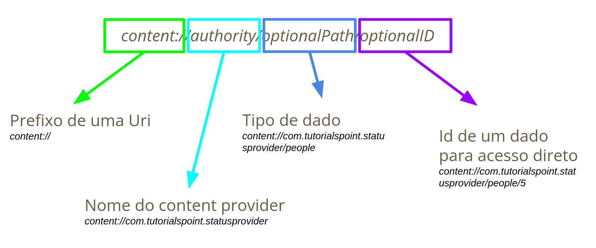

- resources

```kotlin
val uri: Uri = Uri.parse("android.resource://$packageName/drawable/image")
Log.d(LOG,"imageBytes: " + uri.toString())
val imageBytes: ByteArray = contentResolver.openInputStream(uri).use {inputStream ->
  inputStream!!.readBytes()
}
Log.d(LOG,"imageByte: " + imageBytes.size)
```
  
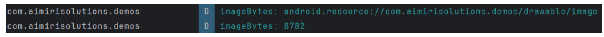

-file

```kotlin
val file: File = File(filesDir,"blah.jpg")
FileOutputStream(file).use { fileOutputStream ->
  fileOutputStream.write(imageBytes)
}
Log.d(LOG, "file uri: " + file.toUri())
```

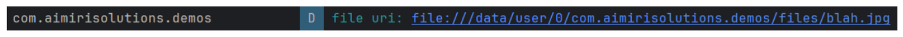

- content

```kotlin
val galleryLauncher = registerForActivityResult(ActivityResultContracts.GetContent()){ uri ->
  Log.d(LOG,"uri: " + uri.toString()
}

select_image = findViewById(R.id.select_image)
select_image.setOnClickListener{
  val i = Intent()
  i.setType("image/*")
  i.setAction(Intent.ACTION_GET_CONTENT)
  galleryLauncher.launch("image/*")
}
```


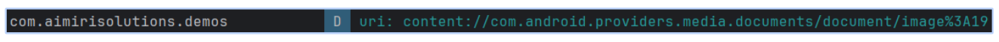

## Content resolver

- Classe que fornece métodos para acessar e manipular dados no Content Provide
- Age como uma ponte entre os aplicativos e os dados fornecidos pelo Content Provider
- Executa operações como consulta, inserção, atualização e exclusão de dados armazenados em Content Providers.

## File provide

- Uma subclasse de content provider que facilita o compartilhamento de arquivos de modo seguro
- Cria uma Uri de tipo content://

```kotlin
<provider
  android:name="androidx.core.content.FileProvider"
  android:authorities="${applicationId}.provider"
  android:exported="false"
  android:grantUriPermissions="true">
  <meta-data
    android:name="android.support.FILE_PROVIDER_PATHS"
    android:resource="@xml/provider_paths"/>
</provider>

```

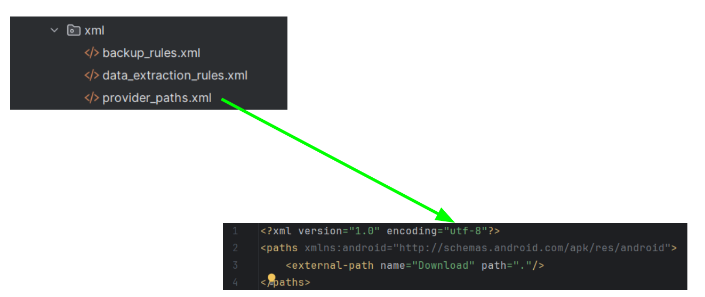

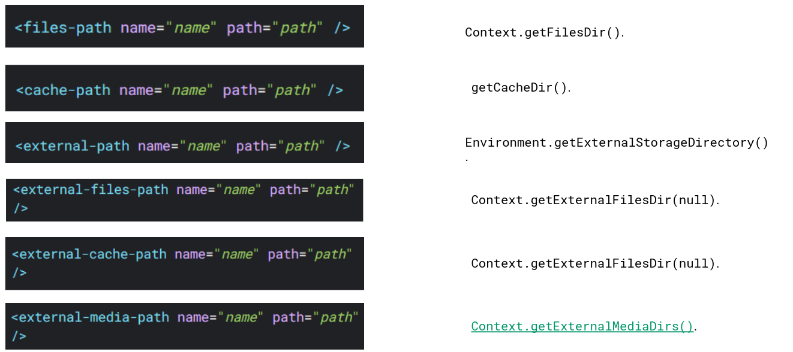

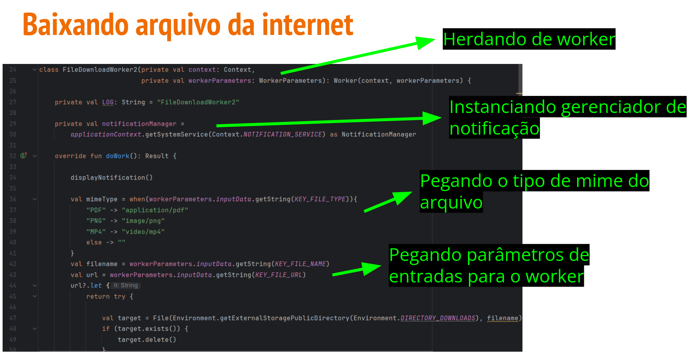

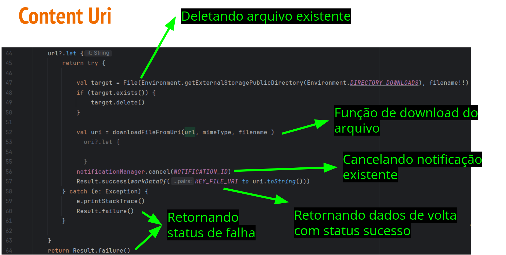

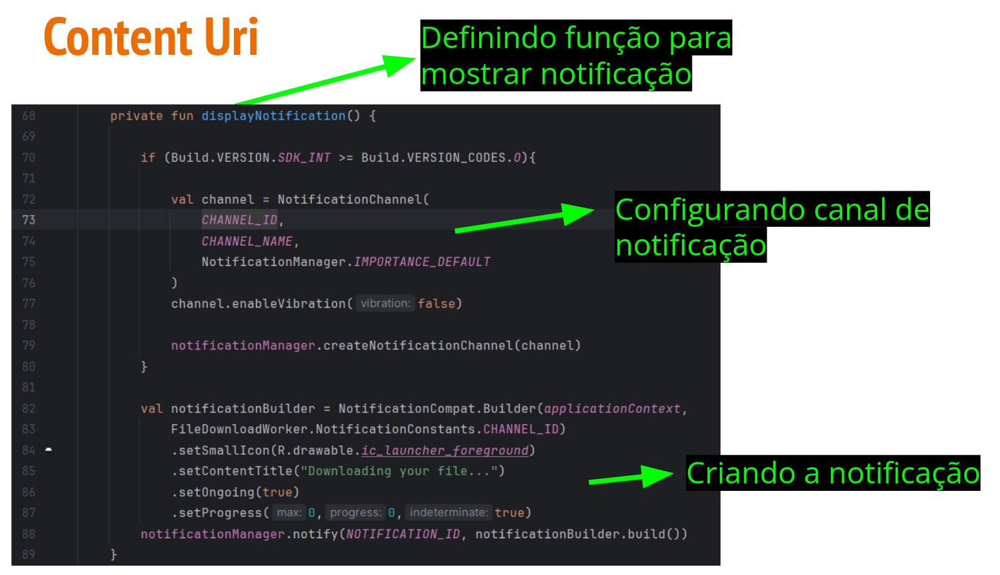

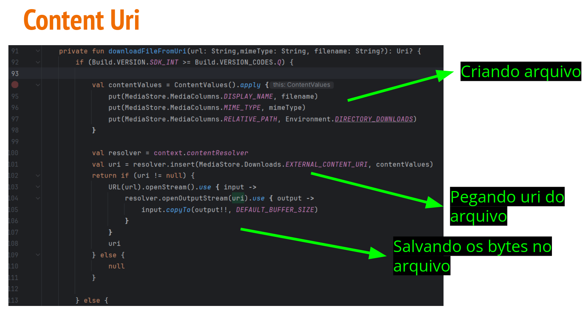

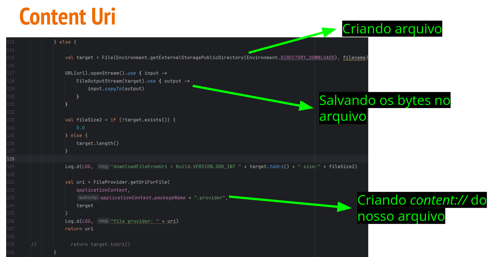

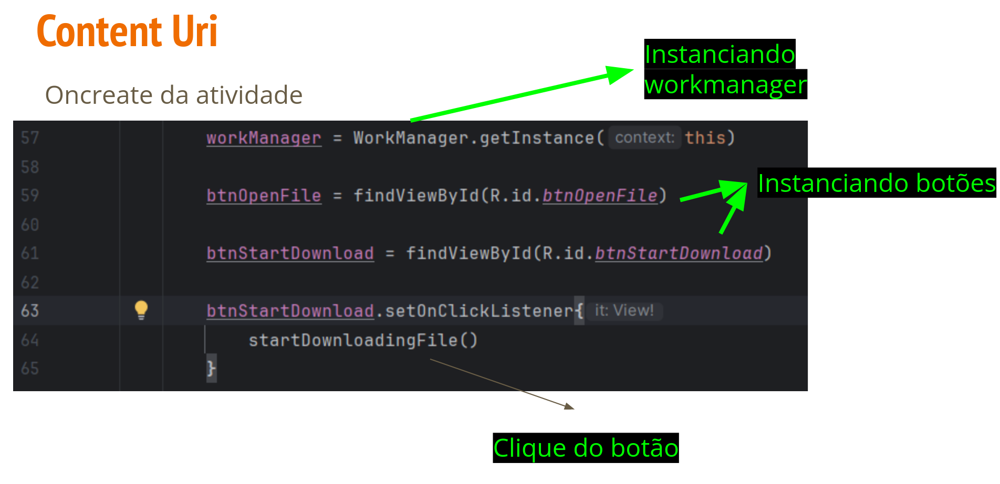

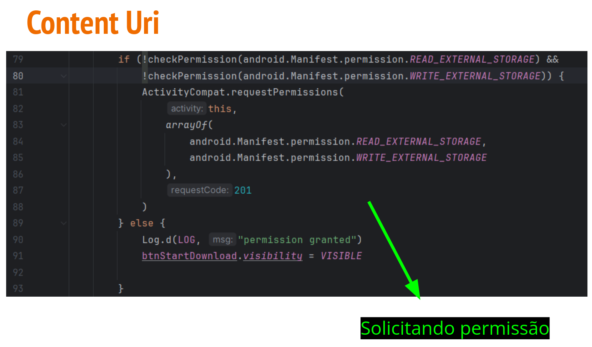

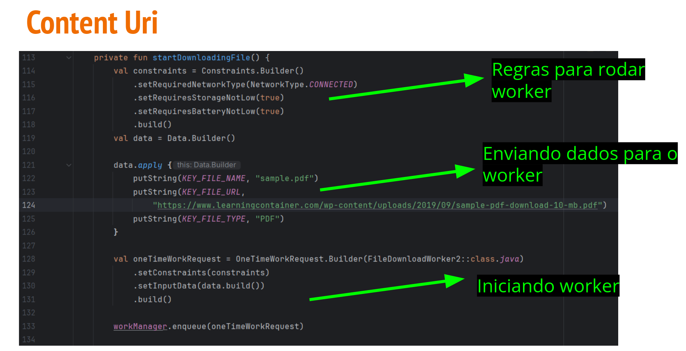

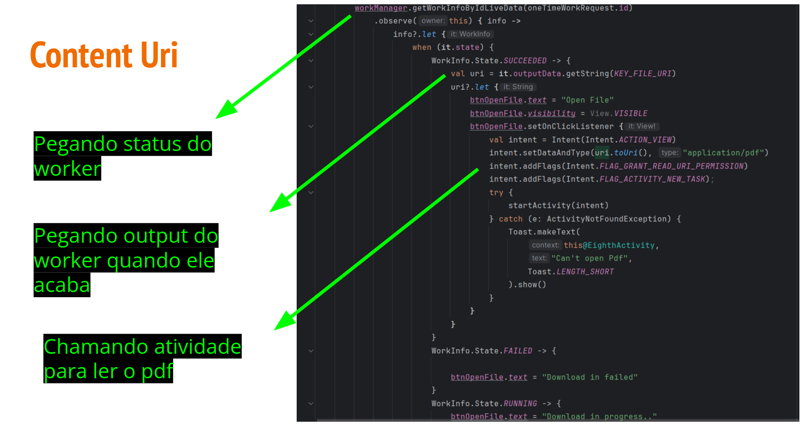
