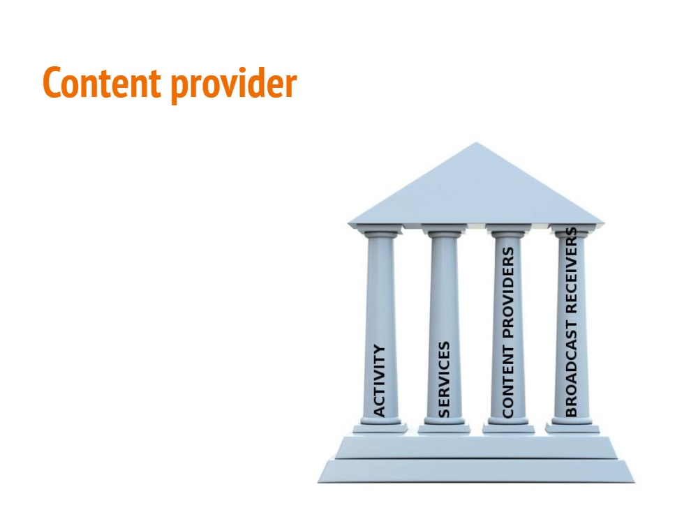
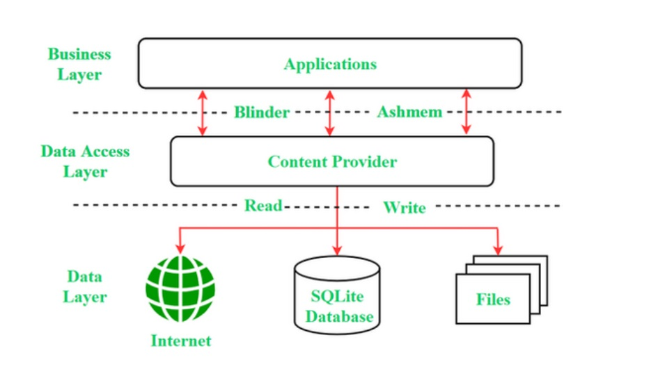
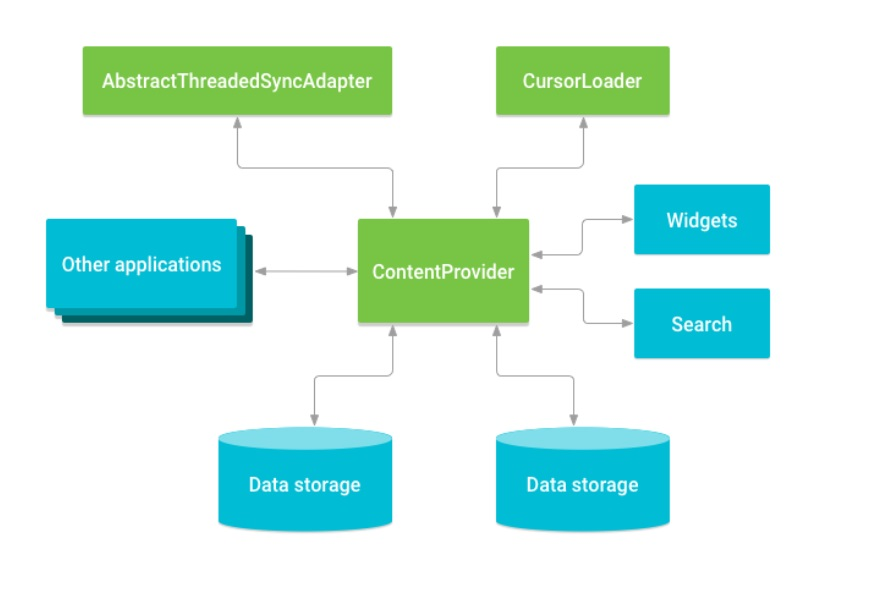

## File provider + Uri + WorkManager

- Content Provider
- File provider
- Download de arquivo

- Na atividade passada:
  
```kotlin
R.id.workmanaer_notification_info -> {
  val notificationWorkRequest: WorkRequest = OneTimeWorkRequest.Builder(MyNotificationWorkManager::class.java)
  .setInitialDelay(3,TimeUnit.SECONDS)
  .build()

WorkManager.getInstance(this).enquaue(notificationWorkRequest)

WorkManager.getInstance(this).getWorkInfoByIdLiveData(notificationWorkRequest.id)
  .observeForever(){ it ->
    when(it.state){
      WorkInfo.State.ENQUEUED -> { Log.d(LOG_MSG, "ENQUEUED")}
      WorkInfo.State.RUNNING -> { Log.d(LOG_MSG, "RUNNING")}
      WorkInfo.State.SUCCEEDED -> { Log.d(LOG_MSG, "SUCCEEDED")}
      WorkInfo.State.FAILED -> { Log.d(LOG_MSG, "FAILED")}
      WorkInfo.State.BLOCKED -> { Log.d(LOG_MSG, "BLOCKED")}
      WorkInfo.State.CANCELLED -> { Log.d(LOG_MSG, "CANCELLED")}
    }
}
}
```

## Content Provider

- Os pilares do android:



- Importante componente do android para compartilhar dados entre aplicativos
- Funciona como "repositório central" na qual dados de aplicativos são armazenados
  - Facilita o gerenciamento e atualizações de informações
    - A atualização de informação depende das restrições impostas
   




- No manifest

```kotlin
<provider
  android:name="com.example.contentprovidersinandroid.MyContentProvider"
  android:authorities="com.demo.user.provider"
  android:enabled="true"
  android:exported="true"></provider>
```

## Content Uri

- As informações são acessadas através de uma Uniform resource identifier (Uri)

- Podem ter conteúdo do tipo:
  - resource
  - file
  - content
  - data
 
  
