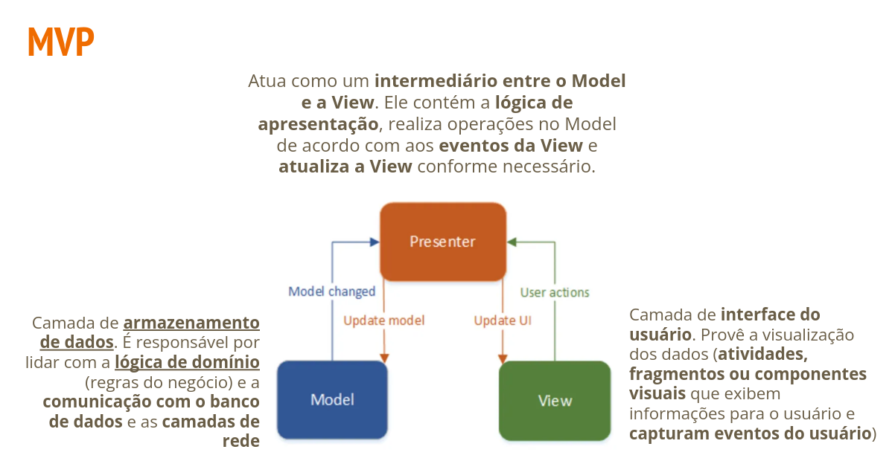

- MVC
- MCP
- MVVM

# MVC

- Separa a interface do usuário (View)
- As regras de negócio e dados (Model)
- Usa um mediador (Controller) para conectar o modelo à View

## MVC - Benecícios

- Separa de interesses

  - **View** cuida da interface com o usuário
  - **Modelo** se encarrega dos dados e regra de negócio
  - **Controlador** envia mensagens entre os dois
    - Fornece os dados do modelo para a view se ligar a interface do usuário
    - Quaisquer alterações ao controlador são transparentes para a view e as mudanças de interface do usuário não afetarão a lógica de negócios e vice-versa
   
## MVC - Aplicativo simples de lista de tarefas

## MVC - Ache o controlador

## MVC - Aplicativo simples de lista de tarefas

# MVP

- Alternativa ao MVC
  - Muitas das regras e lógica do negócio reside no controlador
    - Pode ficar muito **grande** e **difícil de manter**
    - Muitas vezes o **controlador e a view** ficam na **mesma activity**
    - **Difícil de fazer unit testing** devido aos componentes não estarem fazendo parte do SDK do Android
- Promove uma **separação clara de responsabilidades** e ajuda a **evitar o acoplamento excessivo** entre os componentes da aplicação

## MVP

- Comunicação entre View-Presenter e Presenter-Model acontece via interface (também chamado de contrato)

- Apenas 1 presenter gerencia uma view
  - um para um
 
- Model e view não se conhecem de forma alguma!!!

# MVVM

- É uma variação do padrão de projeto Model View Presenter (MVP)

- Prover uma separação de responsabilidades, entre a view e sua lógica

- Ausência de referência da View no ViewModel, ele não consegue modificar a View diretamente, só indiretamente através de bindings

- Model: Representa a **camada de dados** do aplicativo
  - Inclui classes que definem os dados que o aplicativo manipula e lógica para recuperar ou manipular esses dados
 
- View: Representa a camada de **interface do usuário**
  - Consiste em Activities, Fragments e seus respectivos layouts XML
 
- ViewModel: as camadas ViewModel **coordenam as operação entre a view e as camadas** model, além disso, **evocará operações sobre o Model** quando for necessário.

## MVVM - Benecífios

- É uma variação do padrão de projeto Model View Presenter (MVP)

- Prover uma separação de responsabilidades, entre a view e sua lógica

- Ausência de referências da View no ViewModel, ele não consegue modificar a View diretamente, só indiretamente através de bindings.

